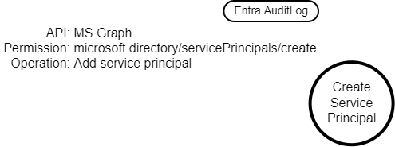
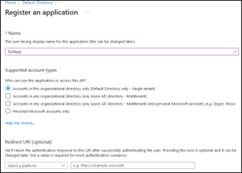

# TRR0000: Azure Service Principal Creation

## Metadata

| Key          | Value                                      |
|--------------|--------------------------------------------|
| ID           | TRR0000                                    |
| External IDs | [T1136.003], [AZT502.2]                    |
| Tactics      | Persistence                                |
| Platforms    | Azure                                      |
| Contributors | Andrew VanVleet                            |

### Scope Statement

This TRR covers [AZT502.2] from Microsoft's Azure Threat Research Matrix, which
corresponds to [T1136.003] (Create Account: Cloud Account) on the Mitre ATT&CK
matrix (as it pertains to Azure).

## Technique Overview

Attackers can gain persistence in a victim's tenant by creating a new service
principal that they control, allowing them to retain access to resources in the
tenant even if they lose their original means of access. Granting additional
roles or permissions to a service principal is covered under [TRR0020] (Service
Principal Manipulation).

## Technical Background

### Security Principals

To access resources that are secured by a Microsoft Entra tenant, the entity
that requires access must be represented by a security principal. This
requirement is true for both users (user principals) and applications (service
principals). The security principal defines the access policy and permissions
for the user or application in the Microsoft Entra tenant.

- **User principals** are the human users of the applications or resources in
  the tenant.
- **Service principals** represent non-human identities in a tenant. These
  account types provide a way for applications and services to authenticate and
  use resources without an interactive user. Service principals are called
  "Enterprise Apps" in the Azure portal.

### Applications in Azure

Applications in Azure have two components:

1. An App Registration
2. A Service Principal (aka Enterprise Application)

An **App Registration** is how you register a new application with Azure; it is
the global representation of your application in Azure across all tenants and is
assigned a globally unique application object ID. You can configure details like
the reply and logout URLs, define the application's APIs, and add credentials
for your application to use to authenticate. You also define the specific
permissions that your application will need to use various Azure resources.

A **Service Principal** is the local representation of an application in *a
single tenant only*. A service principal is created in each tenant where the
application is used and references the globally unique app object. The service
principal object defines what the app can actually do in the specific tenant,
who can access the app, and what resources the app can access. When an
application is given permission to access resources in a tenant (upon
registration or consent), a service principal object is created.  

> [!TIP]
>
> An example helps illustrate this concept: ZScaler offers a "Private Access"
> (ZPA) product in Azure. The App Registration for ZPA exists in ZScaler's own
> tenant. If you want to use the application in your tenant, you go to
> Enterprise Applications, create a new application, and select ZPA from the
> "Azure AD Gallery." This will create a service principal for ZPA in your
> tenant and you will need to grant your consent for it to hold the application
> permissions that it requires (which were defined by ZScaler in the App
> Registration). You can then use ZPA in your tenant.

### Service Principal Types

There are three types of service principals in Azure. An application can be
represented by any one of the three.

- **Application** - Application service principals are very flexible, but
  require developers to manually handle secrets, credentials, certificates, or
  keys used to authenticate the application.

- **Managed identity** - Managed identities allow Azure to handle the
  application authentication behind the scenes, eliminating the need for
  developers to manage credentials. Managed identities can be granted access and
  permissions, but can't be updated or modified directly.[^1][^2]

- **Legacy** - This type of service principal represents a legacy app, which is
  an app created before app registrations were introduced or through legacy
  mechanisms. These cannot be created anymore, but preexisting objects can still
  function. A legacy service principal can have credentials, service principal
  names, reply URLs, and other properties that an authorized user can edit, but
  doesn't have an associated app registration. The service principal can only be
  used in the tenant where it was created.

### Logging

There are two relevant logs created in the Entra ID Audit Log when a service
principal or application is created.

| Operation Name | Action |
| ----- | ----- |
| Add service principal | microsoft.directory/servicePrincipals/create |
| Add application | microsoft.directory/applications/create |

## Procedures

| ID                           | Title            | Tactic            |
|------------------------------|------------------|-------------------|
| TRR0000.AZR.A                | Create service principal | Persistence    |

### Procedure A: Create service principal

An attacker can create a new service principal, allowing them to control all
aspects without fear of disrupting existing applications. The service principal
can be granted the persistent permissions that the attacker desires and can be
configured with authentication credentials held by the attacker to ensure them
continued access to the tenant.

#### Detection Data Model

There are a number of different ways to create a service principal (though all
will ultimately use the Graph API).

Examples include:

- Az PowerShell: `New-AzADServicePrincipal`
- Azure CLI: `az ad sp create`
- Microsoft Graph API: `POST https://graph.microsoft.com/v1.0/servicePrincipals`
- Azure Portal

 

## Available Emulation Tests

| ID            | Link             |
|---------------|------------------|
| TRR0000.AZR.A |                  |

## References

- [Application and service principal objects in Microsoft Entra ID]

[T1136.003]: https://attack.mitre.org/techniques/T1136/003/
[AZT502.2]: https://microsoft.github.io/Azure-Threat-Research-Matrix/Persistence/AZT502/AZT502-2/
[TRR0020]: ../../trr0020/azr/README.md
[Application and service principal objects in Microsoft Entra ID]: https://learn.microsoft.com/en-us/entra/identity-platform/app-objects-and-service-principals

[^1]: [Entra Managed Identities - Microsoft Learn](https://learn.microsoft.com/en-us/entra/identity/managed-identities-azure-resources/overview)
[^2]: [Application and service principal objects in Microsoft Entra ID - Microsoft Learn](https://learn.microsoft.com/en-us/entra/identity-platform/app-objects-and-service-principals)
