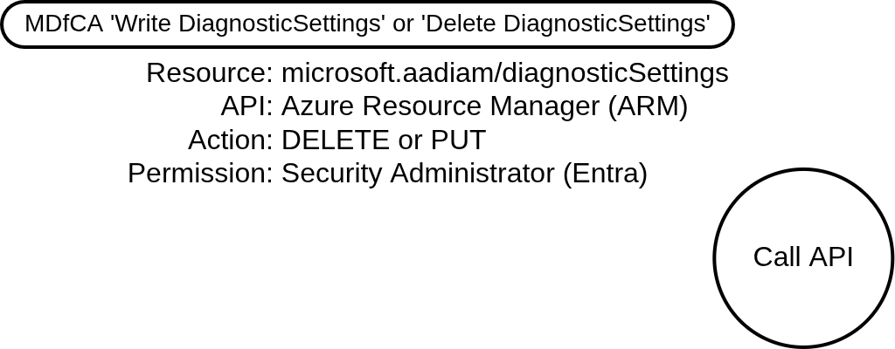
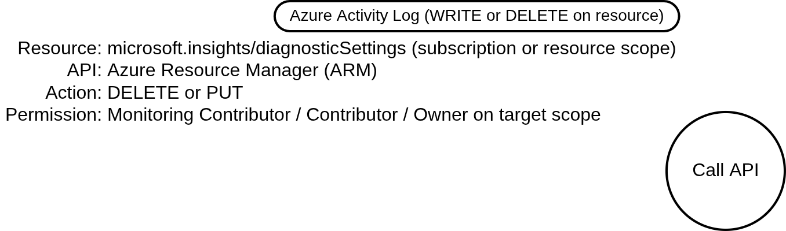

# Forging SAML Tokens for Entra ID

## Metadata

| Key          | Value                                          |
|--------------|------------------------------------------------|
| ID           | TRR0000                                        |
| External IDs | [T1606.002]                                    |
| Tactics      | Credential Access, Defense Evasion             |
| Platforms    | Azure                                          |
| Contributors | Andrew VanVleet                                |

### Scope Statement

This TRR covers the construction, signing, and submission of forged SAML or
WS-Federation tokens to Microsoft Entra ID. The TRR assumes that the signing key
is already trusted by an Entra federated domain.

This TRR is the shared downstream of any technique that produces such signing
material -- including  Entra federated domain trust modification (TRR0031) and
AD FS token signing certificate extraction. The forging operation is
mechanically identical regardless of how the signing material was acquired. This
technique is closely tied to Entra domain federation because for all managed
domains, Entra will handle authentication itself. Federation is one of the
primary ways to get Entra to trust an external signing certificate.

## Technique Overview

An attacker possessing the private key of a signing certificate trusted by Entra
can construct a signed authentication token containing claims for a target user.
Due to the certificate being trusted, Entra will accept the claims and
authenticate the attacker as the named user without requiring password
validation or issuing an MFA challenge (if configured to trust the federated
domain's MFA assertions).

## Technical Background

### Federated Authentication in Entra

For the purposes of this technique, there are two relevant authentication flows
in Entra:

1. Service provider-initiated authentiation (via a browser)
2. Exchanging a SAML bearer token for an OAuth token[^2] (for programmatic
   access)

For the first case, Entra supports two protocols: Web Services Federation
(WS-Fed) and Security Assertion Markup Language (SAML). For the second case,
Entra accepts SAML 1.1 and 2.0 tokens.

In both cases, **Conditional Access Policies (CAP) still evaluate** at each
token request or SAML Bearer exchange. A CAP requiring a compliant device,
specific IP range, or specific named location can still block resource access
even when the federation token validation succeeds.

#### Service Provider-Initiated WS-Federation Sign-in

This is the dominant federated sign-in pattern for Azure tenants that are
federated through Microsoft's Active Directory Federation Services (AD FS). The
authentication flow is:

1. The user navigates to a Microsoft service (e.g.,
   `https://outlook.office.com`).
2. The service determines the user is unauthenticated and redirects the browser
   to `https://login.microsoftonline.com/...` with the service identified as the
   relying party.
3. Entra inspects the user's User Prinicpal Name (UPN) domain. If the domain is
   federated, Entra issues a 302 redirect to the federated Identity Provider
   (IdP)'s WS-Federation sign-in URL (e.g., `https://sts.contoso.com/adfs/ls/`)
   with the WS-Fed parameters:

   - `wa=wsignin1.0`
   - `wtrealm=urn:federation:MicrosoftOnline`
   - `wreply=https://login.microsoftonline.com/login.srf`
   - `wctx=<context blob>`

4. The user authenticates to the IdP (typically AD FS) using whatever the IdP
   requires: domain credentials, integrated Windows authentication, MFA, or a
   smart card.
5. The IdP constructs a SAML 1.1 assertion containing the user's `ImmutableId`,
   UPN, and authentication claims, signs it with its token-signing private key,
   and wraps it in a WS-Federation Request Security Token Response (RSTR).
6. The IdP returns an HTML page to the browser containing a hidden form that
   automatically POSTs to the `wreply` URL (returning the flow to Entra). The
   form's `wresult` field contains the RSTR; `wctx` echoes the original context.
7. The browser POSTs to the `wreply` URL
   (`https://login.microsoftonline.com/login.srf`). Entra validates the token's
   signature against the federation configuration's signing certificate,
   resolves the user by `ImmutableId`, and issues `ESTSAUTH` and
   `ESTSAUTHPERSISTENT` session cookies.
8. The browser is redirected back to the original service with the session
   established.

```text
Browser          Service              Entra              AD FS
 |---GET--------->|                    |                   |
 |<-302-redirect--|                    |                   |
 |---GET------------------------------>|                   |
 |<-302-redirect--(set WS-Fed Params)--|                   |
 |---GET-------------------------------------------------->|
 |  (user authenticates, AD FS signs SAML 1.1)             |
 |<-HTML auto-POST form (wresult=signed RSTR)--------------|
 |---POST /login.srf------------------>|                   |
 |  (Entra validation and additional posssible exchanges   |
 |<-200 + Set-Cookie ESTSAUTH----------|                   |
 |---GET--------->|                    |                   |
 |<-200 service---|                    |                   |
```

Once the session has been established, the attacker can subsequently:

- Navigate to any Microsoft 365 / Entra resource the user has permissions for;
  Entra honors the session cookie and issues a resource-specific session.
- Programmatically request OAuth2 access tokens for any resource by performing
  the OAuth2 authorization code flow with the cookie attached. This is the
  standard SSO pivot: the federation event creates a session, and subsequent
  OAuth2 flows use the session to obtain per-resource tokens.

#### Browser-Initiated SAML 2.0 Sign-in

The SAML authenication flow follows the same pattern as WS-Fed, except it uses
SAML tokens and Entra's SAML endpoints. This flow is used when the federated IdP
is configured for SAML 2.0 SP-Lite rather than WS-Fed (common with non-Microsoft
IdPs like Okta, PingFederate, or third- party SAML providers).

- Steps 1-4 are the same as above, except step 3 redirects to the IdP's SAML 2.0
   SSO URL with a `SAMLRequest` parameter and `RelayState` for context.
- Step 5 - The IdP constructs a SAML 2.0 `<samlp:Response>` containing a signed
   `<saml:Assertion>` and signs the assertion with its token- signing private
   key (and optionally the Response itself).
- Step 6 - The IdP returns an HTML page to the browser containing a hidden form
   that automatically POSTs to Entra's tenant-specific SAML endpoint
   `https://login.microsoftonline.com/{TenantId}/saml2`. The form's
   `SAMLResponse` field contains the Base64-encoded `<samlp:Response>`.
- Steps 7-8 - Same as above.

#### Exchanging a SAML Bearer Token for an OAuth token

This flow is used for hybrid-identity scenarios where a non-Microsoft service
that already holds a SAML token for a user wants to call a Microsoft API on that
user's behalf. The steps of the flow are:

1. The service has previously obtained a signed SAML assertion for the user,
   typically via an upstream SSO event with the user's federated IdP. The
   service needs an access token for a Microsoft API (e.g., Graph.
2. The service POSTs to `https://login.microsoftonline.com/common/oauth2/token`
   with:

   - `grant_type=urn:ietf:params:oauth:grant-type:saml1_1-bearer`
     (or `saml2-bearer` for SAML 2.0 assertions)
   - `assertion=<the base64url-encoded SAML assertion it previously obtained>`
   - `client_id=<the OAuth2 client>`
   - `resource=<target API URI>`

3. Entra validates the signature, resolves the user by `ImmutableId`, and
   returns an OAuth2 access token scoped to the named resource in a JSON body.
4. The service uses the access token as a Bearer credential against the named
   resource API.

In this flow, the request's `resource` parameter names a specific target
resource at the time of exchange. The returned access token is scoped to that
resource only. To access an additional resource, the attacker must either
perform a second SAML Bearer exchange with a different `resource` value, or use
a refresh token (if one was returned with the access token) to obtain access
tokens for additional resources without re-presenting the SAML assertion.

#### Entra Federation Submission Endpoints

Summarizing the above flows, Entra exposes the following relevant authentication
endpoints:

| Endpoint | Protocol | Accepted Token Format(s) |
| --- | --- | --- |
| `https://login.microsoftonline.com/login.srf` | WS-Federation | SAML 1.1 assertion in WS-Fed RSTR |
| `https://login.microsoftonline.com/{tenant}/saml2` | SAML 2.0 protocol | SAML 2.0 `<samlp:Response>` |
| `https://login.microsoftonline.com/common/oauth2/token` | OAuth2 with SAML Bearer assertion grant | SAML 1.1 OR SAML 2.0 assertion (selected by `grant_type`) |

The first two endpoints accept browser-style HTML form POST submissions
and respond with session cookies and a redirect. The third endpoint
accepts a programmatic POST and responds with a JSON body containing
OAuth2 tokens.

### Federation token validation in Entra

When Entra receives a federated authentication request via any endpoint, its
validation steps are:

1. Parse the request (SAML or WS-Fed)
2. Identify the federation realm by matching the token's `Issuer` against the
   `IssuerUri` values in registered federation configurations across the tenant
3. Validate the token signature against the public certificate in the
   matching federation configuration
4. Validate the timestamp window (`NotBefore` to `NotOnOrAfter`)
5. Validate the audience (must be `urn:federation:MicrosoftOnline`)
6. Resolve the user by matching the token's `NameID` against the `ImmutableId`
   attributes on users in the tenant directory
7. Verify that the domain in the user's UPN matches the federated domain.
8. Issue a session (interactive flow) or access token (Bearer flow)

Absent from the validation process is cross-checking the token's
`UserPrincipalName` claim against the resolved user object.

> [!NOTE]
>
> Not all Entra users have an `ImmutableId` by default. For users synced from
> on-premises Active Directory, `ImmutableId` is populated automatically and
> corresponds to the on-prem object's `objectGUID` (or a configured anchor). For
> cloud-only and guest users, the attribute is `null` by default. Attackers have
> worked around this limitation by manually adding an `ImmutableId` to a
> cloud-only user (often a high-privilege one). This requires
> `User.ReadWrite.All` permissions, typically held by `User Administrator`,
> `Global Administrator`, etc. It can be done via the MS Graph cmdlet:
>
> ```Powershell
> `Update-MgUser -UserId "user@yourdomain.com" -OnPremisesImmutableId "Base64StringValue=="`
> ```

#### A Note on Federated Authentication Scope

Microsoft recently added an additional step in the federated token validaiton
process.[^3] Step 7 above - cross-checking the federated domain's domain name
against the user's UPN domain - was added in December 2025 and will be in force
for all tenants by August 2026. Prior to this change, a federated domain's
identity provider could issue tokens for *any* user in the tenant that had an
`ImmutableId`, including cloud-only accounts, guest accounts, and users
federated to another domain. The new default behavior significantly decreases
the blast radius of this attack technique.

While Microsoft strongly discourages it, tenant owners can exclude domains from
this additional validation step by adding a `federatedTokenValidationPolicy`[^4]
with `rootDomains` set to one of 3 possible values:

- all: UPN domain validation applied to all verified domains
- enumerated: validation applied only to the listed domains
- none: validation applied to no domains (the state prior to the Dec 2025
  update)

Currently this can only be done via the Graph API:

```powershell
$body = @{
    "@odata.type" = "#microsoft.graph.federatedTokenValidationPolicy"
    validatingDomains = @{
        "@odata.type" = "microsoft.graph.enumeratedDomains"
        rootDomains = "enumerated"
        domainNames = @("test.tired-labs.org")
    }
}

Invoke-MgGraphRequest -Method PUT `
    -Uri "https://graph.microsoft.com/beta/policies/federatedTokenValidationPolicy" `
    -Body ($body | ConvertTo-Json -Depth 5) `
    -ContentType "application/json"
```

### Authentication Token Details

#### SAML 2.0 token structure

A SAML 2.0 token is an XML document with this skeleton:

```xml
<samlp:Response ID="..." IssueInstant="..." Destination="..." Version="2.0">
  <Issuer>{IssuerUri}</Issuer>
  <samlp:Status>...</samlp:Status>
  <Assertion ID="..." IssueInstant="..." Version="2.0">
    <Issuer>{IssuerUri}</Issuer>
    <Signature>...</Signature>
    <Subject>
      <NameID Format="...">{ImmutableId}</NameID>
      <SubjectConfirmation Method="...:bearer">
        <SubjectConfirmationData NotOnOrAfter="..." Recipient="..."/>
      </SubjectConfirmation>
    </Subject>
    <Conditions NotBefore="..." NotOnOrAfter="...">
      <AudienceRestriction>
        <Audience>urn:federation:MicrosoftOnline</Audience>
      </AudienceRestriction>
    </Conditions>
    <AuthnStatement AuthnInstant="...">
      <AuthnContext>
        <AuthnContextClassRef>...</AuthnContextClassRef>
      </AuthnContext>
    </AuthnStatement>
    <AttributeStatement>
      <Attribute Name="IDPEmail">
        <AttributeValue>{UPN}</AttributeValue>
      </Attribute>
    </AttributeStatement>
  </Assertion>
</samlp:Response>
```

The `<Signature>` element uses XML Digital Signature (XMLDS) with enveloped
signature over the `<Assertion>` element. The signature covers the assertion's
content via a digest (typically SHA-256) and is signed with the IdP's private
key. (An enveloped signature is a signature embedded inside the XML content it
signs. It ensures the integrity of the document by signing the entire structure
except for the `<Signature>` element itself, which is excluded from the digest
calculation.[^1])

#### WS-Federation token structure

The token is a SAML 1.1 assertion wrapped in a
`<wst:RequestSecurityTokenResponse>` (RSTR):

```xml
<t:RequestSecurityTokenResponse>
  <t:Lifetime>
    <wsu:Created>...</wsu:Created>
    <wsu:Expires>...</wsu:Expires>
  </t:Lifetime>
  <wsp:AppliesTo>
    <wsa:EndValidate
TokenpointReference>
      <wsa:Address>urn:federation:MicrosoftOnline</wsa:Address>
    </wsa:EndpointReference>
  </wsp:AppliesTo>
  <t:RequestedSecurityToken>
    <saml:Assertion AssertionID="..." Issuer="..." IssueInstant="..."
                    MajorVersion="1" MinorVersion="1">
      <saml:Conditions NotBefore="..." NotOnOrAfter="...">
        <saml:AudienceRestrictionCondition>
          <saml:Audience>urn:federation:MicrosoftOnline</saml:Audience>
        </saml:AudienceRestrictionCondition>
      </saml:Conditions>
      <saml:AuthenticationStatement AuthenticationMethod="..."
                                    AuthenticationInstant="...">
        <saml:Subject>
          <saml:NameIdentifier>{ImmutableId}</saml:NameIdentifier>
        </saml:Subject>
      </saml:AuthenticationStatement>
      <saml:AttributeStatement>
        <saml:Subject>
          <saml:NameIdentifier>{ImmutableId}</saml:NameIdentifier>
        </saml:Subject>
        <saml:Attribute AttributeName="UPN" AttributeNamespace="...">
          <saml:AttributeValue>{UPN}</saml:AttributeValue>
        </saml:Attribute>
      </saml:AttributeStatement>
      <ds:Signature>...</ds:Signature>
    </saml:Assertion>
  </t:RequestedSecurityToken>
  <t:RequestedAttachedReference>...</t:RequestedAttachedReference>
  <t:RequestedUnattachedReference>...</t:RequestedUnattachedReference>
  <t:TokenType>urn:oasis:names:tc:SAML:1.0:assertion</t:TokenType>
  <t:RequestType>http://schemas.xmlsoap.org/ws/2005/02/trust/Issue</t:RequestType>
  <t:KeyType>http://schemas.xmlsoap.org/ws/2005/05/identity/NoProofKey</t:KeyType>
</t:RequestSecurityTokenResponse>
```

The signature in WS-Fed wraps the inner SAML 1.1 assertion. Same XMLDSig
mechanism, same enveloped pattern.

#### MFA Bypass via Claim Inclusion

When the federated domain has `federatedIdpMfaBehavior` set to
`acceptIfMfaDoneByFederatedIdp` (the default for backward compatibility on
legacy domains), Entra trusts MFA claims in the token without performing its own
MFA challenge. To assert MFA was performed, the attacker includes an
`AuthnContext` claim of
`urn:oasis:names:tc:SAML:2.0:ac:classes:PasswordProtectedTransport` (or
stronger) and an additional `multipleauthn` claim:

```xml
<saml:Attribute Name="http://schemas.microsoft.com/claims/multipleauthn">
  <saml:AttributeValue>true</saml:AttributeValue>
</saml:Attribute>
```

When the federated domain is set to `enforceMfaByFederatedIdp`, Entra still
trusts the IdP's MFA claim (the policy is "the federated IdP must do MFA," and
the attacker's IdP claims to have done it). Only `rejectMfaByFederatedIdp`
causes Entra to ignore the IdP's MFA claim and require its own MFA challenge.

### Telemetry

Entra authentication logs record federated sign-ins with these notable fields:

- `userPrincipalName` (the resolved user's UPN, NOT the UPN claimed in the
  token)
- `appDisplayName` / `appId` (the resource the session is for)
- `clientAppUsed` (the client name from the User-Agent or `client_id` in the
  request)
- `ipAddress` (source IP of the POST)
- `authenticationDetails` array, (including information on whether MFA was
  satisfied by the external provider)
- `federatedTokenIssuer` (should capture the `Issuer` from the forged token, not
  observed in practice during the author's testing)
- `resourceDisplayName` / `resourceId` (the target resource)
- `authenticationProcessingDetails` array (including the `Federation certificate
  thumbprint`, which shows the thumbprint of the federation certificate used to
  sign the authentication token)

The differences in the two authentication flows will show up in the telemetry:

- Browser-initiated authentication will produce a single federation sign-in
  event in the sign in logs followed by a cluster of resource-specific sign-in
  events that share the same `userPrincipalName` and often the same
  `correlationId` chain. The federation event itself may be associated with an
  innocuous-looking resource (Microsoft Office 365 Portal, Microsoft
  Authentication Library, etc.) because the resource value doesn't necessarily
  reflect the attacker's actual targets.
- The SAML Bearer exchange flow produces a sign-in event per resource requested.
  Each event has the `resource` field populated with the targeted resource URI
  and `clientAppUsed` set to whichever OAuth2 `client_id` the attacker chose
  (often a Microsoft first-party app like Azure CLI or PowerShell to blend in).
  Access to multiple resources will generate multiple federated authentication
  log entries, making per-resource targeting visible.

As noted earlier, a user must have an `ImmutableId` in order to be a target for
token forgery. By default, only federated users will have one. Attackers can
make any user in the tenant (including `Global Administrators`) eligible for
forgery by adding an `ImmutableId` to their account. This is tangential to this
technique, but a notable event that's worth mentioning. When an `ImmutableId` is
added to a user, there is an `Update user` Entra audit log generated with
modified properties showing that a value (any value) has been added to the
`SourceAnchor` field.

Should attackers attempt to create a `federatedTokenValidationPolicy` to disable
UPN domain validation, there should be a Microsoft Graph Activity Log record
showing a PUT to the
`https://graph.microsoft.com/beta/policies/federatedTokenValidationPolicy`
endpoint. By default, domains will not have a `federatedTokenValidationPolicy`
object configured, which has the equivalence of a validation policy set to
`all`.

## Procedures

| ID | Title | Tactic |
| --- | --- | --- |
| TRR0000.AZR.A | Submit forged token to federation endpoint | Credential Access, Defense Evasion |
| TRR0000.AZR.B | Exchange forged token via SAML Bearer flow | Credential Access, Defense Evasion |

### Procedure A: Submit Forged Token to Federation Endpoint

An attacker who possesses a trusted token-signing certificate can forge SAML
tokens for users in the tenant (subject to the validation policy in effect in
the tenant). The attacker constructs a SAML 2.0 or WS-Federation token
containing the target user's `ImmutableId` as `NameID`, a properly-matched
`Issuer`, the `urn:federation:MicrosoftOnline` audience, and a valid timestamp
window. The token is signed with the trusted private key and presented to the
corresponding authentication endpoint, and an Entra session is established. The
attack harvests the resulting `ESTSAUTH` and `ESTSAUTHPERSISTENT` session
cookies and can use them to access resources on behalf of the user.

The choice of protocol (SAML or WS-Fed) is up to the attacker.

The attack begins at step 7 of the WS-Fed or SAML browser-intiated flows, with
the attacker forging the token and embedding it in an auto-POSTing HTML
document, which is opened in a browser to continue the authentication as though
steps 1-6 had been completed normally.

#### Detection Data Model



### Procedure B: Exchange Forged Token via SAML Bearer Flow

Instead of using the browser-initiated flow, an attacker could provide a forged
token through the SAML Bearer flow. This attack starts at step 2 and follows the
normal legitimate flow.

This procedure differs from Procedure A in two material ways. First, the
attacker must specify the target resource at exchange time. Multi-resource
access requires either repeated exchanges with different `resource` values or
use of a refresh token (when one is returned). Second, the resulting credential
is an OAuth2 access token rather than a browser session, so the attacker uses it
as a Bearer credential against the named API directly rather than navigating
through the Entra session redirect flow.

The choice of SAML assertion version (1.1 or 2.0) is up to the attacker, both
versions are accepted.

#### Detection Data Model



## Available Emulation Tests

| ID            | Link |
|---------------|------|
| TRR0000.AZR.A |      |
| TRR0000.AZR.B |      |

## References

- [Deep-dive to Azure Active Directory Identity Federation - AADInternals]
- [Security vulnerability in Entra identity federation - AADInternals]
- [Golden SAML - CyberArk]
- [Golden SAML Revisited: The Solorigate Connection - CyberArk]
- [Investigating identity threats in hybrid cloud environments - Microsoft]
- [SAML 2.0 Bearer Assertion Profiles for OAuth 2.0 - RFC 7522]
- [Azure OAuth 2.0 SAML Bearer Assertion Flow - Microsoft Learn]
- [SAML 2.0 Core Specification - OASIS]
- [WS-Federation 1.2 Specification - OASIS]
- [XML Signature Syntax and Processing - W3C]
- [Understanding WS-Federation - Scott Brady]
- [I Spy: Escalating to Entra ID Global Admin - Datadog Security Labs]
- [Detecting Microsoft 365 and Azure Active Directory backdoors - Mandiant]
- [Remediation and hardening strategies for Microsoft 365 - Mandiant]
- [Requesting Entra ID Tokens with Entra ID SSO Cookies - SpecterOps]
- [Migrate from federation to cloud authentication - Microsoft Learn]
- [internalDomainFederation resource type - Microsoft Learn]
- [AADSTS7500514 troubleshooting - Microsoft Learn]
- [AADInternals - GitHub]
- [Changes to federatedTokenValidationPolicy - M365Admin]

[^1]: [Enveloped Signature - Microsoft Learn]
[^2]: [SAML Bearer Assertion - Microsoft Learn]
[^3]: [Changes to federatedTokenValidationPolicy - M365Admin]
[^4]: [federatedTokenValidationPolicy - Microsoft Learn]

[T1606.002]: https://attack.mitre.org/techniques/T1606/002/

[Deep-dive to Azure Active Directory Identity Federation - AADInternals]: https://aadinternals.com/post/aad-deepdive/
[Security vulnerability in Entra identity federation - AADInternals]: https://aadinternals.com/post/federation-vulnerability/
[Golden SAML - CyberArk]: https://www.cyberark.com/resources/threat-research-blog/golden-saml-newly-discovered-attack-technique-forges-authentication-to-cloud-apps
[Golden SAML Revisited: The Solorigate Connection - CyberArk]: https://www.cyberark.com/resources/threat-research-blog/golden-saml-revisited-the-solorigate-connection
[Investigating identity threats in hybrid cloud environments - Microsoft]: https://www.microsoft.com/en-us/security/blog/2024/05/15/investigating-identity-threats-in-hybrid-cloud-environments/
[SAML 2.0 Bearer Assertion Profiles for OAuth 2.0 - RFC 7522]: https://datatracker.ietf.org/doc/html/rfc7522
[Azure OAuth 2.0 SAML Bearer Assertion Flow - Microsoft Learn]: https://learn.microsoft.com/en-us/entra/identity-platform/v2-saml-bearer-assertion
[SAML 2.0 Core Specification - OASIS]: https://docs.oasis-open.org/security/saml/v2.0/saml-core-2.0-os.pdf
[WS-Federation 1.2 Specification - OASIS]: https://docs.oasis-open.org/wsfed/federation/v1.2/os/ws-federation-1.2-spec-os.html
[XML Signature Syntax and Processing - W3C]: https://www.w3.org/TR/xmldsig-core/
[Understanding WS-Federation - Scott Brady]: https://www.scottbrady.io/ws-federation/understanding-ws-federation
[I Spy: Escalating to Entra ID Global Admin - Datadog Security Labs]: https://securitylabs.datadoghq.com/articles/i-spy-escalating-to-entra-id-global-admin/
[Detecting Microsoft 365 and Azure Active Directory backdoors - Mandiant]: https://www.mandiant.com/resources/blog/detecting-microsoft-365-azure-active-directory-backdoors
[Remediation and hardening strategies for Microsoft 365 - Mandiant]: https://www.mandiant.com/resources/remediation-and-hardening-strategies-microsoft-365-defend-against-apt29-v13
[Requesting Entra ID Tokens with Entra ID SSO Cookies - SpecterOps]: https://specterops.io/blog/2025/06/27/requesting-entra-id-tokens-with-entra-id-sso-cookies/
[Migrate from federation to cloud authentication - Microsoft Learn]: https://learn.microsoft.com/en-us/entra/identity/hybrid/connect/migrate-from-federation-to-cloud-authentication
[internalDomainFederation resource type - Microsoft Learn]: https://learn.microsoft.com/en-us/graph/api/resources/internaldomainfederation
[AADSTS7500514 troubleshooting - Microsoft Learn]: https://learn.microsoft.com/en-us/troubleshoot/entra/entra-id/app-integration/error-code-aadsts7500514-supported-response-types-saml11-saml20
[AADInternals - GitHub]: https://github.com/Gerenios/AADInternals
[Enveloped Signature - Microsoft Learn]: https://learn.microsoft.com/en-us/previous-versions/windows/desktop/ms767623(v=vs.85)
[SAML Bearer Assertion - Microsoft Learn]: https://learn.microsoft.com/en-us/entra/identity-platform/v2-saml-bearer-assertion
[Changes to federatedTokenValidationPolicy - M365Admin]: https://m365admin.handsontek.net/microsoft-entra-upcoming-changes-federatedtokenvalidationpolicy-default-settings/
[federatedTokenValidationPolicy - Microsoft Learn]: https://learn.microsoft.com/en-us/graph/api/resources/federatedtokenvalidationpolicy?view=graph-rest-beta
