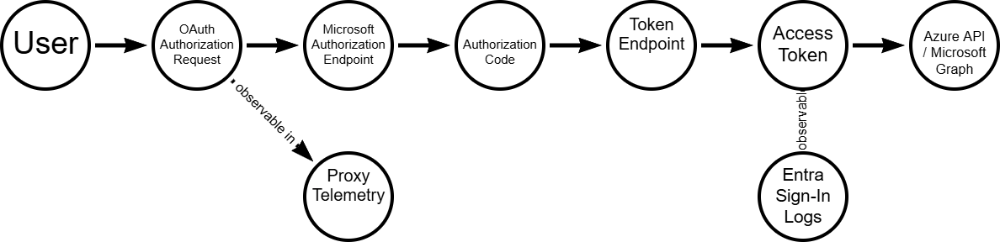

# OAuth Authorization Code Phishing

## Metadata

| Key          | Value             |
| ------------ | ----------------- |
| ID           | TRR0000           |
| External IDs | [T1528]           |
| Tactics      | Credential Access |
| Platforms    | Azure             |
| Contributors | Kyle Barboza      |


## Technique Overview


OAuth authorization code phishing is a technique where an attacker abuses the
OAuth authorization code flow to obtain authorization codes generated during a
legitimate authentication process. In Microsoft Entra ID environments, an
attacker can craft a malicious authorization request and distribute it through
phishing or social engineering to convince a victim to initiate the OAuth
authentication flow. 


After the victim successfully authenticates and grants consent, the identity
provider issues an authorization code and redirects the user’s browser to the
specified redirect URI. If the attacker obtains this authorization code before
it is redeemed by the intended client application, they can exchange it at the
token endpoint to obtain an access token representing the victim’s identity,
allowing access to APIs and services such as Microsoft Graph or Azure Resource
Manager depending on the granted permissions.

## Technical Background


### OAuth

OAuth is a foundational protocol used by modern identity platforms to enable
**secure authorization between users and applications**. It allows a user to
grant an application limited access to resources without sharing credentials
directly with the application.

Instead of providing a password, the identity provider authenticates the user
and issues **tokens that represent the user’s authorized permissions**. These
tokens can then be used by the application to access APIs on behalf of the user.

In Microsoft Entra ID environments, OAuth is commonly used to authorize
applications to access services such as:

- Microsoft Graph
- Azure Resource Manager
- Exchange Online
- SharePoint

This model allows applications to access resources while authentication and
authorization decisions remain centralized within the identity provider.

---

### OAuth Authorization Code Flow

One of the most common OAuth implementations is the **Authorization Code Flow**.
This flow is designed for applications that can securely perform server-side
communication with the identity provider.

In this model, the client application redirects the user to the identity
provider for authentication. After the user successfully authenticates and
grants consent, the identity provider issues a temporary **authorization code**.
The client application then exchanges this code for an **access token**.

```
User
  │
  │ Authorization Request
  ▼
Authorization Endpoint
  │
  │ generates
  ▼
Authorization Code
  │
  │ redeemed
  ▼
Token Endpoint
  │
  │ issues
  ▼
Access Token
  │
  │ used to call
  ▼
API (Graph / Gmail / Slack)
```

The authorization code is designed to be **short-lived** and is intended to be
redeemed only by the client application that initiated the request.

---

### Authorization Endpoint

The authorization flow begins when the client application directs the user’s
browser to the identity provider’s **authorization endpoint**.

In Microsoft Entra ID, this endpoint typically appears as:

```
https://login.microsoftonline.com/{tenant}/oauth2/v2.0/authorize
```

The authorization request contains several parameters that define the request:

- `client_id` – identifies the requesting application
- `redirect_uri` – the location where the authorization code will be sent
- `response_type` – specifies the requested OAuth response (such as `code`)
- `scope` – defines the permissions being requested
- `state` – a client-provided value used to maintain request integrity

An example authorization request may appear as follows:

```
https://login.microsoftonline.com/common/oauth2/v2.0/authorize
?client_id=9bc3ab49-b65d-410a-85ad-de819febfddc
&response_type=code
&redirect_uri=http://localhost:3000/
&response_mode=query
&scope=https://management.azure.com/.default
&state=12345
```

After the user authenticates and grants consent, the identity provider redirects
the browser to the specified `redirect_uri`, including the authorization code as
a parameter.

---

### Redirect URI Behavior

The **redirect URI** defines where the authorization server sends the
authorization code after authentication.

The authorization code is delivered through a browser redirect and typically
appears in the query parameters of the redirected URL.

Example:

```
https://application.example.com/callback?code=AUTHORIZATION_CODE
```

The client application is expected to receive this authorization code and
immediately exchange it with the identity provider's token endpoint.

In some cases, redirect URIs may reference local addresses such as:

```
http://localhost:3000/
```

When the redirect URI points to a local host that is not actively running the
client application, the OAuth authorization flow cannot complete normally.
However, the identity provider may still generate the authorization code and
include it in the redirected URL.

This behavior can expose the authorization code within the browser session prior
to it being redeemed by a client application.

---

### Token Exchange

Once the client receives the authorization code, it sends a request to the
identity provider’s **token endpoint** to exchange the code for an access token.

In Microsoft Entra ID, the token endpoint typically appears as:

```
https://login.microsoftonline.com/{tenant}/oauth2/v2.0/token
```

If the request is valid, the identity provider issues an **access token**
representing the authenticated user and the permissions granted during the
authorization request.

The client application can then use this token to access APIs such as Microsoft
Graph.

---

### First-Party Applications

Microsoft Entra ID includes a number of first-party applications, which are
applications developed and maintained by Microsoft.

These applications are often pre-registered and inherently trusted within
enterprise environments. Because of this, they typically already have
established permissions and do not require the same user consent experience as
newly registered third-party applications.

In the context of this technique, first-party applications play a critical role
by removing the need for a traditional consent prompt. Instead of convincing a
user to approve a malicious application, an attacker can leverage an existing
trusted application and initiate the OAuth authorization flow directly.

As a result, the interaction appears legitimate, and the user is not presented
with a suspicious consent screen. This allows the attack to bypass the consent
phase entirely and focus on capturing the authorization code during the
authentication process.

Understanding the behavior and trust model of first-party applications is
important when analyzing OAuth authorization patterns within Microsoft Entra ID
environments, as they can be leveraged to make malicious activity appear
indistinguishable from normal authentication flows.


## Procedures

| ID            | Title      | Tactic            |
| ------------- | ---------- | ----------------- |
| TRR0000.AZR.A | Authorization Code Collection via Social Engineering (ConsentFix) | Credential Access |

### Procedure A: Authorization Code Collection (ConsentFix)

In this procedure, the attacker abuses the OAuth authorization code flow by
manipulating the authorization request and redirect behavior in order to obtain
the authorization code generated during the authentication process.

The attacker crafts an OAuth authorization request directed at the Microsoft
identity platform authorization endpoint. This request contains parameters
defining the client application, requested scopes, and the redirect URI where
the authorization code will be returned.

Example authorization request:

```
https://login.microsoftonline.com/common/oauth2/v2.0/authorize  
?client_id=9bc3ab49-b65d-410a-85ad-de819febfddc  
&response_type=code  
&redirect_uri=http://localhost:3000/  
&response_mode=query  
&scope=https://management.azure.com/.default  
&state=12345
```

The attacker then delivers this request to the victim through a phishing page or
other social engineering technique designed to encourage the victim to initiate
the OAuth authentication process.

When the victim follows the link, the identity provider (IdP) processes the
authorization request and prompts the user to authenticate. Upon successful
authentication and consent, the IdP generates an authorization code and
redirects the browser to the specified redirect URI.

The attacker intentionally specifies a redirect URI that points to a local or
unreachable destination (such as localhost). Because no legitimate client
application is available to receive and redeem the authorization code, the OAuth
flow cannot complete as intended.

However, the redirect still occurs, and the authorization code is included in
the URL returned to the browser.

Example redirect:

`http://localhost:3000/?code=AUTHORIZATION_CODE`

At this stage, the authorization code is exposed within the browser context. The
attacker then uses social engineering to convince the victim to copy and share
the URL or the authorization code itself, often under the pretense of
troubleshooting or completing the sign-in process.

Once the attacker obtains the authorization code, they redeem it at the token
endpoint of the IdP. The IdP validates the authorization code and, if valid,
issues an access token representing the victim’s identity and granted
permissions.

The attacker can then use this access token to access protected resources and
APIs, depending on the scopes granted during the authorization process.

#### Detection Data Model



Detection opportunities for this technique are limited because much of the OAuth
authorization flow occurs within trusted Microsoft identity infrastructure. One
potential observation point is network or proxy telemetry capturing requests to
the Microsoft authorization endpoint. Although these requests often appear
legitimate, a notable indicator may be the presence of `localhost` within the
`redirect_uri` parameter of the OAuth authorization request, which is uncommon
for most production applications.

This signal may be more meaningful when correlated with Microsoft Entra ID
sign-in telemetry, such as events recorded in `NonInteractiveUserSignInLogs`.
Following a suspicious authorization request, defenders may observe a token
issuance or application sign-in event associated with the same application
identifier present in the request. These events may originate from an unexpected
IP address, device context, or location compared to the user’s normal
authentication patterns, particularly if the authorization code is redeemed from
a different environment than the one used during the initial authentication.

## Available Emulation Tests

| ID            | Link |
| ------------- | ---- |
| TRR0000.WIN.A |      |


## References

- [Push Security - ConsentFix][push-consentfix]
- [NVISO - ConsentFix][nviso-consentfix]
- [RFC 6819][rfc6819]
- [Microsoft - OAuth Redirection][microsoft-oauth]
- [John Hammond - ConsentFix Video Walkthrough][hammond-video]

[push-consentfix]: https://pushsecurity.com/blog/consentfix
[nviso-consentfix]:
  https://blog.nviso.eu/2026/01/29/consentfix-a-k-a-authcodefix-detecting-oauth2-authorization-code-phishing/
[rfc6819]: https://datatracker.ietf.org/doc/html/rfc6819#section-4.4.1.5
[microsoft-oauth]:
  https://www.microsoft.com/en-us/security/blog/2026/03/02/oauth-redirection-abuse-enables-phishing-malware-delivery/
[hammond-video]: https://www.youtube.com/watch?v=AAiiIY-Soak