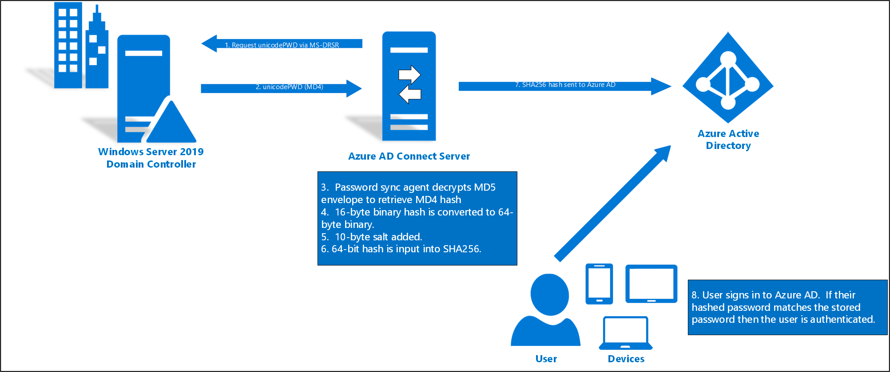
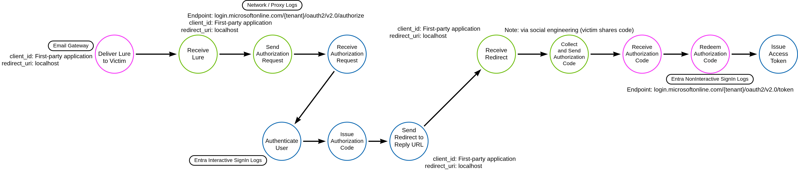
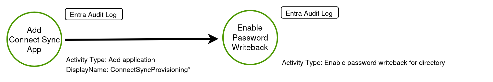

# Password Hash Synchronization: Microsoft Entra ID

## Metadata

| Key          | Value                         |
|--------------|-------------------------------|
| ID           | TRR0000                       |
| External IDs | [T1556.007]                   |
| Platforms    | Active Directory, IaaS        |
| Contributors | Logan Darger                  |

## Technique Overview

Adversaries may patch, modify, or otherwise backdoor cloud authentication 
processes that are tied to on-premises user identities in order to bypass 
typical authentication mechanisms, access credentials, and enable persistent 
access to accounts. This attack primarily targets environments utilizing Hybrid 
Identity—a setup where local Active Directory (AD) credentials and attributes 
are synchronized with a cloud identity platform. Adversaries who successfully 
compromise the synchronization mechanism can gain access to core credential 
material—namely password hashes—which allows them to bypass traditional 
authentication safeguards and establish persistent access. [^1]

## Technical Background

Password Hash Synchronization (PHS) is a critical process for enabling hybrid 
identity by synchronizing a hash of a user's passwords from on-premise data 
sources to a cloud-based directory service. This allows users to sign in using 
the same credentials across both local and cloud resources. PHS involves a 
privileged agent taking password hashes and synchronizing them from the 
on-premises environment to the cloud environment, usually through a multi-step 
process. In Entra ID hybrid environments, this privileged agent is [Microsoft 
Entra Connect Sync] (previously known as [Azure AD Sync]). Entra Connect Sync 
can be connected to any data repositories that organize its data in a 
database-like format and that provides standard data-access methods though only 
Active Directory and Entra ID are relevant to this proceedure set as connected 
data sources. [^2] The sync service itself consists of two components: the 
on-premises Microsoft Entra Connect Sync component and the service side in 
Microsoft Entra ID called Microsoft Entra Connect Sync service [^3].

### Connector Agent Configuration

Password hash sync is the recommended method of hybrid authentication for single 
forest/single Entra tenant environments and is configured within Microsoft Entra 
Connect Sync. Though it is possible to install the sync engine directly on an 
Active Directory DC, best practice documentation recommends that it be installed 
on a separate, domain joined machine. Entra Connect Sync can be installed either 
via express settings or custom installation, with the express settings option 
supporting only the single forest/single tenant topology. Regardless of the 
method chosen, there are three accounts that are required for the PHS process to 
function. These accounts are created by the Entra Connect Sync install wizard at 
setup time:

| Account                           | Purpose
|-----------------------------------| ------------------------------------|
| [AD DS Connector account]           | Used to read and write information to 
Windows Server AD by using Active Directory Domain Services (AD DS). |
| [ADSync service account]            | Used to run the sync service and access 
the SQL Server database. |
| Microsoft Entra Connector account | Used to write information to Microsoft 
Entra ID. |

It should be noted that in order to apply the correct permissions to the 
accounts for PHS functionality, creation of the AD DS Connector account requires 
an Enterprise Administrator at setup. The AD DS Connector account name is always 
prefixed with `MSOL_` and is created with a long, complex password that doesn't 
expire. [^4]

When password hash sync features are enabled for the first time, the agent 
performs an initial synchronization of the passwords of all in-scope users. 
Furthermore, while environments with multiple connectors may disable password 
hash sync for some connectors but not others, it is not possible to explicitly 
define a subset of user passwords that you want to synchronize. After initial 
configuration of the sync engine, the agent will automatically request hashes 
from the domain controller every two minutes. This sync is one way: when a 
password is synchronized, it overwrites existing cloud passwords but cloud 
passwords are not automatically sync with the on-premise domain controller 
(though there are indirect exceptions to this). The synchronization of a 
password has no impact on a user that is currently signed in—if a password 
change is synchronized while a user is signed in to a cloud service, that user's 
current session remains unaffected. 

### PHS Synchronization Flow

The PHS process involves a multi-stage transfer of credential data:

1. Every two minutes, the password hash synchronization agent on the AD Connect 
server requests stored password hashes (the `unicodePwd` attribute) from a DC. 
This request is via the standard Directory Replication Service Remote Protocol 
([MS-DRSR]) used to synchronize data between DCs.
2. The DC encrypts the MD4 password hash by using a key that is a MD5 hash of 
the Remote Procedure Call (RPC) session key and a salt. It then sends the result 
to the password hash synchronization agent over RPC.
3. After the password hash synchronization agent has the encrypted envelope, it 
uses MD5CryptoServiceProvider and the salt to generate a key to decrypt the 
received data back to its original MD4 format.
4. The password hash synchronization agent expands the 16-byte binary password 
hash to 64 bytes
5.  Adds a per user salt, consisting of a 10-bytes.
6. The password hash synchronization agent then combines the MD4 hash plus the 
per user salt, and inputs it into the PBKDF2 function.
7. The password hash synchronization agent takes the resulting 32-byte hash, 
concatenates both the per user salt and the number of SHA256 iterations to it 
then transmits the string over TLS.
8. When a user attempts to sign in to Microsoft Entra ID and enters their 
password, the password is run through the same MD4+salt+PBKDF2+HMAC-SHA256 
process and attempts to match the hash stored in Entra ID

The process relies heavily on the MS-DRSR replication protocol to access the 
[unicodePwd] attribute—the physical location where the password hash is stored 
in Active Directory. Additionally, to execute this retrieval, the dedicated AD 
DS Connector account must be granted elevated permissions on the local Domain 
Controllers. These include the `Replicate Directory Changes` and `Replicate 
Directory Changes All` rights available to the Connector account by default upon 
installation (Note that these privileges can persist even if PHS is disabled).

### Softmatching and Password Writeback

While PHS is designed as a one way operation (on-prem hashes are only 
automatically synced to Entra ID and not vice-versa), it is nevertheless 
possible to utilize Entra Connect Sync to return passwords of cloud users 
through indirect means with softmatching and password writeback. When you start 
synchronizing with Microsoft Entra Connect, the Microsoft Entra service API 
checks every new incoming object and tries to find an existing object to match. 
There are three attributes used for this process: userPrincipalName, 
proxyAddresses, and sourceAnchor/immutableID. A match on userPrincipalName or 
proxyAddresses is known as a "soft match."[^5] It is possible for administrators 
to block soft matching by enabling the `BlockSoftMatch` feature within their 
tenant. 

Microsoft Entra self-service password reset (SSPR) is a feature that allows 
users to reset their passwords or unlock their accounts using a web browser. If 
this feature is configured, it is possible to enable password writeback within 
Entra Connect Sync to maintian password consistency across a hybrid 
environment.[^6] As described in more detail below, by using these two feature 
in conjuction, it is possible for an attacker to retrieve the hashes of cloud 
users to a rogue domain controller.

## Proceedures
| ID            | Title                           | Tactic            |
|---------------|---------------------------------|-------------------|
| TRR0000.AZR.A | Entra Connect Sync: Rogue Cloud | Credential Access |
| TRR0000.AZR.B | Entra Connect Sync: Rogue DC    | Credential Access | 

### Proceedure A: Entra Connect Sync: Rogue Cloud

If an attacker has gained enterprise administrator credential material, they can 
leverage this to create an Entra Connect Sync server connected to an attacker 
controlled cloud environment as a means of exfiltrating user password hashes 
from the environment. 

As most logging regarding the connection of the sync server is stored in either 
the sync server itself or the entra environment, the only consistent way of 
monitoring this activity is through user account creation events (4720) within 
the Windows Security Audit logs of the victim DC. The account name for this 
event is prefixed with `MSOL_`. This is always the naming convention used for AD 
DS Connector accounts created during the installation of the sync server

### Proceedure B: Entra Connect Sync: Rogue DC

An attacker that obtains hybrid administrator credential material of an Entra 
environment is able to use this to connect a cloud environment to a rogue domain 
controller. By enabling password writeback, the attacker can softmatch user 
principals in the rogue domain and require the user to reset their password at 
next login. If SSPR is configured, the new user created password is then synced 
back to the rogue DC. 

There are two distinct events depicting this activity within the Entra Audit 
logs. The first is Activity Type `Add Application` in which the DisplayName 
field begins with `ConnectSyncProvisioning`. The second event is the Activity 
Type of `Enable password writeback for directory` which is a required step in 
order to retrieve passwords from the cloud environment.

## References

- [Password hash synchronization with Microsoft Entra ID] 
- [AAD Attack Paths]
- [Entra ID Lateral Movement]
- [Microsoft Entra Connect Sync Service Manager]

[Password hash synchronization with Microsoft Entra ID]: https://learn.microsoft.com/en-us/entra/identity/hybrid/connect/how-to-connect-password-hash-synchronization
[AAD Attack Paths]: https://guardsix.com/blog/compromises-in-azure-ad-through-aad-connect
[Entra ID Lateral Movement]: https://dirkjanm.io/assets/raw/US-25-Mollema-Advanced-AD-to-Entra-ID-lateral-movement-techniques-final.pdf
[Microsoft Entra Connect Sync Service Manager]: https://docs.azure.cn/en-us/entra/identity/hybrid/connect/how-to-connect-sync-service-manager-ui-connectors

[T1556.007]: https://attack.mitre.org/techniques/T1556/007/
[Microsoft Entra Connect Sync]: https://learn.microsoft.com/en-us/entra/identity/hybrid/connect/how-to-connect-sync-whatis
[Azure AD Sync]: https://blog.quest.com/understanding-azure-ad-sync-an-overview-of-azure-ad-connect-sync-and-cloud-sync/
[AD DS Connector account]: https://learn.microsoft.com/en-us/entra/identity/hybrid/connect/how-to-connect-configure-ad-ds-connector-account
[ADSync service account]: https://learn.microsoft.com/en-us/entra/identity/hybrid/connect/concept-adsync-service-account
[unicodePwd]: https://learn.microsoft.com/en-us/openspecs/windows_protocols/ms-adts/6e803168-f140-4d23-b2d3-c3a8ab5917d2]
[MS-DRSR]: https://learn.microsoft.com/en-us/openspecs/windows_protocols/ms-drsr/f977faaa-673e-4f66-b9bf-48c640241d47
[^1]: https://www.redfoxsec.com/blog/azure-hybrid-identity-attacks
[^2]: https://learn.microsoft.com/en-us/entra/identity/hybrid/connect/concept-azure-ad-connect-sync-architecture
[^3]: https://learn.microsoft.com/en-us/entra/identity/hybrid/connect/how-to-connect-syncservice-features
[^4]: https://learn.microsoft.com/en-us/entra/identity/hybrid/connect/reference-connect-accounts-permissions
[^5]: https://learn.microsoft.com/en-us/entra/identity/hybrid/connect/how-to-connect-install-existing-tenant
[^6]: https://learn.microsoft.com/en-us/entra/identity/authentication/tutorial-enable-sspr-writeback
