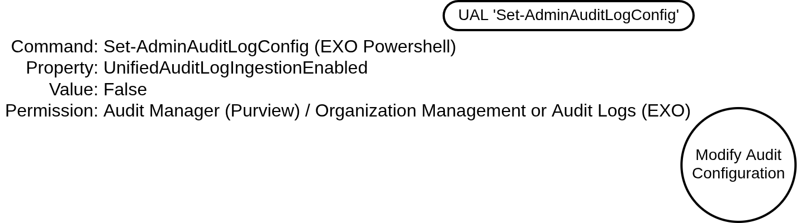
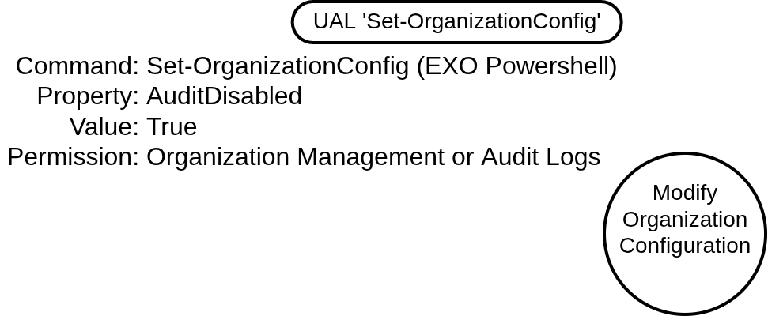
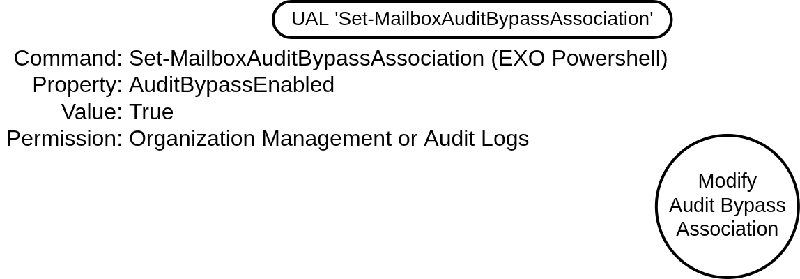
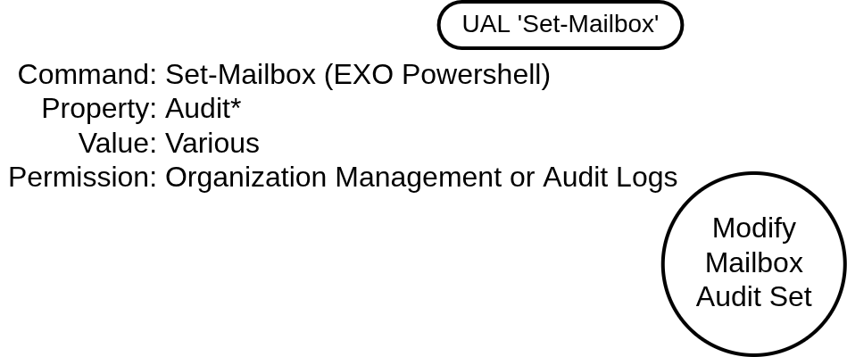
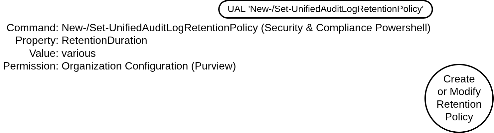

# Disable or Modify Cloud Logs (Microsoft 365)

## Metadata

| Key          | Value                                |
|--------------|--------------------------------------|
| ID           | TRR0000                              |
| External IDs | [T1562.008]                          |
| Tactics      | Defense Evasion                      |
| Platforms    | Microsoft 365                        |
| Contributors | Andrew VanVleet                      |

### Scope Statement

This TRR covers procedures to disable or modify cloud logging from Microsoft 365
(M365) workloads. It corresponds to MITRE ATT&CK technique T1562.008 (Impair Defenses: Disable or Modify Cloud Logs) as it pertains to Microsoft 365.

The following elements are out of scope for this TRR:

- Azure and Entra ID logging (diagnostic settings for Entra activity logs and
  the Azure Activity Log) are covered in a separate TRR.
- Per-workload audit controls for workloads other than Exchange. Power BI/Fabric
  and Dynamics 365/Dataverse expose their own source-level audit settings, but
  they are noted only for completeness and are not developed as procedures.
- The log destinations and their consumers (a SIEM ingesting via the Office 365
  Management Activity API, exported archives).

## Technique Overview

Cloud platforms record administrative and user activity in logs that are
frequently the only forensic record available to defenders, because there is no
underlying host or disk to inspect. In Microsoft 365, auditable events from
every workload — Exchange Online, SharePoint, OneDrive, Teams, a subset of Entra
logs, and others — are federated into a single tenant-wide store, call the
"unified audit log" (UAL). By disabling or modifying these logs, an attacker
reduces the evidence trail of their other activity, delaying or preventing
detection and complicating any subsequent investigation.

## Technical Background

### The Microsoft 365 Audit Logging Model

Auditing in Microsoft 365 can be understood as a pipeline with four layers.
Understanding which layer a technique targets is essential to understanding both
its effect and its observability.

1. **Workload event generation.** Each workload emits auditable events. For most
   workloads (SharePoint, OneDrive, Teams), generation is governed only by the
   tenant-wide ingestion switch at layer 2. There is no separate per-workload
   control: if the UAL is enabled, these workloads will record events. Exchange
   mailbox auditing is the significant exception: it is a workload-level feed
   with its own controls that determine whether mailbox actions are emitted to
   the UAL.

2. **UAL ingestion.** A single organization-wide switch,
   `UnifiedAuditLogIngestionEnabled`, governs whether any event from any
   workload is written to the UAL. This is the auditing master control for all
   M365 workloads.

3. **UAL store and retention.** Written records persist in the UAL for a period
   of time governed by `retention policies`. The records themselves are
   immutable, but the policies that determine how long they are kept can be
   modified.

4. **Access and export.** This layer includes various means for users to access
   and exports logs from the UAL (discussed in more detail in the next section).

The procedures in this TRR target layers one through three. Procedure A targets
the layer 2 master switch, procedures B, C, and D target the layer 1 Exchange
mailbox auditing feed, and procedure E targets the layer 3 retention period.

### The Unified Audit Log

The UAL is the single tenant-wide log into which auditable events from all
Microsoft 365 workloads are federated. The log contains events recording
activity from both the control plane (configuration changes across workloads)
and the data plane (data access such as mail being read or files downloaded)

The UAL can be accessed five ways:

- **Purview Audit portal.** The interactive audit log search tool in the
  Microsoft Purview portal (`purview.microsoft.com`) lets an operator search by
  activity, user, and date range and export the results to CSV.

- **Defender portal Audit page.** The Microsoft Defender portal
  (`security.microsoft.com`) exposes the identical search experience as the
  Purview audit portal, just reached through a different portal.

- **Search-UnifiedAuditLog cmdlet.** The Exchange Online PowerShell cmdlet that
  underlies the portal search tool, and the long-standing scripting interface for
  querying the UAL.

- **Purview Audit Search Graph API.** A Microsoft Graph API (the `auditLogQuery`
  endpoint) that programmatically runs asynchronous audit searches and retrieves
  the results, mirroring the Purview portal's background-search model. Microsoft
  positions it as the successor to `Search-UnifiedAuditLog` and encourages
  callers to migrate to it.[^2]

- **Office 365 Management Activity API.** A pull-based REST API that consumers
  subscribe to by content type (for example `Audit.Exchange`,
  `Audit.SharePoint`, and `Audit.General`).[^1] It is the standard mechanism for
  streaming UAL events into an external SIEM.

All five surfaces read from the same underlying UAL store, so they go dark
together when UAL ingestion is disabled. Whether any event reaches the UAL is
governed by the layer 2 `UnifiedAuditLogIngestionEnabled` switch, controlled via
the `Set-AdminAuditLogConfig` cmdlet. Although this is an Exchange Online
Powershell cmdlet, the switch is tenant-wide and governs all workloads, not only
Exchange.

Beyond these direct access surfaces, there are a number of downstream consumers
that pull UAL data via one of the direct surfaces— principally the Management
Activity API. These include SIEM connectors such as the Microsoft Sentinel
Microsoft 365 connector (pulling Exchange, SharePoint, and Teams logs) and the
Microsoft Defender XDR `CloudAppEvents` table (populated by Microsoft Defender
for Cloud Apps).

### Exchange Online Mailbox Auditing

Mailbox auditing is the workload-level feed that emits per-mailbox actions
according to the sign-in type: owner, delegate, and administrator. Actions
logged include `MailItemsAccessed`, `HardDelete`, `SoftDelete`, `Send`, and
`FolderBind`. Mailbox auditing is on by default and the feed has three control
points in Exchange Online:

- **Organization-wide** (`Set-OrganizationConfig -AuditDisabled $true`): the
  master override for the mailbox audit feed across the tenant.
- **Per-principal bypass** (`Set-MailboxAuditBypassAssociation`): exempts actions
  performed *by* the named principal from being audited in any mailbox they
  touch.
- **Per-mailbox audited action set** (`Set-Mailbox -AuditOwner/-AuditDelegate/`
  `-AuditAdmin`): defines which actions are audited for each logon type.
  Microsoft maintains a `DefaultAuditSet`, which is collection of events that
  will be audited for each logon type by default. Customizing the logged action
  set for a logon type removes  it from the `DefaultAuditSet` and ends
  Microsoft's automatic management of it. Any newly released events must be
  added to the custom set manually. An attacker can therefore create a custom
  set to remove high-value actions while auditing still reports as enabled.

#### Mailbox Auditing Architecture Changes

Historically, Exchange stored audit log entries in a hidden folder within each
individual mailbox. As of March 1, 2025 mailbox audit data is no longer written
to the mailbox itself but is ingested by the unified audit service.[^3] As a
result, the previous per-mailbox `AuditEnabled` property is overridden by the
organization default. Addtionally, the per-mailbox `AuditLogAgeLimit` parameter
is also ignored. (Both properties could be set via the `Set-Mailbox` cmdlet.)
These previous procedures are now nonfunctional.

> [!NOTE]
>
> This TRR addresses procedures to tamper with or disable mailbox auditing
> because mailbox data is a frequent target for attackers. Aside from Exchange,
> most M365 workloads (SharePoint, OneDrive, Teams) have no separate
> per-workload ingestion control — their events flow to the UAL whenever the
> master ingestion switch is on. A few additional M365 workloads do expose their
> own settings that can suppress those workloads' events at the source, most
> notably Power BI/Fabric (offering a tenant audit setting) and Dynamics
> 365/Dataverse (offering per-environment and per-table auditing). These
> per-workload controls are noted here for completeness but will not be
> addressed in depth in this TRR.

### Audit Retention

UAL records persist for a retention period that varies based on license. For
`Audit Standard`, the default is 180 days. For users with an E5 or equivalent
license (`Audit Premium`), Exchange, SharePoint, OneDrive, and Entra ID records
are retained one year by default and all other records 180 days. Custom policies
can extend retention up to ten years. Retention is configured with the `New-`,
`Set-`, and `Remove-UnifiedAuditLogRetentionPolicy` cmdlets in `Security &
Compliance PowerShell` or through the Purview portal. A tenant can have up to 50
custom policies, and any custom policy takes priority over the default. Reducing
a policy's retention duration or creaing a short-duration custom policy can
accelerate the deletion of records. Creating or modifying a retention policy
requires the Organization Configuration role in Purview.

### Telemetry

The act of disabling or modifying the audit configuration is itself an auditable
event. Each of the administrative operations in this TRR —
`Set-AdminAuditLogConfig`, `Set-OrganizationConfig`,
`Set-MailboxAuditBypassAssociation`, `Set-Mailbox`, and the retention-policy
cmdlets — is written to the UAL, provided ingestion is active at the moment it
runs.

## Procedures

| ID             | Title                                   | Tactic          |
|----------------|-----------------------------------------|-----------------|
| TRR0000.M365.A | Disable Unified Audit Log Ingestion     | Defense Evasion |
| TRR0000.M365.B | Disable Mailbox Auditing (Org Wide)     | Defense Evasion |
| TRR0000.M365.C | Bypass Mailbox Auditing (Per Principal) | Defense Evasion |
| TRR0000.M365.D | Reduce Mailbox Audited Actions (Per Mailbox) | Defense Evasion |
| TRR0000.M365.E | Reduce Audit Log Retention              | Defense Evasion |

### Procedure A: Disable Unified Audit Log Ingestion

An attacker holding the Audit Manager role (Purview) or the Audit Logs or
Organization Management roles (Exchange Online) can set
`UnifiedAuditLogIngestionEnabled` to `false` via `Set-AdminAuditLogConfig`. This
is the master switch: once ingestion is disabled, no new events from any
workload are written to the UAL. Existing records remain in the store and age
out according to retention.

#### Detection Data Model



### Procedure B: Disable Mailbox Auditing (Org Wide)

An attacker holding the Organization Management or Audit Logs role sets
`AuditDisabled` to `$true` via `Set-OrganizationConfig`, which turns off
Exchange mailbox auditing across the tenant. Unlike Procedure A, this affects
only mailbox audit events; events from other workloads continue to flow to the
UAL.

#### Detection Data Model



### Procedure C: Bypass Mailbox Auditing (Per Principal)

An attacker holding the Organization Management or Audit Logs role sets
`AuditBypassEnabled` to `True` for a specific identity via
`Set-MailboxAuditBypassAssociation`. A bypass association exempts the identity
from generating mailbox audit records. Critically, the bypass is keyed on the
actor performing the action, not the mailbox being acted upon: once a principal
is bypassed, *any* action it performs in *any* mailbox goes unaudited, while
auditing continues normally for every other principal, including in those same
mailboxes. The feature exists so that high-volume service accounts (journaling,
archiving, e-discovery, migration) do not flood the audit log with low-value
noise.

Relative to Procedure B, this narrows the suppression from the whole tenant to
a single principal, which makes it less conspicuous: ingestion remains on,
mailbox auditing remains on, and every other account is fully logged, while the
attacker-controlled principal operates in a blind spot.

#### Detection Data Model



### Procedure D: Reduce Mailbox Audited Actions (Per Mailbox)

An attacker holding the Organization Management or Audit Logs role can remove
actions from a mailbox's audited action set for one or more logon types.
Auditing for the mailbox continues to report as enabled, but the removed actions
— for example `MailItemsAccessed` or `HardDelete` — are no longer recorded.
Relative to Procedures B and C, this is the most surgical of the mailbox-audit
procedures: it reduces *which* actions are recorded rather than disabling the
feed or exempting a principal.

Exchange Online allows administrators to configure what set of [auditable
actions] will be logged for indvidual mailboxes in the tenant. This
configuration is defined separately for each type of mailbox logon:

- **Owner**: the user to whom the mailbox belongs
- **Admin**: the mailbox is accessed by administrative tools like eDiscovery,
  the Exchange MAPI Editor, or an application or user with permissions to
  impersonate (act on behalf of) the user.
- **Delegate**: the mailbox is accessed by a user with *SendAs*, *SendOnBehalf*,
  or *FullAccess* delegation permissions.

The audit set is defined via `Set-Mailbox` using a per-mailbox property for each logon type:

- `AuditOwner`
- `AuditAdmin`
- `AuditDelegate`

There is a Microsoft-managed set of actions that are audited by default for each
sign-in type. When Microsoft creates a new action, it might be added to the
default set and begin to log automatically. However, if the mailbox settings
have been changed from the default, all new actions will need to be manually
added to the audit set for each mailbox. The `DefaultAuditSet` property
identifies whether a sign-on type is using the Microsoft-managed defaults or a
custom audit set.

As an example, a mailbox configuration with Admin and Delegate on the default
configuration and Owner on a custom configuration will have the following
configuration:

```text
AuditOwner       :  {Update, MoveToDeletedItems, MailItemsAccessed...}
DefaultAuditSet  :  {Admin, Delegate}
```

#### Example of Modifying Mailbox Auditing Actions

There are many changes to the audited action set that could result in an overall
decrease in auditing. An attacker could remove specific actions or overwrite the
current set (default or custom) with a reduced custom set.

Following is an example of both of these options. The example adds actions
to `AuditOwner`, removes other actions from `AuditOwner`, and overwrites actions
for `AuditDelegate` with a reduced set. The resultant values are shown from
Powershell and in the `Parameters` field of the log recording the command (the
`Parameters` field captures the parameters provided to the `Set-Mailbox`
cmdlet).

```powershell
PS> set-mailbox AdeleV -auditowner @{Add="ApplyRecord", "SoftDelete";
 Remove="Update","MoveToDeletedItems"} -auditdelegate "Update", "SendAs"
PS> get-mailbox AdeleV | fl *

<snip>
AuditAdmin : {Update, MoveToDeletedItems, SoftDelete, HardDelete...}
AuditDelegate : {Update, SendAs}
AuditOwner : {SoftDelete, Create, ApplyRecord}
DefaultAuditSet : {Admin}
```

Below is the value from the `Parameters` field of the log recording the above
command. A `+` or `-` preceding an action in the log indicate that the single
action was added or removed from the existing set. A value that has neither `+`
or `-` indicates that the provided set of values replaced the previous set. When
a set is overwritten, the old set is not included in the log.

```json
{
    "Parameters": [
        {
            "Name": "Identity",
            "Value": "AdeleV"
        },
        {
            "Name": "AuditOwner",
            "Value": "+ApplyRecord;+SoftDelete;-Update;-MoveToDeletedItems"
        },
        {
            "Name": "AuditDelegate",
            "Value": "Update;SendAs"
        }
    ]
}
---------------------------
```

#### Detection Data Model



### Procedure E: Reduce Audit Log Retention

An attacker holding the Organization Configuration role in Purview can reduce
how long records persist, either by shortening an existing retention policy's
duration (the `RetentionDuration` parameter) or by introducing a
short-duration policy with a higher priority than existing policies. These can be done using the `Set-` or `New-UnifiedAuditLogRetentionPolicy` cmdlets in Security & Compliance Powershell.

There are two notable boundaries on this procedure:

1. Retention cannot be reduced below 90 days: `RetentionDuration` is an
enumerated value whose smallest option is `ThreeMonths`. There is no shorter
duration and no zero value. The procedure can shrink the long-term record but
cannot delete recent records outright.

2. Retention governs only the searchable UAL store (the Purview and Defender
portals, `Search-UnifiedAuditLog`, and the Audit Search Graph API). It does not
affect events streamed via the Office 365 Management Activity API. The
management API makes content blobs available for a fixed seven-day window
independent of the retention policy.

#### Detection Data Model



## Available Emulation Tests

| ID             | Link |
|----------------|------|
| TRR0000.M365.A |      |
| TRR0000.M365.B |      |
| TRR0000.M365.C |      |
| TRR0000.M365.D |      |
| TRR0000.M365.E |      |

## References

- [Disable or Modify Cloud Logs - MITRE ATT&CK]
- [Manage mailbox auditing - Microsoft Learn]
- [Set-AdminAuditLogConfig - Microsoft Learn]
- [Search the audit log - Microsoft Learn]
- [Manage audit log retention policies - Microsoft Learn]
- [Learn about auditing solutions in Microsoft Purview - Microsoft Learn]
- [Turn auditing on or off - Microsoft Learn]
- [Set-MailboxAuditBypassAssociation - Microsoft Learn]
- [Audit log activities - Microsoft Learn]

[^1]: [Office 365 Management Activity API]
[^2]: [Microsoft Purview Audit Search Graph API - Microsoft]
[^3]: [Search-MailboxAuditLog Deprecation - Microsoft]

[T1562.008]: https://attack.mitre.org/techniques/T1562/008/
[Disable or Modify Cloud Logs - MITRE ATT&CK]: https://attack.mitre.org/techniques/T1562/008/
[Manage mailbox auditing - Microsoft Learn]: https://learn.microsoft.com/en-us/purview/audit-mailboxes
[Set-AdminAuditLogConfig - Microsoft Learn]: https://learn.microsoft.com/en-us/powershell/module/exchange/set-adminauditlogconfig
[Search the audit log - Microsoft Learn]: https://learn.microsoft.com/en-us/purview/audit-search
[Manage audit log retention policies - Microsoft Learn]: https://learn.microsoft.com/en-us/purview/audit-log-retention-policies
[Learn about auditing solutions in Microsoft Purview - Microsoft Learn]: https://learn.microsoft.com/en-us/purview/audit-solutions-overview
[Turn auditing on or off - Microsoft Learn]: https://learn.microsoft.com/en-us/purview/audit-log-enable-disable
[Set-MailboxAuditBypassAssociation - Microsoft Learn]: https://learn.microsoft.com/en-us/powershell/module/exchange/set-mailboxauditbypassassociation
[Audit log activities - Microsoft Learn]: https://learn.microsoft.com/en-us/purview/audit-log-activities
[Office 365 Management Activity API]: https://learn.microsoft.com/en-us/office/office-365-management-api/office-365-management-activity-api-reference
[Microsoft Purview Audit Search Graph API - Microsoft]: https://techcommunity.microsoft.com/blog/microsoft-security-blog/introducing-the-microsoft-purview-audit-search-graph-api/4115818
[Search-MailboxAuditLog Deprecation - Microsoft]: https://techcommunity.microsoft.com/blog/microsoft-security-blog/microsoft-exchange-online-search-mailboxauditlog-and-new-mailboxauditlogsearch-w/4366310
[auditable actions]: https://learn.microsoft.com/en-us/purview/audit-mailboxes#mailbox-actions-for-user-mailboxes-and-shared-mailboxes
