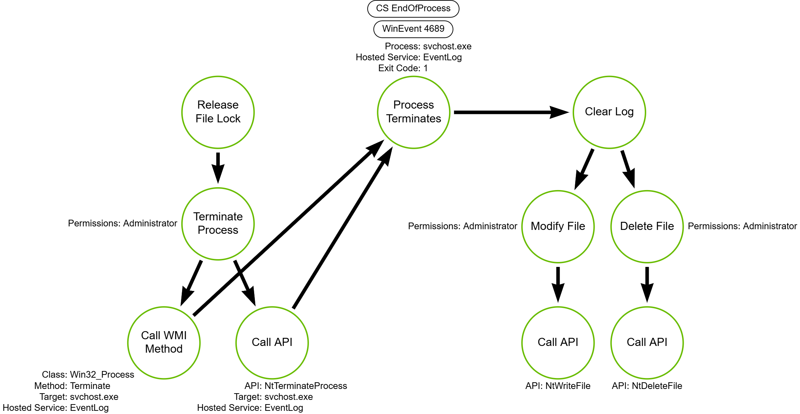

# Clearing Windows Event Logs

## Metadata

| Key          | Value                                      |
|--------------|--------------------------------------------|
| ID           | TRR0000                                    |
| External IDs | [T1070.001]                                |
| Tactics      | Defense Evasion                            |
| Platforms    | Windows                                    |
| Contributors | Andrew VanVleet, Miles Whittaker, Chris Hodson |

## Technique Overview

Event logs are a record of a events that have occurred on a machine and are an
important resource for system administrators, detection engineers, incident
responders, and anyone looking for insight into what activity has occurred on a
host. Adversaries may clear event logs in an attempt to hide activity from
system defenders.

Event logs can be cleared via multiple mechanisms, including `wevutil.exe`, the
event viewer GUI, and PowerShell. Administrative privileges are required for
these approaches.

## Technical Background

Windows has multiple system-defined event sources:

- `System` - The system log contains events that are logged by Windows system
  components. These events are predetermined by Microsoft.
- `Application` - The application log contains events that are logged by
  programs. Events that are written to the application log are determined by the
  developers of the software program.
- `Security` - The security log contains events such as valid and invalid logon
  attempts. It also contains events that are related to resource use, like when
  you create, open, or delete files. `Administrator` privileges are required to
  configure which events are recorded in the security log.
- Windows also collects Active Directory-related events in the `Directory
  Service` log, DNS server events in the `DNS Server` log, and file replication
  events in the `File Replication Service` log.

For more information on the contents, configuration, and security of these logs,
a great resource is the [Understanding the Windows Server Event Log] blog post.

### The EventLog Service

Event logs are written by a Windows service named `EventLog`, which is
implemented in the `wevtsvc.dll` library. By default, the `EventLog` service is
configured to start automatically when the operating system boots and runs
continuously until the system shuts down again. The `EventLog` service can't be
stopped because it's required by other services, and while it's running it holds
an exclusive lock on the event log files, preventing any other process from
reading or writing to them.[^1][^3]


Depending on the version of the Windows operating system, the `EventLog` service
might be hosted alongside other services in one of the `Local Service (Network
Restricted)` instances of `svchost.exe`, or it might be hosted in a
single-service `svchost.exe` process.[^4] You can determine which is the case by
looking at the command line of the `svchost.exe` process currently hosting the
`EventLog` service. If the command line reads only `-k
LocalServiceNetworkRestricted` then it's a shared process, and if it also
includes `-s EventLog` then it is a single-service process (the `-s` switch
indicates a single-service process).[^2] The following PowerShell script will
identify the process hosting the EventLog service:

```powershell
get-wmiobject -class win32_service -filter "name='eventlog'"

ExitCode  : 0
Name      : EventLog
ProcessId : 5244
StartMode : Auto
State     : Running
Status    : OK
```

### Event Log Files

By default, event log files use the `.evt` or `.evtx` file extension[^5] and are
located in the `%SystemRoot%\System32\winevt\Logs` folder. As noted above, under
normal operating conditions these logs will be locked from reading and writing
by any process except the EventLog service.

 Log file name and location information is stored in the registry key at
`HKEY_LOCAL_MACHINE\SYSTEM\CurrentControlSet\Services\EventLog`. You can modify
this information to change the default location of the log files. (For example,
organizations might move log files to another location if they require more disk
space for log data.) The `File` value holds the path to the file that will be
used to store events for each log. To change the location, the `File` value must
be modified to the new location and a new `Flags` value (type `DWORD`) needs to
be created and set to a value of `1`. At that point, the event logging service
will begin writing logs to the new location.[^1]

### Windows EventLog Remoting Protocols

Most event logging tasks are handled by the Windows `EventLog Remoting
Protocol.` This is a remote procedure call (RPC)–based protocol that exposes RPC
methods for reading events in both live event logs and backup event logs on
remote computers. This protocol also specifies how to get general information
for a log, such as the number of records in the log, oldest records in the log,
and if the log is full. It may be used for reading, backing up, and clearing
event logs. There are two versions of the protocol:

| RPC Interface | GUID                                 | Transport | Relevant Methods |
|---------------|--------------------------------------|-----------|------------------|
| [MS-EVEN]     | 82273fdc-e32a-18c3-3f78-827929dc23ea | `ncacn_np`: \PIPE\eventlog       | [ElfrClearELFW] (OpNum 0)<br>[ElfrClearELFA] (OpNum 12) |
| [MS-EVEN6]    | f6beaff7-1e19-4fbb-9f8f-b89e2018337c | `ncacn_ip_tcp`: dynamic endpoint | [EvtRpcClearLog] (OpNum 6)|

## Procedures

| ID                    | Title                             | Tactic            |
|-----------------------|-----------------------------------|-------------------|
| TRR0000.WIN.A         | Event Clearing via RPC Call       | Defense Evasion   |
| TRR0000.WIN.B         | Event Logging Process Termination | Defense Evasion   |
| TRR0000.WIN.C         | Event Log File Redirection        | Defense Evasion   |

### Procedure A: Event Clearing via RPC Call

Attackers can use any of the numerous built-in Windows tools for clearing event
logs. These include the PowerShell `Clear-EventLog` [cmdlet], the `wevutil.exe`
binary, WMI's [ClearEventLog] method, the [Windows Event Log API], and the Event
Viewer application. Generally, all event clearing tools use one of the `EventLog
Remoting Protocol` RPC interfaces. Attackers could also call the RPC interface
methods directly via their own tools or scripts.

#### Detection Data Model


The RPC methods for clearing event logs don't actually delete the log files,
they just overwrite the existing file with a new file that holds only the
standard event log file header.

### Procedure B: Event Logging Process Termination

An attacker can clear event logs by deleting or modifying the files directly,
but would first have to terminate the process that hosts the `EventLog`
service.[^3] They could then delete, truncate, or otherwise alter the event log
files. Windows will typically restart the logging service automatically a short
time after it has been terminated.

#### Detection Data Model



### Procedure C: Event Log File Redirection

Attackers wanting to conceal their activities from the event logs could modify
the registry key to redirect the logs prior to performing their intended
actions. When done, they could then restore the logs back to their standard
location. This causes the event logging service to close its handle to the
redirected log files, making it possible for the attacker to delete the files.
The end result is that the logs recording the activities they wish to conceal
are eliminated.

> [!NOTE]
>
> During our testing of this procedure, Windows never released the file handles
> to the event logs in the default location, even when the log files were being
> written to a new location. This prevented tampering with the logs in the
> standard files.

#### Detection Data Model


The operations in gray are optional: an attacker doesn't have to delete the
diverted log file, but can do so if they choose.

## Available Emulation Tests

| ID            | Link               |
|---------------|--------------------|
| TRR0000.WIN.A | [Atomic Tests 1-3] |
| TRR0000.WIN.B |                    |
| TRR0000.WIN.C |                    |

## References

- [Windows Event Logging]
- [Move Event Viewer Log Files]
- [Delete Corrupted Event Viewer Log Files]

[^1]: [Move Event Viewer Log Files]
[^2]: [Demystifying svchost.exe - Nasreddine Bencherchali]
[^3]: [Delete Corrupted Event Viewer Log Files]
[^4]: [Service host grouping]
[^5]: The `.evt` file extension is used for the older binary file format, and
    the `.evtx` file extension is used for the newer XML-based file format.

[T1070.001]: https://attack.mitre.org/techniques/T1070/001
[Move Event Viewer Log Files]: https://learn.microsoft.com/en-us/troubleshoot/windows-server/application-management/move-event-viewer-log-files
[Delete Corrupted Event Viewer Log Files]: https://learn.microsoft.com/en-us/troubleshoot/windows-server/application-management/delete-corrupt-event-viewer-log-files
[MS-EVEN]: https://learn.microsoft.com/en-us/openspecs/windows_protocols/ms-even/55b13664-f739-4e4e-bd8d-04eeda59d09f
[MS-EVEN6]: https://learn.microsoft.com/en-us/openspecs/windows_protocols/ms-even6/18000371-ae6d-45f7-95f3-249cbe2be39b
[ElfrClearELFW]: https://learn.microsoft.com/en-us/openspecs/windows_protocols/ms-even/9b7a5f23-0269-4ed7-85ad-a7087af66b44
[ElfrClearELFA]: https://learn.microsoft.com/en-us/openspecs/windows_protocols/ms-even/a982c2f3-66c5-49e2-90a8-c7665470b77b
[EvtRpcClearLog]: https://learn.microsoft.com/en-us/openspecs/windows_protocols/ms-even6/6286c156-2f70-4618-b876-09f60fb21a98
[Windows Event Logging]: https://learn.microsoft.com/en-us/windows/win32/eventlog/event-logging
[Demystifying svchost.exe - Nasreddine Bencherchali]: https://nasbench.medium.com/demystifying-the-svchost-exe-process-and-its-command-line-options-508e9114e747
[cmdlet]: https://learn.microsoft.com/en-us/powershell/module/microsoft.powershell.management/clear-eventlog?view=powershell-5.1
[Understanding the Windows Server Event Log]: https://techcommunity.microsoft.com/blog/itopstalkblog/understanding-the-windows-server-event-log/4417350
[Service host grouping]: https://learn.microsoft.com/nl-nl/windows/application-management/svchost-service-refactoring#separating-svchost-services
[ClearEventLog]: https://learn.microsoft.com/en-us/previous-versions/windows/desktop/eventlogprov/cleareventlog-method-in-class-win32-nteventlogfile
[Windows Event Log API]: https://learn.microsoft.com/en-us/windows/win32/api/winevt/nf-winevt-evtclearlog
[Atomic Tests 1-3]: https://github.com/redcanaryco/atomic-red-team/blob/master/atomics/T1070.001/T1070.001.md
