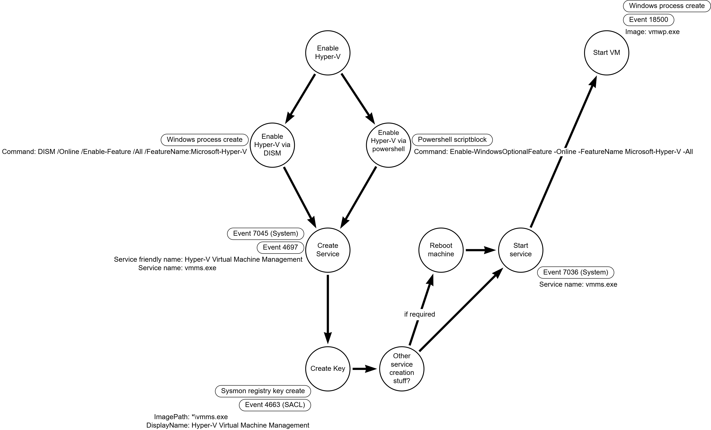
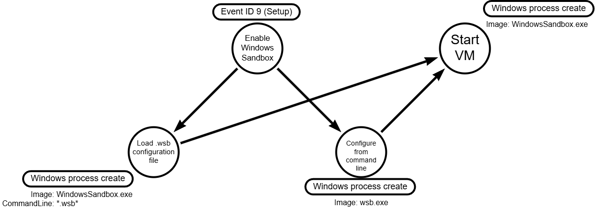

# TRR0000: Execute Malicious VM on Host

## Metadata

| Key          | Value                                      |
|--------------|--------------------------------------------|
| ID           | TRR0000                                    |
| External IDs | [T1564.006](https://attack.mitre.org/techniques/T1564/006/) |
| Tactics      | Defense Evasion, Persistence      |
| Platforms    | Windows                                    |
| Contributors | Jordan Anderson ([keepwatch](https://github.com/keepwatch)) |

## Technique Overview

This technique involves adversaries running malicious code inside a virtual machine (VM) on a compromised host. The primary goal is to isolate their malware from the host operating system, thereby blinding host-based security tools to the details of the malicious activity (which could include encrypting shared disks, establishing C2, local reconnaissance, etc.). 

Note that this ATT&CK technique contains multiple procedures without common operations/chokepoints. As a result, this TRR includes two known procedures (focused on native Windows features), but there are at least two more procedures possible:
- using a third-party hypervisor like VirtualBox
- using a third-party portable hypervisor like VMware Player (no installation required!)

## Technical Background

### Hyper-V details

#### Enable Hyper-V

There are two documented ways to enable Hyper-V, but the key is that they both require service changes, per [MSFT documentation](https://learn.microsoft.com/en-us/windows-server/virtualization/hyper-v/get-started/Install-Hyper-V?tabs=powershell&pivots=windows):

- `Enable-WindowsOptionalFeature -Online -FeatureName Microsoft-Hyper-V -All` (requires a reboot)
- `DISM /Online /Enable-Feature /All /FeatureName:Microsoft-Hyper-V` (this does not require a reboot)

Event ID 7045 is a log entry that indicates a new service has been installed on the system ([src](https://research.splunk.com/sources/614dedc8-8a14-4393-ba9b-6f093cbcd293/)).

#### Import VM to Hyper-V

Unlike a service, a Hyper-V virtual machine's primary configuration is not stored in the registry. Therefore, there aren't many good indicators for a new VM being added to Hyper-V.

#### Start VM

Several built-in Windows events can be used to collect this data (as long as defenders are logging them):

| Event ID | Description | Source | Sample message | Details |
| - | - | - | - | - |
| 18500 | VM started successfully | Microsoft-Windows-Hyper-V-Worker-Admin | 'VM-SRV-001' started successfully. (Virtual machine ID D8EB8812-63FE-468A-9545-1E2028EC1F5F) | Per [MyEventlog - 18500](https://www.myeventlog.com/search/show/788) |
| 15130 | VM failed to start | Microsoft-Windows-Hyper-V-VMMS-Admin | 'VM_Name' failed to start. (Virtual machine ID XXXXXXXX-XXXX-XXXX-XXXX-XXXXXXXXXXXX) | Per [Unable to start LOCAL Hyper-V VM on stopped Windows Server Cluster node - Microsoft Q&A](https://learn.microsoft.com/en-us/answers/questions/1418975/unable-to-start-local-hyper-v-vm-on-stopped-window) |
| 1 | Process create | Sysmon | | Specifically look for the `vmwp.exe` process, and the username (as well as CommandLine) will contain the GUID of the VM | Per [How to Stop/Kill a Hung Virtual Machine on Hyper-V?](https://woshub.com/how-to-stop-a-hung-virtual-machine-on-hyper-v-2016/#:~:text=The%20only%20way%20to%20force,(Virtual%20Machine%20Worker%20Process).) |

Note that 18500 and 15130 are not part of the traditional Windows event logs (System, Application, Security), but found in a different part of the event log system (and likely will require explicit collection decisions). The full path to these logs is: Applications and Services Logs > Microsoft > Windows > Hyper-V-Worker > Admin, or on-disk, `C:\Windows\System32\winevt\Logs\Microsoft-Windows-Hyper-V-Worker%4Admin.evtx` (the `%4` replaces the `/`, which is not a valid Windows file path). 

#### Connect VM to the network

This is not strictly required for malicious activity, but can also be used as a proxy for VM start if other logs are unavailable.

##### Monitor VM connection via Registry artifacts

"When a Hyper-V [VM]is started, the extensible switch interface creates a port before the virtual machine (VM) network adapter is exposed within the guest operating system" ([src](https://learn.microsoft.com/en-us/windows-hardware/drivers/network/overview-of-hyper-v-extensible-switch-ports)). The technical artifact of that change is VMMS creates new GUID-labeled Registry keys under the switch for each "port" in use (by default one) ([src](https://rlevchenko.com/2014/07/28/hyper-v-3-0-interaction-with-registry-and-how-it-was-in-2008-r2/)), and deletes the ports when the VM stops ([src](https://kickthatcomputer.wordpress.com/2013/03/09/hyper-vfailed-to-update-configuration-for-port/#:~:text=In%20the%20Virtual%20Machine%20Settings,additional%20sub%2Dkeys%20still%20present.)). Therefore, a network-enabled VM starting will create a Registry key underneath one of the switch ports (either the default switch, or a custom switch) - the advantage for us is we can merely monitor at the appropriate depth: `HKEY_LOCAL_MACHINE\SYSTEM\CurrentControlSet\Services\VMSMP\Parameters\SwitchList\* (single level)\(new key created here)`

The Hyper-V Virtual Switch Management Protocol (VMSMP) stores the configuration for its virtual switches and all the ports connected to them underneath a registry key: `HKEY_LOCAL_MACHINE\SYSTEM\CurrentControlSet\Services\VMSMP\Parameters\SwitchList`

```
...SwitchList\
│
└───{GUID-for-Default-Switch}  <-- This is your "Default Switch"
│   │   FriendlyName: "Default Switch"
│   │   ...other config values
|
└───{GUID-for-External-Switch}
    │
    ├───{GUID-for-VM1-vNIC-Port}   <-- Port for "VM 1"
    │   │   FriendlyName: "VM 1 - Network Adapter"
    │
    ├───{GUID-for-VM2-vNIC-Port}   <-- Port for "VM 2"
    │
    └───{GUID-for-Host-Adapter-Port} <-- Port for the Host OS
```

There is a "Default Switch" which is automatically enabled when you enable the service on Windows 10 and 11([src](https://www.youtube.com/watch?v=33bBVFobTGY)). On Windows Server, this must be enabled manually ([src](https://youtu.be/jdk6xCNmydU?si=b6JXpzFLPNjNuMPk&t=990)). These registry keys can be used to determine if network connectivity is possible from Hyper-V VMs. 

##### Monitor VM connection via Event logs

Event ID 232 captures the "network connection" event ([src](https://cdn-ak.f.st-hatena.com/images/fotolife/i/ici-blog/20250205/20250205212242.png)) (equivalent to plugging an Ethernet cable into a device, but virtually here). The below is a sample event, derived from [here](https://clustering201.rssing.com/chan-5788003/all_p296.html) (search for 232).
`NIC C0470977-2D74-4F23-B695-B60A74E5100A (Friendly Name: MyTestVM_Network_Adapter) successfully connected to port 608710AB-5CDD-449D-B3DE-801891384C7E on switch FF9A59EE-0D6C-468D-98B0-DE0008045F13(Friendly Name: Default_vSwitch).`


#### Mapping Hyper-V VM GUID to friendly name

- Option 1: `Get-VM -Id "<guid>"`
- Option 2 (use VMCX config file)
  - Navigate to `C:\ProgramData\Microsoft\Windows\Hyper-V\Virtual Machines\`
  - This contains XML-formatted files with names like `<guid>.vmcx`
  - Open this file to find the `name` attribute

### Windows Sandbox details

#### VM Execution Identification
 
The execution of the sandbox is distinct from standard Hyper-V VMs.
 
**Process Execution:**
The primary indicator is the execution of the manager process.
- `WindowsSandbox.exe`: The main entry point application.
- `CmProxy.exe` / `CmProxyD.exe`: Container Manager Proxy, often seen handling RDP connections to the sandbox.

**Command-line interface** (optional) ([src](https://learn.microsoft.com/en-us/windows/security/application-security/application-isolation/windows-sandbox/windows-sandbox-cli))
- `wsb start --config "<Configuration><Networking>Disabled</Networking></Configuration>"` OR `wsb share --id 12345678-1234-1234-1234-1234567890AB -f C:\host\folder -s C:\sandbox\folder --allow-write`
- `wsb exec –-id 12345678-1234-1234-1234-1234567890AB -c app.exe -r System`

**Event Logs**: ([src](https://www.hackthebox.com/blog/windows-sandbox-data-exfiltration-attack-forensics#the_attack_))
- Windows Sandbox session start: `Event ID 39` in the `AppModel-Runtime` channel
- Windows Sandbox session end: `Event ID 41 in the `AppModel-Runtime` channel

[!NOTE]
Other Hyper-V VMs on the system can trigger these events - look specifically for the keyword `CmProxyD` in the event details.
 
#### Feature Enablement (Setup)
Like Hyper-V, this feature must be enabled if not already present.
 
**Commands:** ([src](https://learn.microsoft.com/en-us/windows/security/application-security/application-isolation/windows-sandbox/windows-sandbox-overview))
- PowerShell: `Enable-WindowsOptionalFeature -FeatureName "Containers-DisposableClientVM" -All -Online`
- DISM: `Dism /online /Enable-Feature /FeatureName:"Containers-DisposableClientVM" /All`

**Forensic Artifacts of Enablement:**
- **Registry Keys**:
    - `HKLM\SOFTWARE\Microsoft\Windows\CurrentVersion\Component Based Servicing\Packages\Containers-DisposableClientVM*`: Keys created when the package is installed.
    - `HKLM\SYSTEM\CurrentControlSet\Services\CmService`: The *Container Manager Service* which is required for Sandbox execution. ([src](https://research.checkpoint.com/2021/playing-in-the-windows-sandbox/))
- **Services**:
    - `CmService` (Container Manager Service): This service manages the lifecycle of containers and is essential for Windows Sandbox. Its startup type may change to specific/automatic when the feature is enabled. ([src](https://research.checkpoint.com/2021/playing-in-the-windows-sandbox/))
- **Events**:
	- `Event ID 9` in the `Setup` log fires when the feature has been enabled (and the PC has restarted) ([src](https://www.hackthebox.com/blog/windows-sandbox-data-exfiltration-attack-forensics#the_attack_))

#### Configuration Files (.wsb)
 
Windows Sandbox can be customized using `.wsb` files (XML format). These files are critical forensic artifacts because they define mapped folders (host-to-guest), logon commands (what runs on start), and network settings ([src](https://learn.microsoft.com/en-us/windows/security/application-security/application-isolation/windows-sandbox/windows-sandbox-configure-using-wsb-file)). Technically, the sandbox can be configured with the `wsb` CLI as well, so these are not mandatory (but can be very informative)!
 
- **Extension**: `*.wsb`
- **Suspicious Content**:
    - `<MappedFolder>`: Maps a host folder to the sandbox. This is the primary way to smuggle malware *into* the sandbox.
    - `<LogonCommand>`: Commands to execute automatically when the sandbox starts.
    - `<Networking>Enable</Networking>`: Explicitly enabling networking (though it is on by default).
 
**Example Malicious WSB:**
```xml
<Configuration>
  <MappedFolders>
    <MappedFolder>
      <HostFolder>C:\Users\Public\Payloads</HostFolder>
      <SandboxFolder>C:\Payloads</SandboxFolder> 
      <ReadOnly>true</ReadOnly> 
    </MappedFolder>
  </MappedFolders>
  <LogonCommand>
    <Command>C:\Payloads\malware.exe</Command>
  </LogonCommand>
</Configuration>
```


## Procedures

| ID            | Title                          | Tactic          |
| ------------- | ------------------------------ | --------------- |
| TRR0000.WIN.A | Execute VM via Hyper-V         | Defense Evasion |
| TRR0000.WIN.B | Execute VM via Windows Sandbox | Defense Evasion |

### Procedure A: Execute VM via Hyper-V

There are very useful Hyper-V logs that can give you a lot of data about the VMs being started in your environment. However, almost all of the detail available can be changed by the attacker (such as VM name), so the best defense is to monitor for Hyper-V being **used** on systems where you don't expect it to be running. The recommended way to do that monitoring is by looking for the Hyper-V process executing.
#### Detection Data Model

Note: there are a lot of ways to detect services in Windows, this DDM only includes the most common ones (as well as the key features to identify this particular service).

#### Example Sigma Rules

The below rule could be implemented in several different ways:
- With an exclusion list, using Sigma `expand` and [pipelines](https://sigmahq.io/docs/digging-deeper/pipelines.html#query-expression-placeholders) (ideally we'd use a non-hostname property, like "network zone", as the list of hostnames that should run Hyper-V could be quite long)
- As a `level: informational` rule, combined with external-to-Sigma post-processing to make the rule viable

```
title: Hyper-V VM started on unexpected host
id: 9a1b7ad8-7829-42f7-a685-667366d0fc2b
status: test
description: Adversaries can use Hyper-V VMs to conceal malicious activity from on-host security monitoring
references:
     - <replace-with-trr-link>
author: Jordan Anderson (iwillkeepwatch)
date: 2026-01-23
tags:
    - attack.defense-evasion
    - attack.t1564.006
logsource:
    product: windows
    category: process_create
detection:
    selection:
        Image|endswith: "*\\vmwp.exe"
        Hostname|expand: %non_hyper-v_hosts%
    condition: selection
falsepositives:
    - Systems that legitimately run Hyper-V, like developer devices
level: medium
```

### Procedure B: Execute VM via Windows Sandbox
 
Windows Sandbox provides a lightweight desktop environment to safely run applications in isolation. Unlike Hyper-V, it is designed to be disposable and non-persistent. Adversaries (such as the *MirrorFace* APT) have abused this feature to evade host-based detections by running malware inside this ephemeral boundary.

#### Detection Data Model

 
#### Example Sigma Rules
The below rule could be implemented in several different ways:
- With an exclusion list, using Sigma `expand` and [pipelines](https://sigmahq.io/docs/digging-deeper/pipelines.html#query-expression-placeholders) (ideally we'd use a non-hostname property, like "network zone", as the list of hostnames that should run Hyper-V could be quite long)
- As a `level: informational` rule, combined with external-to-Sigma post-processing to make the rule viable
 
 ```yaml
title: Windows Sandbox Execution
id: 5f1f9630-5807-44e2-a274-1361250284c7
description: Detects the execution of Windows Sandbox processes, which may be used to hide malicious activity.
references:
     - <replace-with-trr-link>
author: Jordan Anderson (iwillkeepwatch)
date: 2026-01-23
tags:
    - attack.defense-evasion
    - attack.t1564.006
status: test
logsource:
    category: process_create
    product: windows
detection:
    selection:
        Image|endswith:
            - '\WindowsSandbox.exe'
    condition: selection
level: informational
```

## Available Emulation Tests

| ID            | Link             |
|---------------|------------------|
| TRR0000.WIN.A | [Atomic Red Team: Create and Start Hyper-V Virtual Machine](https://www.atomicredteam.io/atomic-red-team/atomics/T1564.006#atomic-test-3---create-and-start-hyper-v-virtual-machine) |
| TRR0000.WIN.B | None             |
