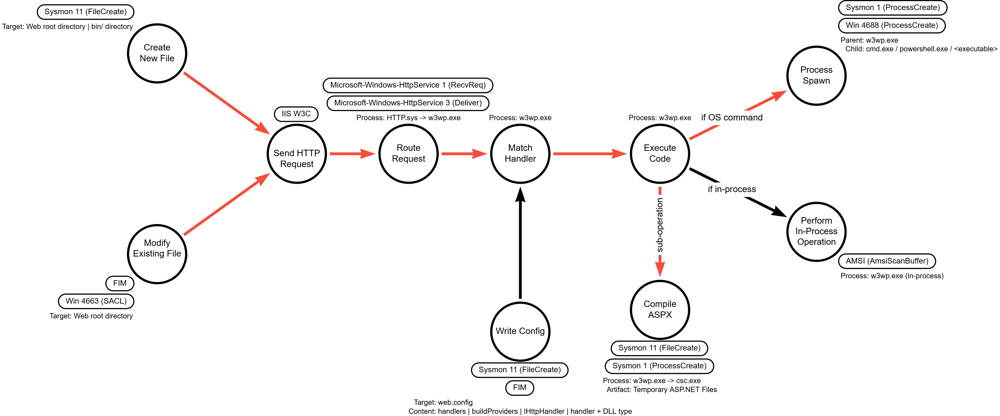
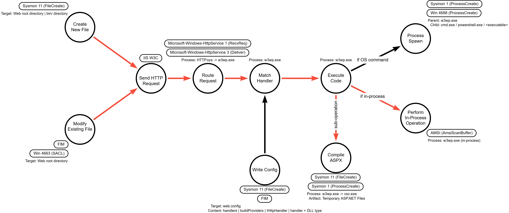
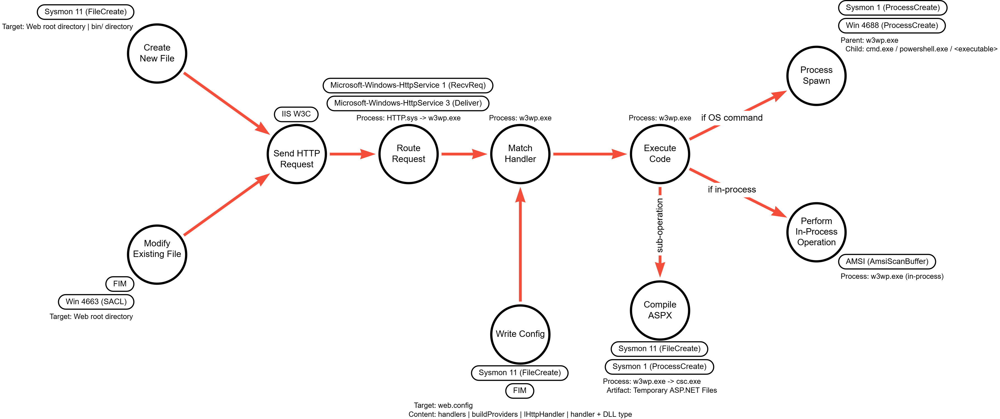
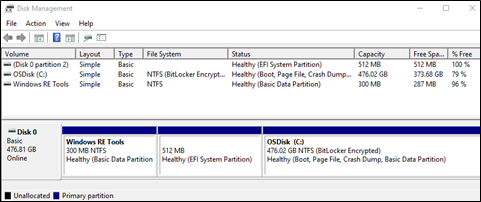
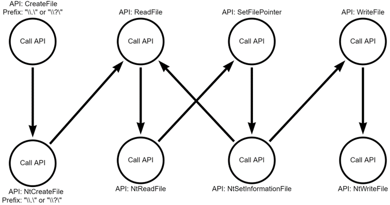
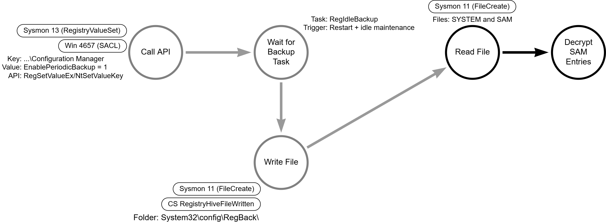

# Extracting Credentials from the SAM Database

## Metadata

| Key          | Value                |
|--------------|----------------------|
| ID           | TRR0000              |
| External IDs | [T1003.002]          |
| Tactics      | Credential Access    |
| Platforms    | Windows              |
| Contributors | Andrew VanVleet      |

### Scope Statement

This TRR covers the extraction of local user account credential hashes from the
Windows Security Account Manager (SAM) database on Windows systems. All
identified procedures require elevated privileges and access to both the SAM and
SYSTEM registry hives.

This TRR only addresses methods to extract credentials from the SAM database on
a running system. Offline or 'dead disk' attacks -- for example, forensic
imaging or booting into an in-memory OS and accessing the drives -- are out of
scope for this TRR.

## Technique Overview

Adversaries with elevated privileges on a Windows system can extract locally
stored credential hashes from the Security Account Manager (SAM) database. The
SAM stores NTLM password hashes for all local user accounts, encrypted with a
boot key derived from the SYSTEM registry hive. Extracting these hashes requires
access to both the SAM and SYSTEM data, after which the attacker can derive the
boot key and decrypt the hashes offline. Recovered hashes can be cracked or used
directly in pass-the-hash attacks to authenticate as local users. Even though
the passwords are for local users, passwords -- especially for local
administrator accounts -- might be reused across multiple machines, potentially
granting an attacker access to additional endpoints.

## Technical Background

### The SAM Database

The Security Account Manager (SAM) is a database in Windows that stores local
user account information, including password hashes. It exists in two forms: as
a registry hive mounted at `HKLM\SAM` and as a backing file on disk at
`%SystemRoot%\System32\config\SAM`. The two are kept in sync by the Windows
kernel's Configuration Manager, which manages all registry hives. The structure
of the SAM database is:

``` text
HKLM\SAM\SAM\
├── Domains\
│   ├── Account\
│   │   ├── F                     ← domain account F value (used to derive hashed boot key)
│   │   ├── Users\
│   │   │   ├── 000001F4\         ← Built-in Administrator (RID 500)
│   │   │   │   ├── V             ← encrypted user data (hashes, username, etc.)
|   |   |   |   └── F             ← account operational data (last logon, logon count, etc.)
│   │   │   ├── 000001F5\         ← Guest (RID 501)
│   │   │   │   └── V
|   |   |   |   └── F 
│   │   │   ├── 000001F7\         ← DefaultAccount (RID 503)
│   │   │   │   └── V
|   |   |   |   └── F 
│   │   │   ├── 000003E8\         ← First user-created account (RID 1000)
│   │   │   │   └── V
|   |   |   |   └── F 
│   │   │   ├── Names\            ← maps usernames to RIDs
│   │   │   │   ├── Administrator
│   │   │   │   ├── Guest
│   │   │   │   └── ...
│   │   └── Aliases\              ← local groups
│   └── Builtin\                  ← built-in groups
```

Each local user account has an entry under `SAM\Domains\Account\Users\[RID]`,
where `[RID]` is the account's relative identifier (e.g., `000001F4` for the
built-in Administrator). Each key has the following values:

- `V` value - contains the encrypted hashes and profile data
- `F` value - contains account operational data: last logon time, password last
  set, account expiration, login count, failed login count, account control
  flags (disabled, locked out, etc.)
- `SupplementalCredentials` - contains a structured binary value that holds
  additional cryptographic forms of the user's password.[^10] None of these
  additional forms are used in this technique.

Another value of interest to this technique is the domain-level
`SAM\Domains\Account\F` value. This contains some of the encryption material
needed to decrypt the password hashes.

### SAM Encryption and the Boot Key

Password hashes in the SAM are not stored in cleartext. Windows applies a
multi-layered encryption scheme to protect them.

The first layer of protection is the boot key (also called the SysKey), a
16-byte value derived from four registry keys under
`HKLM\SYSTEM\CurrentControlSet\Control\Lsa`: specifically, the keys named `JD`,
`Skew1`, `GBG`, and `Data`. The boot key material is stored in each key's
*Class* attribute - a hidden field not visible through RegEdit - as a Unicode
hex string. The four class values are concatenated and then descrambled using a
fixed permutation to produce the final boot key.

The boot key is then used to derive a *hashed boot key* (or `SAMKey`) from data
in the SAM's domain-level `F` value.  On modern systems (Vista and later), it
uses AES-128-CBC. The hashed boot key is subsequently used to decrypt individual
per-user hashes stored in each account's `V` value, with an additional per-user
DES key transformation using the account's RID.

Because the password hashes cannot be decrypted without the boot key, all
procedures for extracting SAM credentials require access to both the SAM data
and the SYSTEM hive's boot key components.

### Access Control

The `HKLM\SAM` registry key is protected by a restrictive discretionary access
control list (DACL) that grants `Full Control` only to the `SYSTEM` account.
However, the `SeBackupPrivilege` token privilege, which can be enabled by
members of the `Administrators` and `Backup Operators` groups, causes the system
to bypass access control checks for read operations to files, directories, and
registry keys. Standard system tools like RegEdit do not enable
`SeBackupPrivilege`, but custom code running under the `Administrator` or
`Backup Operators` groups can. That would enable code running under those groups
to access the SAM registry keys and dump the credentials.

### File Locking

The SAM and SYSTEM hive backing files (`%SystemRoot%\System32\config\SAM` and
`SYSTEM`) are exclusively locked by the Windows kernel while the operating
system is running. Standard file read or copy operations will fail, requiring
attackers to either access the information via the registry or to use one of
several procedures to bypass the file lock.

## Procedures

| ID            | Title                       | Tactic            |
|---------------|-----------------------------|-------------------|
| TRR0000.WIN.A | Local Registry Access       | Credential Access |
| TRR0000.WIN.B | Remote Registry Access      | Credential Access |
| TRR0000.WIN.C | Volume Shadow Copy Access   | Credential Access |
| TRR0000.WIN.D | Raw Disk Access             | Credential Access |
| TRR0000.WIN.E | Acquire Registry Backup     | Credential Access |

### Procedure A: Local Registry Access

This procedure reads SAM and SYSTEM data through the local kernel registry
interface using standard Windows registry APIs that are handled by the kernel's
Configuration Manager.

There are two approaches to retrieving data from each hive, and the attacker can
select either path for each hive:

In the **enumerate-and-query** approach, the attacker opens a handle to the
registry key (`RegOpenKeyEx`), iterates through sub-keys with `RegEnumKeyEx`,
and reads individual values with `RegQueryValueEx` or `RegQueryMultipleValues`
(both of these ultimately call `NtQueryValueKey`).

- For the SAM hive, this means walking `SAM\Domains\Account\Users\[RID]` and
reading the `V` value for each account.
- For the SYSTEM hive, the attacker enumerates the four boot key component keys
(`JD`, `Skew1`, `GBG`, `Data`) under `CurrentControlSet\Control\Lsa`. The
critical data is returned in the *Class* attribute by the `RegQueryInfoKey`
call, rather than via a standard value query. Data remains in the calling
process's memory with no file written to disk.

In the **save** approach, the attacker creates an export of the desired keys,
including all sub-keys, using the `RegSaveKey` API. The kernel handles
enumeration of the sub-keys and values and writes the results to a file on disk
(specified by the attacker in the `RegSaveKey` call). The attacker can then
parse the file to extract the needed values.

After obtaining both the SAM data and boot key material through either path,
the attacker derives the boot key, computes the hashed boot key, and decrypts
the per-user password hashes. This decryption is an in-memory computational
operation with no direct telemetry.

> [!Note]
>
> In addition to the direct API calls, [PowerShell's registry drives], the
> `RegEdit.exe` application, and the `reg.exe` utility use the standard Windows
> registry APIs and thus also fall under this procedure.

For both approaches, the user needs to be part of a group that can enable
`SeBackupPrivilege` on the target machine and all registry API calls must have
the `REG_OPTION_BACKUP_RESTORE` flag set.

#### Detection Data Model



The DDM consists of three steps:

1. Extract key data from the `SYSTEM` hive
2. Extract hashes and key material from the `SAM` hive
3. Decrypt the hashes

Steps 1 and 2 can be done in any order but must both be completed before step
3. Because of the complexity of the first two steps, the DDM contains a
high-level initial model, with 'implementation' arrows showing the specific
sub-model for each high-level step.

For both steps 1 and 2, the model shows the **enumerate-and-query** approach and
the **save** approach. Both have been included in this procedure because an
attacker can mix and match them as they choose.

### Procedure B: Remote Registry Access

This procedure is very similar to Procedure A, except that it uses the Windows
Remote Registry Protocol (MS-RRP) RPC interface to access the target registry
keys. The [Windows registry APIs] natively support access to a local or remote
registry. If the request is for a local registry, the request is sent to the
local kernel via the native NT APIs (NtOpenKey, NtSaveKey, etc) - this is
Procedure A. If the request is for a remote registry, the request is routed
through MS-RRP.

Thus, on the client machine the attacker could implement the MS-RRP client
directly (using calls to `OpenLocalMachine`, `BaseRegOpenKey`, etc) or they
could open a handle to the remote registry with `RegConnectRegistry` and use the
same functions employed in Procedure A, allowing Windows to handle the
translation to RPC calls.

When using MS-RRP, the attacker authenticates to the target via SMB, using the
named pipe `\PIPE\winreg`, to establish a session that the Remote Registry
service uses to impersonate the caller for access checks. When running, it is
hosted in a dedicated `svchost.exe` process, and this is the process that
actually performs the activities on the target system's registry.

The default status of the Remote Registry service depends on the version of
Windows running on the target:

- Windows 10/11: The service is disabled by default. It must be enabled manually
  or via group policy, but this can also be done remotely.
- Windows Server 2003 and Windows XP/2000: The service is configured to start
  automatically by default.[^11]
- Windows Server 2012+: The service is set to `Automatic (Trigger Start)`,
  meaning it auto-starts when a connection is made to `\PIPE\winreg`. (On Server
  2019+, the service will shut down after being idle for 10 minutes, but will
  restart on a new request.)[^12]

> [!Note]
>
> RPC methods can be called locally: essentially the 'remote machine' is itself.
> An attacker might use this procedure locally to attempt to blend in with
> normal system processes. It might look less suspicious or confuse incident
> responders if `svchost.exe` is performing the registry operations instead of
> an arbitrary non-system process.

Similar to Procedure A, the authenticated user needs to be part of a group that
can enable `SeBackupPrivilege` on the target machine and all API calls must have
the `REG_OPTION_BACKUP_RESTORE` flag set.

#### Detection Data Model



The procedure begins on the source machine with an RPC call to
`OpenLocalMachine`[^1] or by calling `RegConnectRegistry`, both of which will
open a handle to the remote machine's `HKEY_LOCAL_MACHINE` hive.

The DDM has been simplified due to the large number of operations required to
implement this procedure. It uses green borders for source machine operations
and blue borders for target machine operations. For every operation, the source
machine makes an RPC call to the target, which is handled by the Remote Registry
service. The DDM only includes the client's first operations to open the remote
registry. After that, it includes only the RPC calls received by the target
machine, but each of those operations has a corresponding client side operation.
Remember that the client can call the regular registry APIs or their
corresponding RPC methods directly. This variance is abstracted away in the DDM,
leaving the focus on the operations taken on the target machine, which are the
same regardless of which method the client uses.

This procedure has the same two options as Procedure A: enumerating each key and
value or exporting the entire hive. When saving the hive file on a remote
machine, the file is written to the *target machine's* file system and the
attacker must subsequently retrieve it. There are many ways an attacker could do
this, including reading it via the `ADMIN$` or `C$` SMB administrative shares,
but this TRR will not delve into the specifics of how an attacker might retrieve
or exfiltrate the files.

### Procedure C: Volume Shadow Copy Access

Rather than accessing the registry interface, this procedure reads the SAM and
SYSTEM hive files directly from a volume shadow copy snapshot.

This procedure requires Administrator or SYSTEM privileges to create a shadow
copy (the Volume Shadow Copy Service requires administrative context).

#### The Volume Shadow Copy Service (VSS)

The VSS is a set of Component Object Model (COM) interfaces[^5] that implement a
framework to allow volume backups to be performed while applications on a system
continue to write to them. Backup software can interface with VSS COM objects to
create and delete shadow snapshots and copy files from them. Attackers can
access copies of files, including sensitive system files and files locked by the
operating system, through the Volume Shadow Copy Service.

The VSS was introduced in Windows Server 2003 to facilitate the process of
backing up and restoring critical business data without taking applications
offline. Backing up files is complicated by the fact that the data usually needs
to be backed up or restored while the applications that produce the data are
still running, and thus data files might be open or in an inconsistent state.
Also, if a data set is large, it can be difficult to back up all of it at one
time because changes might be made during the time it takes to create the copy.

VSS coordinates the actions that are required to create a consistent shadow copy
(also known as a snapshot or a point-in-time copy) of the data that is to be
backed up. This is a complicated process that involves coordinating with all
writers to temporarily freeze writes, complete all open transactions, and flush
caches so that the data is in a consistent state. Then the copy is made, and
future changes are logged to allow the VSS to reconstruct the state of the data
at the time of copy. Once a shadow copy has been created, the files can be read
even if the original files are locked.

#### Component Object Model (COM) interfaces

COM is a technology that allows objects to interact across process and computer
boundaries as easily as within a single process. COM allows developers to define
an interface, or group of related functions, that can then be used by other
programmers. Many Windows components, like the File Open dialogue, are
implemented as COM objects to simplify the effort required to perform a common
Windows task.[^6]

COM interfaces are assigned a class identifier (CLSID) that is used to
instantiate the COM object. So, for example, the CLSID for the VSS COM interface
is `DA9F41D4-1A5D-41D0-A614-6DFD78DF5D05`, while the CLSID for the VSS
Coordinator interface is `E579AB5F-1CC4-44B4-BED9-DE0991FF0623`. A program must
first initialize the COM library by calling [CoInitializeEx], then it can create
an instance of an object by calling [CoCreateInstance] and providing the
object's class identifier (CLSID). After that, it can call any of the methods
defined in the interface. So, after a program has instantiated a VSS Coordinator
object, it can use that object to call the interface's `DeleteSnapshots` method,
for example, to delete a volume snapshot.

#### Using the VSS

There are numerous ways for users to interact with the VSS:

- The COM interfaces can be accessed from all major programming languages: C,
C++, VisualBasic, PowerShell and even Python. Microsoft provides a lot of
documentation[^7] and an example application[^8] to help programmers learn how
to use the COM classes and methods.

- Microsoft has created a function, `CreateVssBackupComponents` (exported by
`VssApi.dll`), that handles the task of instantiating the COM interfaces so it's
easier to use the VSS COM interface methods. The function returns a pointer to
an IVssBackupComponents interface object, ready for use.

- WMI has a [Win32_ShadowCopy] class that can be used to list, create, and
delete VSS shadow copies. WMI can also be accessed through most Windows
programming languages, or directly through tools like wmic.exe.

- Windows has also defined an RPC interface for creating and deleting volume
shadow copies, [File Server Remote VSS Protocol] (MS-FSRVP). This RPC
interface has methods to query, create, or delete shadow copies on a remote
server. The RPC methods don't expose all of the possible options available
via the COM interfaces, but they do permit some actions to be performed
remotely.

- There are multiple windows applications, like `VSSAdmin.exe` and
`DiskShadow.exe`, that have been created to facilitate interactions with the
VSS.

VSS can create three kinds of shadow copies:

- **Complete copy** - This method makes a complete copy (called a "full copy"
or "clone") of the original volume at a given point in time. This copy is
read-only and can be transported to a different system.

- **Copy-on-write** - This method does not copy the original volume. Instead,
it makes a differential copy by storing all the original values for any
changes made to the volume in the volume shadow copy. The original data can
be reconstructed by taking the data from the original volume, then rolling
back changes using the original values stored in the shadow copy.

- **Redirect-on-write** - This method does not copy the original volume, and
it does not make any changes to the original volume after a given point in
time. Instead, it makes a differential copy by redirecting all changes to
the volume shadow copy. The original data can be read from the original
volume, while the current data state can be constructed by taking the
original data and adding the changes logged in the shadow copy.

For the purpose of this procedure, we only need a differential shadow copy,
which we will use to extract a full copy of the SAM and SYSTEM backing files.

#### Exposing and Surfacing Shadow Copies

A requester can make a shadow copy available to other processes as a mounted
read-only device, which is known as "exposing"[^6] the shadow copy. Shadow
copies can be exposed as a local volume - assigned a drive letter or associated
with a mounted folder - or as a file share. A shadow copy can be exposed using
the method [IVssBackupComponents::ExposeSnapshot]. Only persistent shadow copies
can be exposed.

"Surfacing" a shadow copy means making it known to the system's mount manager,
so that it can be mounted like any other volume. Exposed shadow copies are also
surfaced copies, but it's possible to create a surfaced copy without exposing
it.

#### Detection Data Model



The DDM shows the shadow copy creation feeding into parallel file reads for
SAM and SYSTEM, converging at decryption. Shadow copy creation is observable
through Windows event 8222 and, if performed via a command-line utility, through
process creation events (Sysmon 1). File reads from the shadow copy path
produce file creation events (Sysmon 11) if the files are copied to another
location.

### Procedure D: Raw Disk Access

This procedure bypasses both the registry interface and the filesystem API
entirely by opening a raw handle to the disk volume and parsing NTFS structures
manually to locate and read the SAM and SYSTEM hive files.

Normal input/output operations use operating system APIs (like `CreateFile` and
`WriteFile`) to interact with files on the disk. This permits the operating
system to do all the work required to locate the file on the physical disk,
regardless of file system structure, and read or write the requested data. This
also means that the operating system can enforce consistency protections and
security checks on the requested access. A few examples of checks the operating
system might enforce are:

- Locks on files which are opened by a process and cannot be opened by other
  processes, such as the `NTDS.dit` file or SYSTEM registry hives.

- A System Access Control List (SACL) flag set on a file to alert when the file
  is opened.

- A Discretionary Access Control List (DACL) which only allows a specific set of
  users, like SYSTEM, to open a file.

An attacker can bypass these OS-level protections by opening the raw disk or
volume directly, but they also lose the benefits of having the operating system
read the file system structures to locate the desired data.

Administrative rights are required to open a raw disk or volume.

#### Physical Disk Architecture

Physical disks are subdivided into partitions and volumes. There is a table
maintained of the divisions in one of two formats: Master Boot Record (MBR) or
Global Partition Table (GPT). GPT is the way most modern operating systems do
it, while MBR is the legacy method. The disk, partitions, and volumes of a
generic business laptop are below: there are 3 volumes and 3 partitions across a
single disk, with a 1-1 relationship between volumes and partitions. Two volumes
have been formatted using the NTFS file system, but only one (C:) has been
assigned a drive letter and is accessible from the OS.



There are many details about disk management and partitioning that aren't in
scope for this procedure. The most important aspect is that in order for the
operating system to store files on a disk, it must be assigned to a volume,
given a drive letter and formatted with a file system (on Windows, that's
usually NTFS). **Thus, to read raw data, the attacker will mostly likely be
accessing a volume.** It is possible to access the raw physical disk, but this
would require parsing the GPT or MBR manually to find the desired volume.

> [!NOTE]
>
> On systems with BitLocker full-volume encryption (FVE) enabled, the FVE filter
> driver (`fvevol.sys`) transparently decrypts data for all I/O that passes
> through the volume device stack. If an attacker opens a volume handle (e.g.,
> `\\.\C:`) rather than a physical disk handle (`\\.\PhysicalDrive0`), read
> requests traverse the full storage stack and return decrypted data.
> BitLocker's encryption and decryption operations are transparent when
> interacting with unlocked volumes on a running system. If the attacker instead
> opens the physical disk directly, the reads bypass the FVE filter driver and
> return raw encrypted data, rendering NTFS parsing impossible without
> independent access to the Full Volume Encryption Key (FVEK).[^2][^3]

At the time of creation, volumes are assigned a globally unique identifier
(GUID) that can be used to reference them. They can also be assigned a drive
letter, a label, both, or neither. (A label is a user-friendly name that is
assigned to a volume, usually by an end user, to make it easier to recognize.)
In the picture above, the third volume has been assigned a label of "Windows RE
Tools" but no drive letter. The second has both a label of "OSDisk" and a letter
of `C:`. The first volume has neither label nor letter.

#### Reading a Raw Volume in Windows

The `CreateFile` API provides the ability to access everything from raw disks to
individual files. To access a file, the full file path is provided. For a
device, the `\\.\` prefix will access the Win32 device namespace instead of the
Win32 file namespace. So, to access a physical disk, use `\\.\PhysicalDrive0`
(the number specifies which disk), and to access a volume use `\\.\C:`
(specifying the volume drive letter).

It is also possible access a volume (like one that doesn't have a drive letter
assigned) by using the `\\?\` prefix. The `\\?\` prefix to a path string tells
the Windows APIs to disable all string parsing and to send the string that
follows it straight to the file system. So, a volume can ben accessed using
`\\?\Volume{*GUID*}\\` (the PowerShell `Get-Volume` cmdlet will show volume
GUIDs).

When reading a disk in "raw" mode, the operating system doesn't interpret the
data at all, it simply reads the raw binary data from the disk sectors. File
system structures (like the MFT) must be parsed manually to find and read the
physical address of the desired data on disk. This also requires knowing disk
geometry details like sector size. There is at least one public library[^9] that
defines all the data structures and functions needed to read the NTFS file
system using a raw volume. Attackers can use it or create their own
implementation.

#### Detection Data Model



The DDM shows the raw disk handle opening, followed by numerous `ReadFile` and
`SetFilePointer` calls used to read the NTFS stuctures, locate the desired
clusters, and read the data for the SAM and SYSTEM files. Raw disk access
operates below the standard filesystem telemetry layer, so traditional file
access events are not generated. Some EDR products have visbility into volume
handle operations and can observe `CreateFile` calls targeting raw disks or
volumes.

### Procedure E: Acquire Registry Backup

Certain versions of Windows automatically back up critical registry files,
include the SAM and SYSTEM hives. Starting with Windows 10, Microsoft disabled
these automatic backups on personal desktop versions of the operating system
(Windows 10 and 11).[^4] It remains on by default for server versions. If
disabled, this behavior can be re-enabled by creating a DWORD registry value
named `EnablePeriodicBackup` set to `1` under
`HKLM\SYSTEM\CurrentControlSet\Control\Session Manager\Configuration Manager`.

Once set, the `RegIdleBackup` scheduled task will create backup copies of all
registry hives (including SAM and SYSTEM) during idle maintenance periods once
every 10 days after a system restart. The `RegIdleBackup` scheduled task has a
COM handler with `ClassId` `{CA767AA8-9157-4604-B64B-40747123D5F2}`, which is
handled by `Windows\System32\regidle.dll`. This library makes a call to the
undocumented `NtInitializeRegistry` function with an argument of `0x13e8`, which
is implemented in `ntoskrnl.exe`. The kernel code does a number of checks,
then makes copies of the registry hives. The backed up files are stored in the
`%SystemRoot%\System32\config\RegBack\` directory, which is hard-coded in the
kernel's implementation.

An attacker can simply collect the SAM and SYSTEM backups if they already exist
or modify the registry key and wait for them to be created. The backup files are
not locked, allowing access via a standard read or copy.

This procedure requires Administrator privileges to modify the registry key and
to read files in the `config` directory.

#### Detection Data Model



The operations in gray are to enable automatic backups if they don't already
exist.

## Available Emulation Tests

| ID             | Link |
|----------------|------|
| TRR0000.WIN.A  | [Atomic Test T1003.002] #1, #2, #4, #7, #8 |
| TRR0000.WIN.B  | [regsecrets.py - GitHub]  |
| TRR0000.WIN.C  | [Atomic Test T1003.002] #3, #5, #6 |
| TRR0000.WIN.D  |      |
| TRR0000.WIN.E  |      |

## References

- [SysKey and the SAM - Brendan Dolan-Gavitt (moyix)]
- [RegSaveKeyA function - Microsoft Learn]
- [Windows registry APIs]
- [MS-RRP: Windows Remote Registry Protocol - Microsoft Learn]
- [SeBackupPrivilege - Microsoft Learn]
- [CVE-2021-36934 - MSRC]
- [Silent Harvest: Extracting Windows Secrets Under the Radar - Sud0ru blog]
- [Mimikatz lsadump Module - wiki.yourway]
- [regsecrets.py - GitHub]
- [Revisiting SecretsDump - Synacktiv]
- [Priv2Admin: SeBackupPrivilege - gtworek]
- [Atomic Test T1003.002]

[^1]: `OpenLocalMachine` is an initially confusing name for a procedure that is
    connecting to a remote system's registry. The name refers to the fact that
    the procedure is used to open the `HKEY_LOCAL_MACHINE` hive on the remote
    system. There is an `Open*` procedure for each hive; for example,
    `OpenClassesRoot` will open `HKEY_CLASSES_ROOT` on the remote system.
[^2]: [BitLocker I/O Control - Geoff Chappell]
[^3]: [Unlocking BitLocker - hackyboiz]
[^4]: [No Backed Up RegBack Folder - Microsoft Learn]
[^5]: [Volume Shadow Copy API - Microsoft Learn]
[^6]: [Code Example: The Open Dialog Box - Microsoft Learn]
[^7]: [VSS: Generating a Backup Set - Microsoft Learn]
[^8]: [VShadow - GitHub]
[^9]: [An NTFS Parser Library - CodeProject]
[^10]: [MS-SAMR SupplementalCredentials - Microsoft Learn]
[^11]: See the footnotes at [RegConnectRegistryA function - Microsoft Learn]
[^12]: [BloodHound Inner Workings - Compass Security]

[T1003.002]: https://attack.mitre.org/techniques/T1003/002/
[SysKey and the SAM - Brendan Dolan-Gavitt (moyix)]: https://moyix.blogspot.com/2008/02/syskey-and-sam.html
[RegSaveKeyA function - Microsoft Learn]: https://learn.microsoft.com/en-us/windows/win32/api/winreg/nf-winreg-regsavekeya
[Windows registry APIs]: https://learn.microsoft.com/en-us/windows/win32/sysinfo/registry-functions
[MS-RRP: Windows Remote Registry Protocol - Microsoft Learn]: https://learn.microsoft.com/en-us/openspecs/windows_protocols/ms-rrp/
[SeBackupPrivilege - Microsoft Learn]: https://learn.microsoft.com/en-us/windows/win32/secauthz/privilege-constants
[CVE-2021-36934 - MSRC]: https://msrc.microsoft.com/update-guide/vulnerability/CVE-2021-36934
[Mimikatz lsadump Module - wiki.yourway]: https://tools.thehacker.recipes/mimikatz/modules/lsadump
[Silent Harvest: Extracting Windows Secrets Under the Radar - Sud0ru blog]: https://sud0ru.ghost.io/silent-harvest-extracting-windows-secrets-under-the-radar/
[Revisiting SecretsDump - Synacktiv]:  https://www.synacktiv.com/publications/lsa-secrets-revisiting-secretsdump
[regsecrets.py - GitHub]: https://github.com/fortra/impacket/blob/master/impacket/examples/regsecrets.py
[Priv2Admin: SeBackupPrivilege - gtworek]: https://github.com/gtworek/Priv2Admin/blob/master/SeBackupPrivilege.md
[Atomic Test T1003.002]: https://github.com/redcanaryco/atomic-red-team/blob/master/atomics/T1003.002/T1003.002.md
[BitLocker I/O Control - Geoff Chappell]: https://www.geoffchappell.com/studies/windows/km/fvevol/ioctl/index.htm
[Unlocking BitLocker - hackyboiz]: https://hackyboiz.github.io/2026/01/22/banda/BitLocker_part1/en/
[No Backed Up RegBack Folder - Microsoft Learn]: https://learn.microsoft.com/en-us/troubleshoot/windows-client/installing-updates-features-roles/system-registry-no-backed-up-regback-folder
[PowerShell's registry drives]: https://learn.microsoft.com/en-us/powershell/scripting/samples/managing-windows-powershell-drives
[Volume Shadow Copy API - Microsoft Learn]: https://learn.microsoft.com/en-us/windows/win32/vss/volume-shadow-copy-api-interfaces
[Code Example: The Open Dialog Box - Microsoft Learn]: https://learn.microsoft.com/en-us/windows/win32/learnwin32/example--the-open-dialog-box
[VSS: Generating a Backup Set - Microsoft Learn]: https://learn.microsoft.com/en-us/windows/win32/vss/generating-a-backup-set
[VShadow - GitHub]: https://github.com/microsoft/Windows-classic-samples/tree/main/Samples/VShadowVolumeShadowCopy
[An NTFS Parser Library - CodeProject]: https://www.codeproject.com/Articles/81456/An-NTFS-Parser-Lib
[MS-SAMR SupplementalCredentials - Microsoft Learn]: https://learn.microsoft.com/en-us/openspecs/windows_protocols/ms-samr/0705f888-62e1-4a4c-bac0-b4d427f396f8
[RegConnectRegistryA function - Microsoft Learn]: https://learn.microsoft.com/en-us/windows/win32/api/winreg/nf-winreg-regconnectregistrya
[Manual (Trigger Start) - Robert Wray]: https://robertwray.co.uk/blog/what-does-manual-triggered-mean-for-a-windows-service
[BloodHound Inner Workings - Compass Security]: https://blog.compass-security.com/2022/05/bloodhound-inner-workings-part-3/