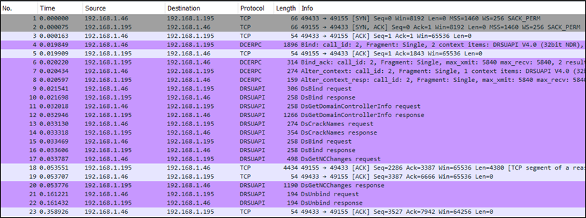
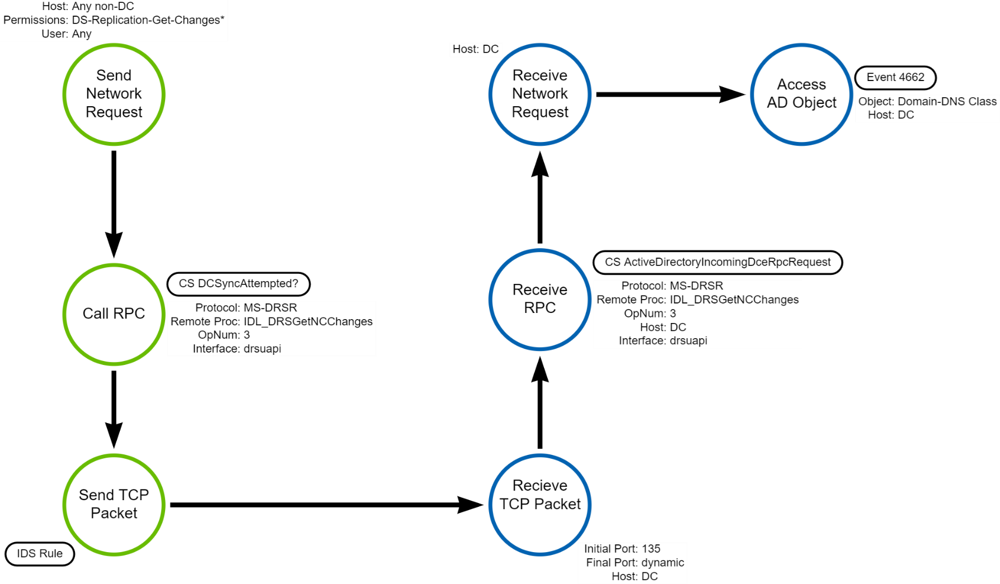

# DC Synchronization Attack (DCSync)

## Metadata

| Key     | Value     |
|--------------|------------|
| ID           | TRR0011 |
| External IDs | [T1003.006] |
| Tactics      | Credential Access |
| Platforms    | Active Directory |
| Contributors | Andrew VanVleet |

## Technique Overview

Adversaries may attempt to access credentials and other sensitive information by
using a Windows Domain Controller's (DC) application programming interface
(API) to simulate the replication process used to keep DCs synchronized. Members
of the Administrators, Domain Admins, or Enterprise Admin groups; computer
accounts on the DCs; or any Active Directory (AD) account with a specific set of
permissions are able to request replication information from any DC that may
contain current and historical hashes of potentially useful accounts, such as
`KRBTGT` and `Administrators`. The hashes can then be used to create a [Golden
Ticket], in a [Pass the Ticket] attack, or to change an account's password.

## Technical Background

Production AD domains almost always have more than one DC. This
helps ensure resilience against failures and can help ensure low latency to a DC
across the network. Changes can be written to the directory on any DC, and those
changes are synchronized across all DCs in the domain through a process called
"replication." During replication, a DC will send a request to another DC asking
for any changes to domain objects. As DCs replicate regularly with one another,
they ensure that all replicas converge to a single common state.

### Confidential Attributes

Generally, all objects and attributes in AD are readable by any
account in the domain. To accommodate more sensitive information stored in AD
attributes, confidential attributes were introduced with Windows 2003 SP1.
AD uses confidential attributes to store things like the BitLocker
key, password hashes (including a history of password hashes), and potentially
cleartext passwords. Confidential attributes are not visible to normal users;
there is a 'confidential bit' that can be set on an attribute that forces a
secondary access check against a "control access right" that is typically held
only by administrators (`RIGHT_DS_READ_PROPERTY`). A [control access right] is
not identified by a specific bit in an [access mask] as the standard access
rights are. Instead, each control access right is identified by a GUID.
An access-control entry (ACE) that grants or denies a control access right
specifies the `RIGHT_DS_CONTROL_ACCESS (CR)` bit (`0x100`) in
the `ACCESS_MASK` field and the [GUID] identifying the particular control access
right in the ObjectType field. Most of the attributes holding sensitive
credential information will never grant read access[^1], but they are included
in replication data (by necessity). Thus, an attacker can gain access to those
attributes only by emulating another DC and requesting replication.

### Replication Permissions

Replication permissions are in the category of special AD
"extended rights"[^2] that are a group of special operations not covered by the
standard set of rights (these are control access rights, as discussed above).
The specific permissions that allow a user to request replication are:

| Name | Control Access Right GUID | Description |
|----|----|----|
| DS-Replication-Get-Changes | 1131f6aa-9c07-11d1-f79f-00c04fc2dcd2 |This allows replication of data, excluding confidential attributes like password hashes. This is the base permission; it must be held for the other two permissions to work.|
| DS-Replication-Get-Changes-All | 1131f6ad-9c07-11d1-f79f-00c04fc2dcd2 |This allows replication of all data, including confidential attributes.|
|DS-Replication-Get-Changes-In-Filtered-Set | 89e95b76-444d-4c62-991a-0facbeda640c |This allows replication of domain data, including confidential attributes that are in a filtered set that will never be replicated to a Read Only Domain Controller (RODC).|

These rights are granted by default to members of the Administrators, Domain
Admins, or Enterprise Admin groups; they are also given to the system accounts
(ending in $) on the DCs. They can also be granted to any other account in the
domain.

### Replication Process

DC replication takes place using the Directory Replication Services Remote
(MS-DRSR) protocol, which is implemented using the Distributed Computing
Environment/Remote Procedure Call (DCE/RPC) protocol. The MS-DRSR protocol is
designed for replication and management of data in AD and specifies two separate
interfaces: drsuapi and dsaop. Only drsuapi is relevant to DCSync.

MS-DRSR allows transport via TCP and associates the drsuapi interface with the
UUID `{e3514235-4b06-11d1-ab04-00c04fc2dcd2}` (which is represented in hex in
network packets as `35 42 51 e3 06 4b d1 11 ab 04 00 c0 4f c2 dc d2`).

A client wishing to perform a DCSync attack would first connect to a DC via the
DCE/RPC protocol (which itself is implemented using TCP) and request a bind to
the drsuapi interface – see packet no. 4 below. They would then call the DsBind
remote procedure (opnum 0) as a mandatory first step to calling any other
procedure in the interface – see packet no 9. The next step is to call the
DsGetNCChanges remote procedure (opnum 3) – see packet no 17. The protocol
encrypts the payloads of both the request and response data, but the headers –
showing what remote procedure is being called – are unencrypted.



### Background on DCE/RPC

DCE/RPC is an industry standard for making remote procedure calls. Microsoft's
implementation of DCE/RPC is called MSRPC. DCE/RPC can use various transports:
`ncacn_np` (transport via SMB Named Pipes); `ncacn_ip_tcp` (transport via
TCP/IP) and ncacn\_http (transport via HTTP), to name a few. Microsoft defines
numerous operating system protocols that use RPC. Each interface comes with its
own set of numbered procedures (opnums), and procedures are called by opnum
rather than name. The DCE/RPC protocol requires an initial bind request (packet
type `0x0b`), where the desired RPC protocol is specified by its assigned UUID.
After binding to a protocol, clients call a specific procedure within the
protocol.

By way of example, services can be managed remotely via the Service Control
Manager Remote Protocol (MS-SCMR), which permits transport via both TCP and
named pipes. When using TCP, the DCE/RPC bind packet will specify the protocol's
UUID of `{367ABB81-9844-35F1-AD32-98F038001003}`, and when using named pipes, it
will connect to the protocol's designated pipe `\PIPE\svcctl`.

### Windows Event Logging

AD DCs can be configured[^3] to log attempts to access AD objects (it can be
configured to log success, failure, or both). This will generate event 4662 (An
operation was performed on an object). Replication is performed on an object of
the `DomainDNS` class in AD (this is the object that represents
the root of the directory). The `DomainDNS` class is represented in AD and its
logs with the GUID `19195a5b-6da0-11d0-afd3-00c04fd930c9`. Thus, logs showing
access to an AD object (Event 4226) will show access to the `DomainDNS` class.
If the request was successful, they will also show an access mask with the
`RIGHT_DS_CONTROL_ACCESS (CR)` bit set (`0x100` or decimal `256`) and the GUID
of the specific replication privilege used in the request
(`DS-Replication-Get-Changes`, for example).

Here is an example log showing domain replication:

```json
"Provider Name": "Microsoft-Windows-Security-Auditing"
"EventID": "4662"
"SubjectUserName": <Hostname of machine requesting replication>
"SubjectDomainName": <Domain where replication occurred>
"ObjectServer": "DS"
"ObjectType": "%{19195a5b-6da0-11d0-afd3-00c04fd930c9}" 🡨 This is the GUID for the DomainDNS Class
"OperationType": "Object Access"
"AccessMask": "256"    🡨 this is RIGHT_DS_CONTROL_ACCESS (0x100)
"Properties": "%%7688\\r\\n\\t\\t{1131f6aa-9c07-11d1-f79f-00c04fc2dcd2}\\r\\n\\t{19195a5b-6da0-11d0-afd3-00c04fd930c9}\\r\\n"   🡨 This is CONTROL_ACCESS (%%7688) using the permission DS-Replication-Get-Changes on the DomainDNS class object.
```

## Procedures

| ID | Title | Tactic |
|----|----|----|
| TRR0011.AD.A | Request replication from a DC | Credential Access |

### Procedure A: Request replication from a DC

This is the only known procedure for a DC replication attack. An attacker who
gains access to an account with the required permissions calls the
`IDL_DRSGetNCChanges` RPC to request replication for as many accounts as
desired. The DC replies by sending the requested data.

#### Detection Data Model



There are multiple great options for detecting this technique. Only a DC
should ever request replication from a DC, so a request from other machines
is almost certainly malicious. Replication requests can be identified on the
network (using an IDS rule), with an EDR event, or using Windows event 4662
(example in the logging section). Any of these options can provide comprehensive
coverage of this technique.

## Available Emulation Tests

| ID            | Link             |
|---------------|------------------|
| TRR0011.AD.A | [Atomic Tests 1-2] |

## References

- [What is DCSync - Netwrix Blog]
- [MS-DRSR Protocol - Microsoft Learn]
- [Mimikatz DCSync - ADSecurity.org]
- [Detecting DCSync - Black Lantern Security]
- [IDL_DRSGetNCChanges - Microsoft Learn]
- [Passwords technical overview - Microsoft Learn]
- [Detecting DCSync and DCShadow Network Traffic - NVisio Blog]
- [Windows Event Accesses IDs - Lee Harvey Blog (via Wayback Machine)]
- [The Other Replicating Directory Changes - Eric Kuehn]
- [ADS_RIGHTS_ENUM - Microsoft Learn]
- [Criminal Actor Targeting Organizations for Data Exfil and Destruction -
  Microsoft]
- [Earth Lusca Operations - TrendMicro]
- [Analysis of Intrusion Campaign Targeting Telecom and BPO Companies -
  Crowdstrike]
- [Operation Wocao - FoxIT]
- [Using M365 Defender to Protect Against Solorigate - Microsoft]
- [Deep Dive into Solorigate - Microsoft]
- [Observations from the StellarParticle Campaign - Crowdstrike]

[T1003.006]: https://attack.mitre.org/techniques/T1003/006/
[Golden Ticket]: https://attack.mitre.org/techniques/T1558/001
[Pass the Ticket]: https://attack.mitre.org/techniques/T1550/003
[control access right]: https://learn.microsoft.com/en-us/openspecs/windows_protocols/ms-adts/1522b774-6464-41a3-87a5-1e5633c3fbbb
[access mask]: https://learn.microsoft.com/en-us/windows/win32/api/iads/ne-iads-ads_rights_enum
[GUID]: https://learn.microsoft.com/en-us/openspecs/windows_protocols/ms-adts/1522b774-6464-41a3-87a5-1e5633c3fbbb
[Atomic Tests 1-2]: https://github.com/redcanaryco/atomic-red-team/blob/master/atomics/T1003.006/T1003.006.md
[What is DCSync - Netwrix Blog]: https://blog.netwrix.com/2021/11/30/what-is-dcsync-an-introduction/
[MS-DRSR Protocol - Microsoft Learn]: https://learn.microsoft.com/en-us/openspecs/windows_protocols/ms-drsr/f977faaa-673e-4f66-b9bf-48c640241d47
[Mimikatz DCSync - ADSecurity.org]: https://adsecurity.org/?p=1729
[Detecting DCSync - Black Lantern Security]: https://blog.blacklanternsecurity.com/p/detecting-dcsync
[IDL_DRSGetNCChanges - Microsoft Learn]: https://learn.microsoft.com/en-us/openspecs/windows_protocols/ms-drsr/b63730ac-614c-431c-9501-28d6aca91894
[Passwords technical overview - Microsoft Learn]: https://learn.microsoft.com/en-us/windows-server/security/kerberos/passwords-technical-overview
[Detecting DCSync and DCShadow Network Traffic - NVisio Blog]: https://blog.nviso.eu/2021/11/15/detecting-dcsync-and-dcshadow-network-traffic/
[Windows Event Accesses IDs - Lee Harvey Blog (via Wayback Machine)]: https://web.archive.org/web/20140221063115/http://my.opera.com/Lee_Harvey/blog/2008/10/14/microsoft-windows-security-audit-event-accesses-ids
[The Other Replicating Directory Changes - Eric Kuehn]: https://www.secureideas.com/blog/the-other-replicating-directory-changes
[ADS_RIGHTS_ENUM - Microsoft Learn]: https://learn.microsoft.com/en-us/windows/win32/api/iads/ne-iads-ads_rights_enum
[Criminal Actor Targeting Organizations for Data Exfil and Destruction - Microsoft]: https://www.microsoft.com/en-us/security/blog/2022/03/22/dev-0537-criminal-actor-targeting-organizations-for-data-exfiltration-and-destruction/
[Earth Lusca Operations - TrendMicro]: https://www.trendmicro.com/content/dam/trendmicro/global/en/research/22/a/earth-lusca-employs-sophisticated-infrastructure-varied-tools-and-techniques/technical-brief-delving-deep-an-analysis-of-earth-lusca-operations.pdf
[Analysis of Intrusion Campaign Targeting Telecom and BPO Companies - Crowdstrike]: https://www.crowdstrike.com/blog/analysis-of-intrusion-campaign-targeting-telecom-and-bpo-companies/
[Operation Wocao - FoxIT]: https://www.fox-it.com/media/kadlze5c/201912_report_operation_wocao.pdf
[Using M365 Defender to Protect Against Solorigate - Microsoft]: https://www.microsoft.com/en-us/security/blog/2020/12/28/using-microsoft-365-defender-to-coordinate-protection-against-solorigate/
[Deep Dive into Solorigate - Microsoft]: https://www.microsoft.com/en-us/security/blog/2021/01/20/deep-dive-into-the-solorigate-second-stage-activation-from-sunburst-to-teardrop-and-raindrop/
[Observations from the StellarParticle Campaign - Crowdstrike]: https://www.crowdstrike.com/blog/observations-from-the-stellarparticle-campaign/

[^1]: [MS-ADTS Protocol - Microsoft Learn](https://learn.microsoft.com/en-us/openspecs/windows_protocols/ms-adts/e6685d31-5d87-42d0-8a5f-e55d337f47cd)
[^2]: [MS-ADTS Protocol - Microsoft Learn](https://learn.microsoft.com/en-us/openspecs/windows_protocols/ms-adts/e6685d31-5d87-42d0-8a5f-e55d337f47cd)
[^3]: [Audit Directory Service Access](https://learn.microsoft.com/en-us/previous-versions/windows/it-pro/windows-10/security/threat-protection/auditing/audit-directory-service-access)
