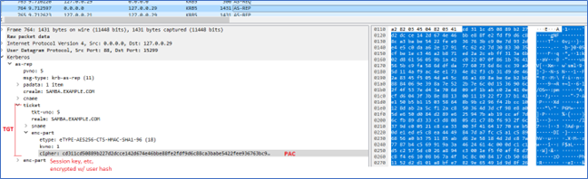
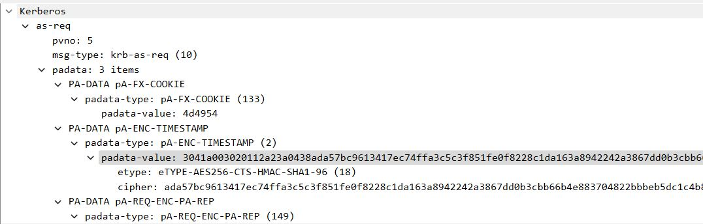
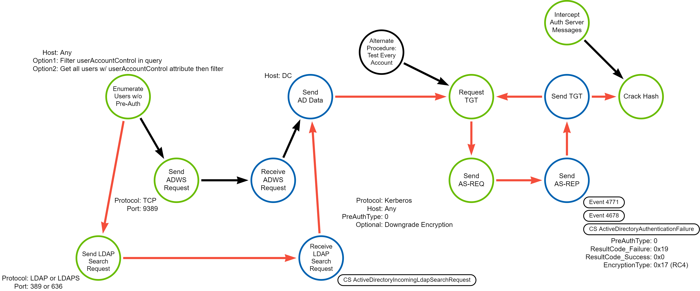
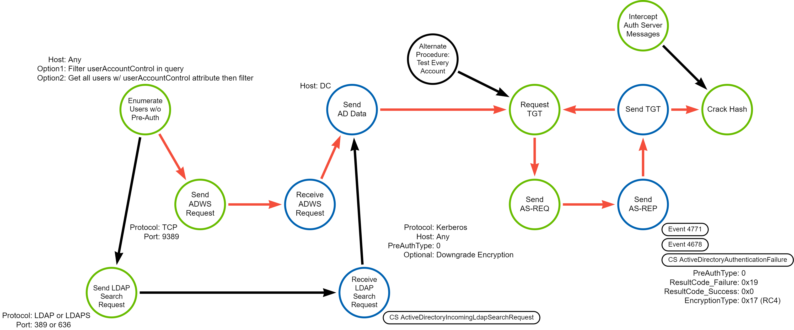
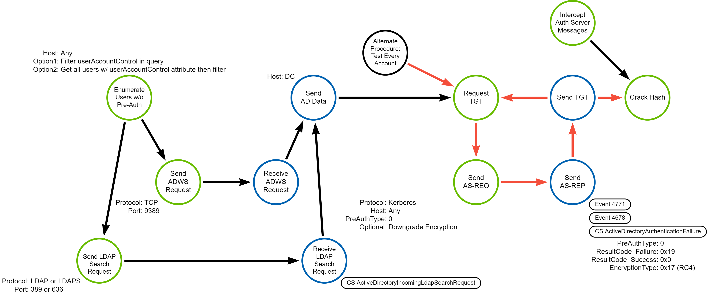
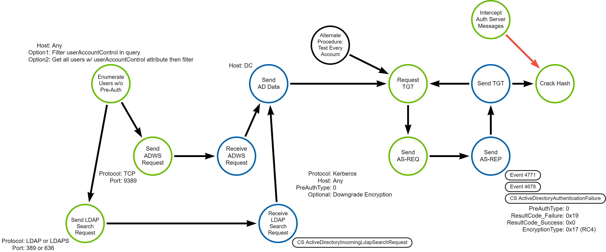

# Kerberos AS-REP Roasting

## Metadata

| Key     | Value  |
|--------------|---------|
| ID           | TRR0012 |
| External IDs | [T1558.004] |
| Tactics      | Credential Access |
| Platforms    | Active Directory |
| Contributors | Andrew VanVleet |

## Technique Overview

Adversaries may reveal credentials of accounts by cracking encrypted portions of
Kerberos' Authentication Server messages. Each of the encrypted messages has a
known structure, which can serve as a crib[^0] for use in determining when the
correct password has been attempted.

This attack is similar to T1558.003 Kerberoasting. Kerberoasting attempts to
crack cipher texts from TGS tickets, while AS-REP roasting attempts to crack
cipher texts from Authentication Server messages.

Any valid domain account can be used to list all domain accounts that have
pre-authentication disabled by querying the directory via standard means (like
LDAP, for example). Alternatively, the adversary may send an Authentication
Server Request (AS-REQ) message for each user. If the DC responds without
errors, the account does not require pre-authentication and the Authentication
Server Reply (AS-REP) message will already contain the encrypted data.

## Technical Background

### The Kerberos Protocol

Kerberos is a network authentication protocol designed to provide strong
authentication for client/server applications by using symmetric key
cryptography to sign 'tickets' that a client can use to prove their identity and
authorization to access a network resource. The Kerberos protocol consists of 3
components (hence the name, which references the 3-headed dog of Greek
mythology):

- Client
- Application Server (AP)
- Key Distribution Center (KDC)

The client is the user who wants access to a network resource. The AP is the
server hosting the desired network resource. The KDC is the authoritative source
of information about users and what resources they are authorized to access. In
Windows domains, the domain controllers are also the Kerberos KDC.

The KDC is also comprised of 3 elements. While these can be distributed over
multiple servers, most modern implementations have them on the same server:

- An authentication server (AS) that performs the initial authentication.
- A ticket-granting server (TGS) that issues tickets to clients for specific
  services hosted on APs.
- A Kerberos database that stores the password and identity of all verified
   users.

 The Kerberos protocol defines a series of messages exchanged between the
 client, the KDC and AP. After a client has authenticated, they receive a Ticket
 Granting Ticket (TGT) that is stored on the client device and can be used to
 request access to specific network resources without having to reauthenticate.
 The client presents a TGT to the TGS when it requests access to a network
 resource, and the TGS provides a service ticket back to the client. The client
 can then provide the service ticket to the AP to gain access to the service.

Kerberos is stateless: it relies on cryptographically signed tickets for
authentication and authorization. This requires that the cryptographic keys are
known only by the key's owner and the KDC. There are a few different keys used
for these cryptographic signatures:

- TGTs are signed with the password hash of the `KRBTGT` account, which is a
special service account that represents the KDC in the directory.
- Service tickets are signed with the hash of the service account associated
with a given service (a CIFS share, an FTP server, etc). In the directory,
services are represented by a service principal name (SPN) connected to the
associated service account. The password of the service account should be known
only by the KDC and the service.
- Clients prove their identity by signing a timestamp with their own password
hash, which should be known only by the KDC and themselves.

 The Kerberos protocol was originally designed in the 1980's and is on version
 5. It is employed in use cases far beyond what was originally envisioned and
has had dozens of extensions added to it to enable those use cases. As a result,
it is a very complex protocol. What follows is a simplified summary; you can
find more in-depth descriptions online.[^1][^2][^3]

1. **AS-REQ**: The client authenticates to the AS with a username and password.
By default in a Windows domain, pre-authentication data is also included in the
form of a current timestamp encrypted with the user’s secret key (derived from
the windows password).  
2. **AS-REP**: The KDC validates the client's credentials, then sends back a
TGT. The TGT contains the Privilege Attribute Certificate (PAC), which includes
the symmetric user session key that is used in subsequent steps to encrypt
communications with the KDC. The TGT also contains the username that it was
issued for and an expiration timestamp. Note that the client cannot read the
encrypted portions of the TGT because it does not have the KDC's encryption key.
The AS-REP also contains the session key and expiration time encrypted with the
user's hash, which the client can read. At this point, the client has a session
key that it decrypted using the user’s secret key and the TGT (which contains
the same session key, encrypted with the KDC's secret key). In the image below,
you can see an AS-REP message, with the TGT (the ticket section), PAC (the
ticket->enc-part section), and data encrypted with the user's key (the enc-part
section).

3. **TGS-REQ**: When the client wants access to a specific resource, it presents
the TGT to the KDC's Ticket Granting Service (TGS) in a message that also
contains the SPN of the service it wants to access. The request is encrypted
using the user's session key, obtained from the AS-REP message earlier.
4. **TGS-REP**: The KDC opens the TGT and validates the PAC checksum. If
successful, it proceeds to create a Service Ticket that contains the PAC. A
symmetric key is generated for use between the client and the requested service
(the service session key). The Service Ticket is encrypted with the service’s
password hash. The Service Ticket and the service session key are encrypted a
second time using the user's session key and sent to the client.
5. **AP-REQ**: Client decrypts the Service Ticket and service session key from
the TGS-REP message and sends the Service Ticket to the server hosting the
desired resource. The client also includes an authenticator message generated by
the client and encrypted with the service session key.
6. The Application Server decrypts the Service Ticket (using its own password
hash) and extracts the service session key. It then decrypts the authenticator
using the service session key. The Application Server extracts the PAC from the
Service Ticket and grants the client access to the resource.  
7. **AP-REP** (optional): If mutual authentication is needed, it can send back
an optional AP-REP message.
8. **PAC Validation**: If the TGT is older than 20 minutes, the AP will send a
PAC Validation message to the KDC to verify that the PAC's information is valid.

### Roasting AS-REQ and AS-REP Messages

Adversaries may attempt to guess the password of an account by cracking the
portions of an AS-REQ or AS-REP message that are encrypted with the user's
password hash. Each of the encrypted messages has a known structure, which can
serve as a crib for determining when the correct password has been attempted.
Cracking the password can be easier if a weak encryption algorithm is used, like
RC4.

If pre-authentication is not required, any domain user can request a TGT for any
other domain user, because it is assumed the session key (which is provided in
the AS-REP message and encrypted with the user's password hash) cannot be
accessed except by the user to whom the TGT has been issued. Without the session
key, the TGT cannot be used to request a TGS (the TGS-REQ message must be
encrypted with the session key). AS-REP roasting takes advantage of this by
requesting TGTs for other users, but instead of attempting to use the TGT the
attacker collects the encrypted data and attempts to brute force the user's
password.

When pre-authentication is required, the client must include a timestamp
encrypted with their password hash in the AS-REQ message. When the KDC correctly
decrypts the timestamp, it proves the client is who they claim to be.
Pre-authentication makes it more difficult for an attacker to collect AS-REP
messages for users, because they can't request a TGT without first verifying
they know the client's password.

### Preventing AS-REP Roasting

AS-REP roasting can be prevented by requiring pre-authentication for all
accounts (the default on Windows domains), using strong encryption for Kerberos
tickets, and requiring strong passwords. As a brute force attack, this technique
can be rendered almost entirely ineffective by uncrackable passwords.

### Logging

Windows has two logs that are relevant to the process of requesting a Kerberos
TGT:

- Event 4771 - Kerberos pre-authentication failed (logged on failure).
- Event 4678 - A Kerberos authentication ticket (TGT) was requested (logged on
  success and failure).

The field `Pre-Authentication Type` indicates what kind of pre-auth data was
provided (if any). `0` indicates that no pre-auth data was provided.

When pre-authentication fails, the field `Result Code` (`Failure Code` in 4771
events) contains a hex value that indicates what caused the failure.
`KDC_ERR_PREAUTH_REQUIRED` is `0x19`.

Finally, the field `Encryption Type` indicates the encryption algorithm used to
encrypt the ticket. There are numerous options defined by IANA[^8], the most
common are `0x17` and `0x18` for RC4, and `0x11` through `0x14` for AES.

Additionally, to gain more visibility into potential enumeration, a SACL[^9]
could be set on accounts that don't require pre-authentication. This would
generate an Event 4662 every time the accounts were read in the directory. It
could be potentially noisy, but could provide additional telemetry.

CrowdStrike has two logs relevant to TGT requests:

- ActiveDirectoryAuthentication
- ActiveDirectoryAuthenticationFailure

In both cases, the `ActiveDirectoryAuthenticationMethod` field will be `0` for
Kerberos. The ActiveDirectoryAuthentication event does not have a field
indicating if pre-auth data was provided, and as such is less useful than
Windows event 4678 for this technique. The ActiveDirectoryAuthenticationFailure
has a `KerberosErrorCode` field that contains the same `Result Code` information
as Windows event 4771, but it shows the value in decimal instead of hex, so
`KDC_ERR_PREAUTH_REQUIRED` is decimal `25`

## Procedures

| ID | Title | Tactic |
|----|----|----|
| TRR0012.AD.A | Enumerate Accounts Lacking Pre-Authentication via LDAP | Credential Access |
| TRR0012.AD.B | Enumerate Accounts Lacking Pre-Authentication via ADWS | Credential Access |
| TRR0012.AD.C | Test All Accounts for Pre-Authentication Status| Credential Access |
| TRR0012.AD.D | Intercept AS Messages on the Network | Credential Access |

### Procedure A: Enumerate Accounts Lacking Pre-Authentication via LDAP

An attacker can identify accounts without pre-authentication requirements by
querying the directory via LDAP and checking the `userAccountControl`[^4]
attribute, which is a bitmask[^5] of flags.  Accounts that do not require
pre-auth will have the `ADS_UF_DONT_REQUIRE_PREAUTH` (`0x400000`) bit set. This
can be queried via LDAP with the following filter (0x400000 = 4194304 decimal,
and 1.2.840.113556.1.4.803 is the OID in LDAP for a bitwise AND operation[^6]):

`(userAccountControl:1.2.840.113556.1.4.803:=4194304)`

#### Detection Data Model

This is the best-known procedure. The LDAP search request is a great opportunity
to detect it if telemetry is available, otherwise the next opportunity is likely
the point where TGTs are requested for many accounts lacking pre-auth. It should
be unusual for one source to request TGTs for many other accounts, especially if
those accounts all don't require pre-authentication.

### Procedure B: Enumerate Accounts Lacking Pre-Authentication via ADWS

This procedure is very similar to procedure A, except it uses ADWS to query the
directory instead of LDAP. An attacker would still query the
`userAccountControl` field for `ADS_UF_DONT_REQUIRE_PREAUTH`.

The Active Directory PowerShell module, which uses ADWS, expands the
userAccountControl attribute and adds a `DoesNotRequirePreAuth` property to the
user object that can be used in filters. This will be set to "True" if
pre-authentication is not required for the account, otherwise it will be
"False." It can be queried with the following command:

`Get-ADUser -Filter { DoesNotRequirePreAuth -eq $true } -Properties
DoesNotRequirePreAuth | select SamAccountName,DoesNotRequirePreAuth`

#### Detection Data Model

Unfortunately, at the time of writing there isn't good telemetry for ADWS
queries, removing that identification opportunity. The best opportunity for
identifying this procedure is at the point where multiple TGTs are requested for
accounts lacking pre-auth requirements.

### Procedure C: Test All Accounts for Pre-Authentication Status

If an AS-REQ message doesn't contain the required pre-auth data, the KDC will
reply with a `KDC_ERR_PREAUTH_REQUIRED` error message.[^7] An attacker could
skip enumerating accounts and simply test all accounts for pre-authentication
by sending a TGT request that lacks pre-auth data. If they get an error back,
they know the account requires pre-authentication, and if it doesn't they will
get back an AS-REP message.

#### Detection Data Model

This procedure is distinguished by skipping enumeration, but instead involves
many TGT requests that get back `KDC_ERR_PREAUTH_REQUIRED` errors, which
provides the best opportunity to identify it. Windows clients provide
pre-authentication information by default, but Linux clients may or may not, so
depending on the environment `KDC_ERR_PREAUTH_REQUIRED` errors might be rare.

### Procedure D: Intercept AS Messages on the Network

If there are no accounts that lack pre-authentication, or as an alternative to
actively requesting a TGT, an attacker can collect AS-REQ and AS-REP messages by
capturing network traffic between the client and the KDC. Depending on their
position in the network, this may limit the number of accounts they could
attempt to crack, but it would also eliminate many detection options and allow
them to attempt to AS-REP roast even if all accounts required
pre-authentication. An attacker might take this route if they know the password
policy or encryption algorithm is weak and anticipate being able to crack
passwords easily.

#### Detection Data Model

The DDM makes it clear that there aren't any great opportunities to detect this
procedure if an attacker has established a man-in-the-middle position that
permits harvesting network packets.

## Available Emulation Tests

| ID | Link |
|----|----|
| TRR0012.AD.A | [Atomic Tests 1-3] |
| TRR0012.AD.B | |
| TRR0012.AD.C | |
| TRR0012.AD.D | |

## References

- [Introduction to Kerberos - Echo_Slow]
- [AS-REQ Roasting from a Router - Devin Boyle]
- [AS-REP Roasting - Mitre ATT&CK]
- [Impacket GetNPUsers.py - GitHub]
- [Kerberos v5 Protocol - Robert Broeckelmann]
- [Kerberos Wireshark Captures - Robert Broeckelmann]
- [Event 4768 - Microsoft Learn]
- [Event 4771 - Microsoft Learn]
- [Rubeus Roast.cs - GitHub]

[T1558.004]: https://attack.mitre.org/techniques/T1558/004/
[Introduction to Kerberos - Echo_Slow]: https://infosecwriteups.com/introduction-to-kerberos-39a1922ec5ac
[AS-REQ Roasting from a Router - Devin Boyle]: https://medium.com/@business1sg00d/as-req-roasting-from-a-router-2a216c801a2c
[AS-REP Roasting - Mitre ATT&CK]: https://attack.mitre.org/techniques/T1558/004/
[Impacket GetNPUsers.py - GitHub]: https://github.com/fortra/impacket/blob/master/examples/GetNPUsers.py
[Kerberos v5 Protocol - Robert Broeckelmann]: https://medium.com/@robert.broeckelmann/kerberos-and-windows-security-kerberos-v5-protocol-b9c804e06479
[Kerberos Wireshark Captures - Robert Broeckelmann]: https://medium.com/@robert.broeckelmann/kerberos-wireshark-captures-a-windows-login-example-151fabf3375a
[Event 4768 - Microsoft Learn]: https://learn.microsoft.com/en-us/previous-versions/windows/it-pro/windows-10/security/threat-protection/auditing/event-4768
[Event 4771 - Microsoft Learn]: https://learn.microsoft.com/en-us/previous-versions/windows/it-pro/windows-10/security/threat-protection/auditing/event-4771
[Rubeus Roast.cs - GitHub]:
    https://github.com/GhostPack/Rubeus/blob/master/Rubeus/lib/Roast.cs
[Atomic Tests 1-3]: https://github.com/redcanaryco/atomic-red-team/blob/master/atomics/T1558.004/T1558.004.md

[^0]: [Known Plaintext Attack - Wikipedia](https://en.wikipedia.org/wiki/Known-plaintext_attack)
[^1]: [Kerberos v5 Protocol - Robert Broeckelmann](https://medium.com/@robert.broeckelmann/kerberos-and-windows-security-kerberos-v5-protocol-b9c804e06479)
[^2]: [Kerberos Wireshark Captures - Robert Broeckelmann](https://medium.com/@robert.broeckelmann/kerberos-wireshark-captures-a-windows-login-example-151fabf3375a)
[^3]: [Designing an Authentication System: a Dialogue in Four Scenes - MIT.edu](https://web.mit.edu/kerberos/dialogue.html)
[^4]: [AD Schema: userAccountControl - Microsoft Learn](https://learn.microsoft.com/en-us/windows/win32/adschema/a-useraccountcontrol)
[^5]: [Mask (Computing) - Wikipedia](https://en.wikipedia.org/wiki/Mask_(computing))
[^6]: [LDAP Matching Rules - Microsoft Learn](https://learn.microsoft.com/en-us/openspecs/windows_protocols/ms-adts/4e638665-f466-4597-93c4-12f2ebfabab5)
[^7]: [Event 4768 - Microsoft Learn](https://learn.microsoft.com/en-us/previous-versions/windows/it-pro/windows-10/security/threat-protection/auditing/event-4768)
[^8]: [Kerberos Parameters - IANA](https://www.iana.org/assignments/kerberos-parameters/kerberos-parameters.xhtml)
[^9]: [Configuring SACL for AD Objects - ADAuditPlus.com](https://demo.adauditplus.com/help/reports/access-aduc-to-enable-audit-sacls.html)
