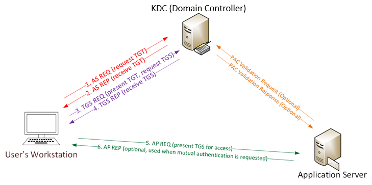
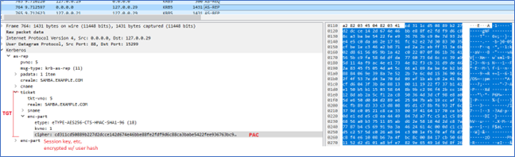
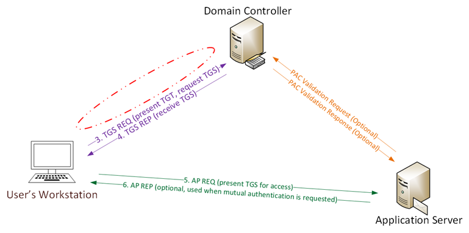
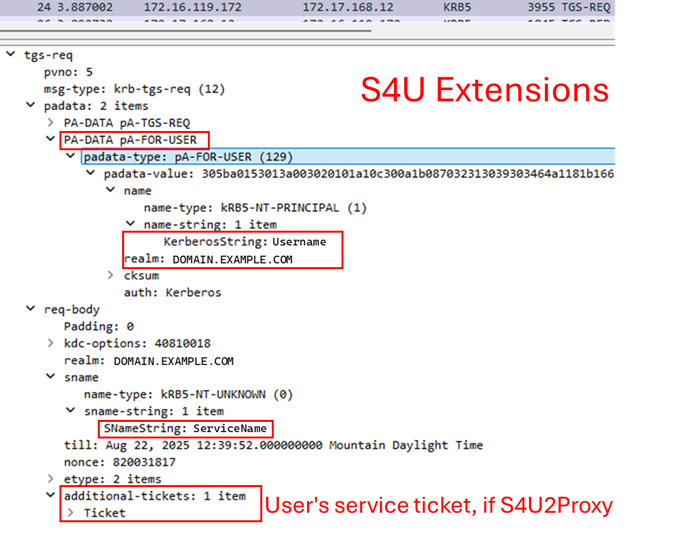
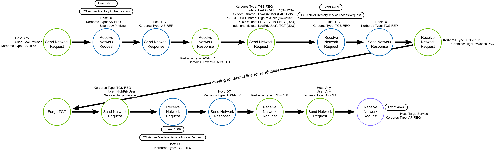

# Forge a Kerberos TGT

## Metadata

| Key          | Value                         |
|--------------|-------------------------------|
| ID           | TRR0013                       |
| External IDs | [T1558.001]                   |
| Tactics      | Credential Access             |
| Platforms    | Active Directory              |
| Contributors | Andrew VanVleet, Chris Hodson |

## Technique Overview

Adversaries who have the `krbtgt` account password hash may forge Kerberos
ticket granting tickets (TGTs) for any user in the domain. This is referred to
as a "Golden Ticket" attack because the attacker can gain access to any resource
in the domain, regardless of password changes, so long as the `krbtgt` password
remains unchanged. Later variations on the technique have been dubbed Sapphire
and Diamond Tickets. This TRR currently covers Golden and Sapphire tickets.

## Technical Background

### The Kerberos Protocol

Kerberos is a network authentication protocol designed to provide strong
authentication for client/server applications by using symmetric key
cryptography to sign 'tickets' that a client can use to prove their identity and
authorization to access a network resource. The Kerberos protocol consists of 3
components (hence the name, which references the 3-headed dog of Greek
mythology):

- Client
- Application Server (AS)
- Key Distribution Center (KDC)

The client is the user who wants access to a network resource. The AS is the
server hosting the desired resource. The KDC is the authoritative source of
information about users and what resources they are authorized to access. In
Active Directory domains, the domain controllers are also the Kerberos KDC.

Kerberos is stateless: it relies on cryptographically signed tickets to validate
the identity of clients and their authorization to access resources. Tickets are
encrypted with the password hash of the account intended to use them. This
requires that the cryptographic private keys are known only by the key's owner
and the KDC.

Kerberos uses 2 different ticket types:

- **A Ticket Granting Ticket (TGT)**: After a client has authenticated, they
receive a TGT that is stored on the client device and can be used to request
access to specific network resources without having to reauthenticate. These
tickets are signed with the KDC's private key.
- **A Service Ticket**: Clients are issued a service ticket to grant access to a
specific resource. Service tickets are issued by the KDC and are provided by the
client to the AS to prove that the client is authorized to access the resource.
These tickets are signed with the private key of the service account associated
with requested resource.

In the Active Directory implementation of Kerberos, the KDC's private key is the
password hash of a special service account that represents the KDC in the
directory. This account is created automatically when the domain is created and
is named `krbtgt`. A foundational assumption of Kerberos is that no one knows
the `krbtgt` password except the KDC, and thus any tickets that have been signed
by the KDC's key must have been generated previously by the KDC itself.

### Kerberos Messages in Detail

The Kerberos protocol defines a series of messages exchanged between the client,
the KDC, and AS. The Kerberos protocol was originally designed in the 1980's and
is on version 5. It is employed in use cases far beyond what was originally
envisioned and has had dozens of extensions added to it to enable those use
cases. As a result, it is a very complex protocol. What follows is a simplified
summary; more detailed descriptions are available online.[^1][^2][^3]



1. AS-REQ: The client authenticates to the KDC's Authentication Server with a
    username and password. By default in a Windows domain, pre-authentication
    data is also included in the form of a current timestamp encrypted with the
    user's secret key (derived from the windows password).
2. AS-REP: The KDC validates the client's credentials, then sends back a TGT.
    The TGT contains the PAC, which includes the symmetric user session key that
    is used in subsequent steps to encrypt communications with the KDC. The TGT
    also contains the username that it was issued for and an expiration
    timestamp. Note that the client cannot read the encrypted portions of the
    TGT because it does not know the KDC's encryption key. The AS-REP also
    contains the session key and expiration time encrypted with the user's hash,
    which the client can read. At this point, the client has a session key that
    it decrypted using the user's secret key and the TGT (which contains the
    same session key, encrypted with the KDC's secret key). In the image below,
    you can see an AS-REP message, with the TGT (the ticket section), PAC (the
    ticket->enc-part section), and data encrypted with the user's key (the
    enc-part section).



3. TGS-REQ: When the client wants access to a specific resource, it presents
    the TGT to the KDC's Ticket Granting Service (TGS) in a message that also
    contains the SPN of the service it wants to access. The request is encrypted
    using the user's session key, obtained from the AS-REP message earlier.
4. TGS-REP: The KDC opens the TGT and validates the PAC checksum. If
    successful, it proceeds to create a service ticket that contains the PAC. A
    symmetric key is generated for use between the client and the requested
    service (the service session key). The service ticket is encrypted with the
    service's password hash. The service ticket and the service session key are
    encrypted a second time using the user's session key and sent to the client.
5. AP-REQ: Client decrypts the service ticket and service session key from the
    TGS-REP message and sends the service ticket to the server hosting the
    desired resource. The client also includes an authenticator message
    generated by the client and encrypted with the service session key..
6. The AS decrypts the service ticket (using its own password hash) and extract
    the service session key. It then decrypts the authenticator using the
    service session key. The AS extracts the PAC from the service ticket and
    grants the client access to the resource.
7. AP-REP (optional): If mutual authentication is needed, it can send back an
    optional AP-REP message.
8. PAC Validation: If the TGT is older than 20 minutes, the AP will send a PAC
    Validation message to the KDC to verify that the PAC's information is valid.

### The Privileged Attribute Certificate (PAC)

The Kerberos protocol is one of the most commonly used authentication
mechanisms. However, the Kerberos protocol does not define any explicit group
membership or logon policy information to be carried in the Kerberos tickets;
applications are expected to manage their own authorization. Kerberos extensions
provide a mechanism to convey authorization information by encapsulating this
information within an `AuthorizationData` structure. The [Privileged Attribute
Certificate] (PAC) was created to provide this authorization data for Active
Directory domains.

Active Directory's implementation of Kerberos always includes a PAC. This is
included in the TGT and is signed with the KDC's encryption key (again, derived
from the `krbtgt` password hash). The PAC contains the session key and
information about the user's privileges in the domain. PAC validation is
generally performed by checking the signature instead of inspecting if the
attributes are correct (because Kerberos assumes that only the KDC knows the
key).

Here is an example of a decoded TGT.

```text
Decoding unencrypted data in credential[0]['ticket']:
[*] Service Name : krbtgt/AD.SOSTUP.ID
[*] Service Realm : AD.SOSTUP.ID
[*] Encryption type : aes256_cts_hmac_sha1_96 (etype 18)
    ---begin PAC data---
[*] Decoding credential[0]['ticket']['enc-part']:
[*] LoginInfo
[*] Logon Time : 21/08/2024 17:31:23 PM
[*] Logoff Time : Infinity (absolute time)
[*] Kickoff Time : Infinity (absolute time)
[*] Password Last Set : 15/07/2024 20:27:57 PM
[*] Password Can Change : 16/07/2024 20:27:57 PM
[*] Password Must Change : Infinity (absolute time)
[*] LastSuccessfulILogon : Infinity (absolute time)
[*] LastFailedILogon : Infinity (absolute time)
[*] FailedILogonCount : 0
[*] Account Name : slacker
[*] Full Name : slacker
[*] Logon Script :
[*] Profile Path :
[*] Home Dir :
[*] Dir Drive :
[*] Logon Count : 1222
[*] Bad Password Count : 0
[*] User RID : 1104
[*] Group RID : 513
[*] Group Count : 4
[*] Groups : 512, 1112, 513, 518
[*] Groups (decoded) : (512) Domain Admins
[*] (513) Domain Users
[*] (518) Schema Admins
[*] +1 Unknown custom group
[*] User Flags : (32) LOGON_EXTRA_SIDS
[*] User Session Key : 00000000000000000000000000000000
[*] Logon Server : DC01
[*] Logon Domain Name : ad
[*] Logon Domain SID : S-1-5-21-338595573-2398786023-2841481039
[*] User Account Control : (528) USER_NORMAL_ACCOUNT, USER_DONT_EXPIRE_PASSWORD
[*] Extra SID Count : 1
[*] Extra SIDs : S-1-18-1 Authentication authority asserted identity (SE_GROUP_MANDATORY, SE_GROUP_ENABLED_BY_DEFAULT, SE_GROUP_ENABLED)
[*] Resource Group Domain SID :
[*] Resource Group Count : 0
[*] Resource Group Ids :
[*] LMKey : 0000000000000000
[*] SubAuthStatus : 0
[*] Reserved3 : 0
[*] ServerChecksum
[*] Signature Type : hmac_sha1_96_aes256
[*] Signature : 90dba4e477076822eb654182
[*] KDCChecksum
[*] Signature Type : hmac_sha1_96_aes256
[*] Signature : aa1cc0659f9a235eef56ce78
[*] ClientName
[*] Client Id : 21/08/2024 17:31:23 PM
[*] Client Name : slacker
[*] UpnDns
[*] Flags : (2) S_SidSamSupplied
[*] UPN : slacker@ad.sostup.id
[*] DNS Domain Name : AD.SOSTUP.ID
[*] SamAccountName : slacker
[*] UserSid : S-1-5-21-338595573-2398786023-2841481039-1104
[*] Attributes Info
[*] Flags : (1) PAC_WAS_REQUESTED
[*] Requestor Info
[*] UserSid : S-1-5-21-338595573-2398786023-2841481039-1104
```

### Forging the TGT and Detecting Forgeries

If an attacker can gain access to the password hash of the `krbtgt` account,
they can use it to forge and sign TGTs for any user in the domain. Instead of
requesting a TGT from the KDC, the attacker presents a forged TGT in the request
for a service ticket.



Remember that the information in the PAC is not validated unless the TGT is
older than 20 minutes, so an attacker can make any claims they want, even if
they are not in accordance with domain policies and configuration. For example,
an attacker can forge a TGT for any user in the domain, claim any user is part
of the Domain Admins group or set the expiration date of the TGT far into the
future.

### Logging

There are a handful of Windows events logged during the Kerberos authentication
and authorization process. These are:

- Event 4678 - A Kerberos authentication ticket (TGT) was requested.
- Event 4769 - A Kerberos service ticket was requested.
- Event 4624 - An account was successfully logged on.

Additionally, the Kerberos protocol is mostly unencrypted, except for the
tickets, authenticators, and other sensitive details that employ message and
field level encryption. This makes it possible to identify specific messages on
the network, though the most important details are found in the encrypted
portions.

Finally, CrowdStrike IDP generates an `ActiveDirectoryAuthentication` event when
a user authenticates and is granted a TGT, and an
`ActiveDirectoryServiceAccessRequest` event when a TGT is submitted to request a
service ticket.

## Procedures

| ID | Title | Tactic |
|----|----|----|
| TRR0013.AD.A | Forge a TGT from scratch (Golden Ticket) | Credential Access |
| TRR0013.AD.B | Forge TGT using PAC acquired via U2U+S4U2Self (Sapphire Ticket) | Credential Access |

### Procedure A: Forge a TGT from scratch (Golden Ticket)

In this procedure, a TGT is created from scratch. The attacker is responsible
for determining the correct fields and values to populate in the forged TGT. If
an attacker is careful to forge a ticket with all the details in a legitimate
TGT issued by the domain's KDC, a Golden Ticket attack is likely impossible to
detect. An attacker can use a tool like [Impacket's getPAC.py] to inspect a
legitimate TGT in the domain as a reference and ensure their forgery matches it.

#### Detection Data Model


In the DDM above, the green operations represent the client, the blue the KDC,
and the purple the application server. The TGT request is included in gray
circles, showing the process that normally would occur but is skipped in a
Golden Ticket attack.

The best opportunities for detecting Golden Tickets depend on adversaries making
mistakes when forging their TGTs that distinguish the forgery from real
KDC-issued TGTs.

For example, Rubeus (an open source tool for attacking Active Directory)
generates a TGT that does not include a timestamp for the last time a user's
password was reset or information on which specific server issued the TGT. These
fields are not necessary for access to a resource and not validated by the AS,
but they are always included in a legitimate TGT issued by a true KDC.

Snippet of a default Rubeus-generated TGT:

```text
[*] LoginInfo
[*] Logon Time : 20/08/2024 13:36:23 PM
[*]Logoff Time : Infinity (absolute time)
[*] Kickoff Time : Infinity (absolute time)
[*] Password Last Set : Infinity (absolute time)
[*] Password Can Change : Infinity (absolute time)
[*] Password Must Change : Infinity (absolute time)
[*] Account Name : slacker
[*] User RID : 1104
[*] Group RID : 513
[*] Group Count : 1
[*] Groups : 512
[*] Groups (decoded) : (512) Domain Admins
[*] Logon Server :
[*] Logon Domain Name : AD
```

Other indicators that a TGT might be forged include:

- Issued for usernames that don't exist in Active Directory
- Modified group memberships (added or removed)
- Username and RID mismatches
- Weaker than normal encryption types (e.g., RC4 instead of AES-256)
- Ticket lifetimes that exceed the domain maximum (the default domain lifetime
is 10 hours but the default assigned by mimikatz is 10 years)
- A request for a service ticket using a TGT that was never issued.

### Procedure B: Forge TGT using PAC acquired via U2U+S4U2Self (Sapphire Ticket)

A Sapphire Ticket attempts to address the challenge of ensuring that a forged
TGT blends into the environment by using legitimate elements issued by the KDC
in the forgery. This is done by abusing two Kerberos features: [User-to-User
Authentication Exchanges] (U2U) and the [Service for User] (S4U) protocol
extension.

#### User-to-User (U2U)

User-to-User authentication provides a method to perform authentication when the
verifier (i.e. the service) does not have a access to a long-term service key.
(This might be the case when running a server as a user on a workstation or when
running peer-to-peer application, for example).

To address this problem, the Kerberos protocol allows a client to request that
the ticket issued by the KDC be encrypted using a session key from a TGT issued
to the party that will verify the authentication (again, usually the application
server). This TGT must be obtained from the verifier by some means external to
the Kerberos protocol prior to requesting U2U authentication.

> [!NOTE]
>
> The client cannot use the verifier's TGT to impersonate the verifier because
> they do not have the session key, which would be used to encrypt the TGS-REQ
> message. Knowledge of the session key is how a client proves a TGT belongs to
> them.

When the client sends its TGS-REQ message to the KDC, it includes the verifying
server's TGT as an additional ticket (using the `additional-tickets` section)
and sets the `ENC-TKT-IN-SKEY` flag to `True`. After validating the request, the
KDC will encrypt the service ticket with the session key contained in the
verifier's TGT. The client will then submit the service ticket to the
application server in an AP-REQ message, setting the `USE-SESSION-KEY` flag in
the `ap-options` field. The verifying server will be able to decrypt the service
ticket because it can decrypt its own TGT and obtain the session key.


#### Service for User (S4U)

Sometimes there is a need for a service to be able to impersonate a user while
requesting data from another service. For example, a web server may need to
query a database server but should only be allowed to access the information the
requesting user has access to. In Kerberos, the functionality permitting the web
server to impersonate a user is called "delegation."

Microsoft created the [\[MS-SFU\] Service for User and Constrained Delegation]
Kerberos protocol extension to enable delegation. Using Service For User (S4U),
an application can request a Kerberos service ticket on behalf of a user (this
is the opposite of the normal flow). There are two extensions included in
\[MS-SFU\]:

- **S4U2Self** - This extension allows a service to use its own TGT to retrieve
  a service ticket to itself on behalf of a client, as though the client
  originally requested and provided the ticket to the service.
- **S4U2Proxy** - This extension allows a service to obtain a service ticket on
  behalf of a client to a different service, using a service ticket from the
  client as evidence that the client has authenticated.

The \[MS-SFU\] extension defines two new pre-authentication data (`padata`)
types, `PA-FOR-USER` and `PA_S4U-X509_USER`. Both are used to define the user
for which a delegated service ticket is being requested. The former identifies
the user by username and realm and the latter identifies them with an X509
certificate. The KDC can identify an S4U request by the presence of one of these
two data types in the TGS-REQ message (in the `padata` section of the message).

An S4U2Self request only needs the `PA-FOR-USER` data, but an S4U2Proxy
request also requires that a service ticket from the client is included in the
`additional-tickets` field as proof that the client made the request to the
service that will be acting as a proxy.[^4]



#### U2U+S4U2Self

A Sapphire Ticket attack employs an unusual combination of U2U and S4U2Self to
obtain a legitimate PAC for a target high privilege user, which can then be used
to forge a credible TGT for that user. The attack uses the S4U extension's
`PA-FOR-USER` data structure to request a service ticket on behalf of the target
high profile user as though it were acting as a delegate for that user. However,
instead of using a legitimate service as the delegator, it uses a low privilege
user account, which doesn't have a long-term service key that the KDC can use to
encrypt the service ticket. The attacker can't impersonate a legitimate service
as the supposed delegator because they don't have the service's long-term key,
and wouldn't be able to decrypt the resulting service ticket. This problem is
solved by using U2U. By including the low privilege user's TGT and setting the
`ENC-TKT-IN-SKEY` flag, the resulting service ticket will be encrypted with a
key the attacker possesses, allowing them to obtain the high privilege user's
PAC.

#### Detection Data Model



This DDM has been simplified due to the large number of operations required for
this procedure. The lower level networking details have been omitted, keeping
the DDM focused at the Kerberos protocol application layer.

An attacker performing a Sapphire Ticket attack starts by requesting a TGT for a
compromised low privileged user. This TGT is one of two elements needed to forge
a credible TGT. They then send a TGS-REQ message using U2U+S4U2Self to obtain a
service ticket, encrypted with the low privilege user's session key, that
contains a legitimate PAC for the target high privilege user. Using the low
privilege user's session key they decrypt the service ticket and extract the
PAC. Then, using the `krbtgt` password hash, they decrypt the low privilege
user's TGT and replace their PAC with the high privilege user's PAC. They also
alter the TGT's client name (`cname`) to match the high privilege user. The
ticket is then re-encrypted, resulting in a forged TGT for the high privilege
user composed of all legitimate elements issued by the KDC. They can then use
this forged TGT to request service tickets as the high privilege user.

#### A Note on Logging U2U+S4U2Self

Because this procedure employs an unusual permutation of Kerberos messages, it
throws off Windows event logging. Event 4769 records the U2U+S4U2Self TGS-REQ.
The U2U requirement of setting the `ENC-TKT-IN-SKEY` flag is observable via the
`TicketOptions` field (it is bit `0x8`), but the logging logic fails to
recognize the S4U delegation. The resulting log simply has the low privilege
user as both the TargetUserName and the ServiceName, and the targeted higher
privilege user fails to appear in the log at all.

CrowdStrike's `ActiveDirectoryServiceAccessRequest` event is more accurate,
properly identifying that delegation is occurring and recording the low
privilege user as the service and the high privilege user as the client
requesting the service ticket. Additionally, it attempts to identify the
delegator service, which under proper use of S4U2Proxy would be the service name
(`sname`) in the service ticket included in the `additional-tickets` field.
(Under valid S4U2Proxy, the service in the event would be the second service for
which the delegator service is requesting a ticket on behalf of the client.)
However, the Sapphire Ticket's unusual combination of U2U+S4U2Self means that
instead of finding a service ticket in the `additional-tickets` field as
expected, it finds the TGT holding the session key needed for U2U. CrowdStrike
reads the `sname` from the additional ticket and includes it in the
`DelegatorAccountUserPrincipal` event field, but the `sname` for a TGT is always
`krbtgt`. So, the presence of the `krbtgt` account name in the
`DelegatorAccountUserPrincipal` is a strong indicator that the TGS-REQ message
was employing U2U+S4U2Self, and therefore a Sapphire Ticket attack.

## Available Emulation Tests

| ID | Link |
|----|----|
| TRR0013.AD.A | [Atomic Tests 1-2] |
| TRR0013.AD.B | |

## References

- [RFC 4120 - Kerberos v5]
- [Kerberos and Windows Security - Robert Broeckelmann]
- [Kerberos Wireshark Captures - Robert Broeckelmann]
- [Golden Ticket Attack for Blue Teams - Orhan Öztaş]
- [Formal PAC MIDL Definition - Microsoft Learn]
- [GetPac.py - GitHub]
- [Kerberos & krbtgt: AD's Domain Kerberos Service Account- AD Security]
- [Kerberos, Active Directory's Secret Decoder Ring - AD Security]
- [Detecting Forged Kerberos Ticket - AD Security]
- [Abusing Microsoft Kerberos - Sorry you guys don't get it - Benjamin Delpy]
- [Fighting Golden Ticket Attacks - Varonis]
- [Kerberos Attacks (Part 2) - RedFox Security]
- [Diamond Tickets - Semperis]
- [Impacket describeTicket.py - GitHub]
- [Designing an Authentication System - MIT.edu]
- [The New Generation of Kerberos Attacks - Palo Alto]
- [Privilege Attribute Certificate Data Structure - Microsoft Learn]
- [User-to-User Authentication Exchanges]
- [\[MS-SFU\] Service for User and Constrained Delegation]
- [Kerberos II - Credential Access - Raul Redondo]
- [Kerberos III - User Impersonation - Raul Redondo]
- [Kerberos IV - Delegations - Raul Redondo]
- [Next Gen Kerberos Attacks - Palo Alto]

[^1]: [Kerberos and Windows Security - Robert Broeckelmann]
[^2]: [Kerberos Wireshark Captures - Robert Broeckelmann]
[^3]: [Designing an Authentication System - MIT.edu]
[^4]: [S4U2Proxy Specs]

[Kerberos and Windows Security - Robert Broeckelmann]: https://medium.com/@robert.broeckelmann/kerberos-and-windows-security-kerberos-v5-protocol-b9c804e06479
[Kerberos Wireshark Captures - Robert Broeckelmann]: https://medium.com/@robert.broeckelmann/kerberos-wireshark-captures-a-windows-login-example-151fabf3375a
[Golden Ticket Attack for Blue Teams - Orhan Öztaş]: https://orhanoztasbir.medium.com/golden-ticket-attack-explaining-from-the-blue-team-perspective-411361ca7a22
[Formal PAC MIDL Definition - Microsoft Learn]: https://learn.microsoft.com/en-us/openspecs/windows_protocols/ms-pac/1d4912dd-5115-4124-94b6-fa414add575f
[GetPac.py - GitHub]: https://github.com/fortra/impacket/blob/master/examples/getPac.py
[Kerberos & krbtgt: AD's Domain Kerberos Service Account- AD Security]: https://adsecurity.org/?p=483
[Kerberos, Active Directory's Secret Decoder Ring - AD Security]: https://adsecurity.org/?p=227
[Detecting Forged Kerberos Ticket - AD Security]: https://adsecurity.org/?p=1515
[Abusing Microsoft Kerberos - Sorry you guys don't get it - Benjamin Delpy]: https://www.slideshare.net/slideshow/abusing-microsoft-kerberos-sorry-you-guys-dont-get-it/37957800
[Fighting Golden Ticket Attacks - Varonis]: https://www.varonis.com/blog/pac_requestor-and-golden-ticket-attacks
[Kerberos Attacks (Part 2) - RedFox Security]: https://redfoxsec.com/blog/kerberos-attacks-part-2/
[Diamond Tickets - Semperis]: https://www.semperis.com/blog/a-diamond-ticket-in-the-ruff/
[Impacket describeTicket.py - GitHub]: https://github.com/fortra/impacket/blob/master/examples/describeTicket.py
[Designing an Authentication System - MIT.edu]: https://web.mit.edu/kerberos/dialogue.html
[The New Generation of Kerberos Attacks - Palo Alto]: https://unit42.paloaltonetworks.com/next-gen-kerberos-attacks/
[Privilege Attribute Certificate Data Structure - Microsoft Learn]: https://learn.microsoft.com/en-us/openspecs/windows_protocols/ms-pac/54d570b1-fc54-4c54-8218-f770440ec334
[Privileged Attribute Certificate]: https://learn.microsoft.com/en-us/openspecs/windows_protocols/ms-pac/1d4912dd-5115-4124-94b6-fa414add575f
[Impacket's getPAC.py]: https://github.com/fortra/impacket/blob/master/examples/getPac.py
[Atomic Tests 1-2]: https://github.com/redcanaryco/atomic-red-team/blob/master/atomics/T1558.001/T1558.001.md
[T1558.001]: https://attack.mitre.org/techniques/T1558/001/
[User-to-User Authentication Exchanges]: https://www.rfc-editor.org/rfc/rfc4120#section-3.7
[Service for User]: https://learn.microsoft.com/en-us/openspecs/windows_protocols/ms-sfu/3bff5864-8135-400e-bdd9-33b552051d94
[\[MS-SFU\] Service for User and Constrained Delegation]: https://learn.microsoft.com/en-us/openspecs/windows_protocols/ms-sfu/3bff5864-8135-400e-bdd9-33b552051d94
[S4U2Proxy Specs]: https://learn.microsoft.com/en-us/openspecs/windows_protocols/ms-sfu/c920c148-8a9c-42e9-b8e9-db5755cd281b
[Kerberos II - Credential Access - Raul Redondo]: https://labs.lares.com/fear-kerberos-pt2/
[Kerberos III - User Impersonation - Raul Redondo]: https://labs.lares.com/fear-kerberos-pt3/
[Kerberos IV - Delegations - Raul Redondo]: https://labs.lares.com/fear-kerberos-pt4/
[RFC 4120 - Kerberos v5]: https://www.rfc-editor.org/rfc/rfc4120#section-3.7
[Next Gen Kerberos Attacks - Palo Alto]: https://unit42.paloaltonetworks.com/next-gen-kerberos-attacks/
