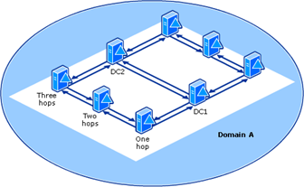

# Rogue Domain Controller (DCShadow)

## Metadata

| Key          | Value            |
|--------------|------------------|
| ID           | TRR0014          |
| External IDs | [T1207]          |
| Tactics      | Defense Evasion  |
| Platforms    | Active Directory |
| Contributors | Andrew VanVleet  |

## Technique Overview

Adversaries may register a rogue domain controller (DC) to enable manipulation
of Active Directory (AD) data. This attack has been coined as "DCShadow."
Controlling a rogue DC allows an attacker to manipulate AD data, including
objects and schemas, to establish persistence or evade defenses. A DCShadow
attack requires Domain or Enterprise Admin privileges, and enables many other
AD-related attacks, like SID History Injection ([T1134.005]) or granting users
highly privileged rights. Changes to Active Directory objects are logged only by
the DC that originates them, so a change made via a rogue DC is not logged (the
attacker-controlled DC will not generate and forward a log, but the legitimate
DCs receiving the changes via replication will not log it, either). This makes a
DCShadow attack an attractive option for establishing long-term access to a
compromised domain.

## Technical Background

The goal of an attack with a rogue DC is to identify the minimal set of changes
required in the directory to inject a new participant into the replication
process. This allows the attacker to create, delete, or modify any and all
objects in the directory without generating the logs that would normally record
such changes. Inserting a rogue DC into the directory requires a high level of
privilege, so this is not a privilege escalation attack. This technique can be
used to enable many other attack techniques while evading defenses in place to
detect them and would likely be employed to establish long term persistence in a
compromised Active Directory domain.

### Active Directory Concepts

Following are some key AD concepts that play a pivotal role in this
technique.

#### Service Principal Names (SPNs)

A service principal name (SPN) is a unique identifier of a service
instance. Kerberos authentication uses SPNs to associate a service instance with
a service sign-in account. The service's sign-in account will contain the
password hash used for Kerberos authentication to that service. Before a client
can use an SPN to authenticate to an instance of a service, the SPN must be
registered as a property on the user or computer account in the directory that
the service instance will use to log on. Adding an SPN requires write
permissions to the object in Active Directory.

An SPN consists of two or three parts, each separated by a forward slash ('/').
The first part is the [service class], the second part is the host name (with an
optional port), and the third part (if present) is the service name. For
example, the LDAP service on a DC named DC-01 in the Fabrikam.com domain would
use the SPN `ldap/dc-01.fabrikam.com/fabrikam.com`; `ldap` is the service class
name, `dc-01.fabrikam.com` is the host name, and `fabrikam.com` is the service
name. With a port specified, it would be
`ldap/dc-01.fabrikam.com:389/fabrikam.com`.

A client wishing to connect to a service in the domain will compose the SPN for
the desired service, then request a Kerberos ticket granting access to that
service. If the client has permission to access the service, the Kerberos
protocol ensures that the necessary information and session key are provided to
both the client and the service to allow for mutual authentication.

There are two SPNs required for Active Directory replication:

- The DRS service class (which has the well-known GUID
    `E3514235–4B06–11D1-AB04–00C04FC2DCD2` for its service class; this GUID is
    also associated with the drsuapi RPC interface)

- The Global Catalog service class (which has the string `GC/` for its service
    class)

A writable DC will require both SPNs, while a read-only DC only needs the Global
Catalog SPN. This is because the DRS SPN is used for outbound replication, while
the Global Catalog one is use for inbound replication. (More information on
outbound and inbound replication in the section on Active Directory replication
below.)

Below is an example of the SPNs registered for a DC in a vanilla lab
environment:

```text
Registered ServicePrincipalNames for CN=WIN-DC,OU=Domain Controllers,DC=mylab,DC=local:

 ldap/WIN-DC/ForestDnsZones.mylab.local
 HOST/WIN-DC/mylab.local
 ldap/WIN-DC/DomainDnsZones.mylab.local
 GC/WIN-DC/mylab.local
 ldap/WIN-DC/mylab.local
 HOST/WIN-DC/MYLAB
 ldap/WIN-DC/MYLAB
 Dfsr-12F9A27C-BF97-4787-9364-D31B6C55EB04/WIN-DC.mylab.local
 ldap/WIN-DC.mylab.local/ForestDnsZones.mylab.local
 ldap/WIN-DC.mylab.local/DomainDnsZones.mylab.local
 DNS/WIN-DC.mylab.local
 GC/WIN-DC.mylab.local/mylab.local
 RestrictedKrbHost/WIN-DC.mylab.local
 RestrictedKrbHost/WIN-DC
 HOST/WIN-DC.mylab.local/MYLAB
 HOST/WIN-DC
 HOST/WIN-DC.mylab.local
 HOST/WIN-DC.mylab.local/mylab.local
 ldap/WIN-DC.mylab.local/MYLAB
 ldap/WIN-DC
 ldap/WIN-DC.mylab.local
 ldap/WIN-DC.mylab.local/mylab.local
 RPC/9a2687db-af1e-439d-af77-c6a4ff8b406b.\_msdcs.mylab.local
 E3514235-4B06-11D1-AB04-00C04FC2DCD2/9a2687db-af1e-439d-af77-c6a4ff8b406b/mylab.local
 ldap/9a2687db-af1e-439d-af77-c6a4ff8b406b.\_msdcs.mylab.local
```

#### Active Directory Replication

Enterprise Active Directory domains almost always have more than one DC. This
helps ensure resilience against failures and can help provide low latency to a
DC across the network. Changes can be written to the directory on any writable
DC (it's possible to create a read-only DC), and those changes are synchronized
across all DCs in the domain through a process called "replication." During
replication, one DC will send a request to another DC (it's 'replication
partner') asking for any changes to domain objects. As DCs replicate regularly
with one another, they ensure that all DCs (or 'replicas') converge to a single
common state.

#### Replication Topology

The specific details of how DCs will replicate with one another is called the
"replication topology"[^3]. The replication topology is generated by the
Knowledge Consistency Checker (KCC), a replication component that runs as an
application on every DC and communicates through the distributed Active
Directory database. The KCC functions by reading configuration data and reading
and writing connection objects in the local Active Directory database (i.e. the
replica on the DC on which it runs). For most of its operation, the KCC that
runs on one DC does not communicate directly with the KCC on any other DC.
Rather, all KCCs use the knowledge of the common, global data that is stored in
the configuration directory partition as input to the topology generation
algorithm to converge on the same view of the replication topology. The KCC
communicates with other KCCs only to make a remote procedure call (RPC) request
for replication error information. The KCC uses the error information to
identify gaps in the replication topology. A request for replication error
information occurs only between DCs in the same site.

The objects that are read or written by the KCC are:

1. The **Server objects** in the `Sites` container that represent each
    replication participant. Each DC in the forest has a
    corresponding server object in the Sites container.

2. An **NTDS Settings object** (class `nTDSDSA`) object. Each server object in
    the Sites container must have a child `NTDS Settings` object that contains
    information about the server as a replication partner.

3. **Connection objects** (class `nTDSConnection`). These objects are children
    of the `NTDS Settings` object and define a one-way, inbound connection from
    another DC (the replication source, or 'replication
    partner'). All of a given DC's replication partners (the DC's that it will
    request replication data from) will be defined as connection objects under
    the DC's `NTDS Settings` class in the configuration partition.

The KCC generates the replication topology by creating a list of all the
replication servers in the site (there MUST be a server object with an `NTDS
Settings` object in the Site container of the configuration partition for the
KCC to include a server as a replication participant). The KCC then connects
those servers in a ring. From the perspective of a single KCC process (running
on one DC in the domain), the KCC will create a connection object for each
neighboring server in the ring (if one doesn't already exist).



Finally, the KCC mandates that each DC be no more than 3 hops from all other
DCs. If there are paths that exceed 3 hops, the KCC will add additional
optimizing connections[^2] until all DCs are within the minimum-hop requirement.
The image shows a theoretical example of the replication topology developed for
a domain with 8 DCs, requiring two optimizing connections (optimizing
connections are one-way, so the link between DC2 and DC1 represents **two**
optimizing connections).

#### Outbound and Inbound Replication

The term "outbound" replication is a little misleading. In Active Directory
replication, **the request to replicate is always a pull request.** One DC can
notify the other that it has changes to replicate, but it cannot push those
changes. Once it is notified of the changes, the other DC must initiate the
replication by calling the `DRSGetNCCChanges` method and request to have those
changes sent. In that lens, all replication is inbound replication. However,
Microsoft documentation refers to "outbound" replication when a DC sends its
changes, upon request, to another DC. So, for any given replication interaction,
the requesting partner is performing inbound replication (request and update),
and the responding partner is performing outbound replication (send updates).


#### Background on DCE/RPC

DCE/RPC is an industry standard for making remote procedure calls. Microsoft's
implementation of DCE/RPC is call MSRPC. DCE/RPC can use various transports:
`ncacn_np` (transport via SMB Named Pipes); `ncacn_ip_tcp` (transport via
TCP/IP) and `ncacn_http` (transport via HTTP), to name a few. Microsoft defines
numerous operating system protocols that use RPC. Each interface comes with its
own set of numbered procedures (opnums), and procedures are called by opnum
rather than name. The DCE/RPC protocol requires an initial bind request (packet
type `0x0b`), where the desired RPC protocol is specified by its assigned UUID.
After binding to a protocol, clients call a specific procedure within the
protocol.

By way of example, services can be managed remotely via the Service Control
Manager Remote Protocol (MS-SCMR), which permits transport via both TCP and
named pipes. When using TCP, the DCE/RPC bind packet will specify the protocol's
UUID of `{367ABB81-9844-35F1-AD32-98F038001003}`, and when using named pipes, it
will connect to the protocol's designated pipe `\PIPE\svcctl`.

#### MS-DRSR RPC Protocol

Active Directory replication uses the Directory Replication Services Remote
(MS-DRSR) protocol, which is implemented using the Distributed Computing
Environment/Remote Procedure Call (DCE/RPC) protocol. The MS-DRSR protocol is
designed for replication and management of data in Active Directory and
specifies two separate interfaces: drsuapi and dsaop. Only drsuapi is relevant
to this technique. MS-DRSR allows transport via TCP (`ncacn_ip_tcp`) and
associates the drsuapi interface with the UUID
`{e3514235-4b06-11d1-ab04-00c04fc2dcd2}` (which is represented in hex in network
packets as `35 42 51 e3 06 4b d1 11 ab 04 00 c0 4f c2 dc d2`).

While the drsuapi interface[^1] defines 30 different methods, four of them are
essential for responding to a replication request:

- `IDL_DRSBind` - Creates a context handle necessary to call any other method
   in this interface.
- `IDL_DRSUnbind` - Destroys a context handle previously created by the
   `IDL_DRSBind` method.
- `IDL_DRSGetNCChanges` - Replicates updates from an NC replica on the server.
- `IDL_DRSUpdateRefs` - Adds or deletes a value from the `repsTo` attribute of
   a specified NC replica.

### Participating in Replication

In order to act as a rogue DC, a machine must meet 3 criteria:

1. Be a part of the replication topology. Specifically, be referenced as a
replication source in at least one `nTDSConnection` object for a legitimate
domain DC.
2. Have the necessary SPNs defined to support Kerberos authentication. (Meeting
this criteria requires having an NTDS Object in the site container of the
configuration partition, because a DSA GUID – which is assigned to an `NTDS
Object` – is a necessary element in composing the DSA SPN.)
3. Implement the basic set of RPC calls used in outbound replication:
`IDL_DRSBind`, `IDL_DRSUnbind`, `IDL_DRSGetNCChanges`, `IDL_DRSUpdateRefs`.

### Logging

DCs are responsible for logging changes to the directory that they originate.
They do not log changes that they receive from another DC during the replication
process; it is assumed that the originating replica will have already written
the log. This makes a DCShadow attack particularly stealthy (after the rogue DC
has been established -- creating a rogue DC generates quite a few logs), because
the originating DC is controlled by the attacker, which will obviously not
create any logs to record the changes. These are the logs that would be
generated by the attack:

| Event ID | Title | Notes |
| ----- | ----- | ----- |
| 4742 | Computer Account Changed | Logged on the local machine when the SPNs are added to the target computer account (the computer that will become the rogue DC) |
| 4928 | An Active Directory replica source naming context was established. | Logged by the receiving DC when a new replication source is added (if the attacker chooses to trigger replication rather than wait) |
| 4929 | An Active Directory replica source naming context was removed. | Logged by the receiving DC when the rogue DC is removed as a replication source. |
| 4935 | Directory Service Replication Start | Logged by the requesting DC when replication begins. |
| 4936 | Directory Service Replication End | Logged by the requesting DC when replication ends. |
| 5136 | A directory service object was modified.  | This should be logged when the malicious SPNs are added to the directory, by whatever DC receives the LDAP request to add them. |
| 5137 | A directory service object was created. | This should be logged by the DC receiving the RPC request when the `Server` and `NTDS Settings` object are created in the configuration partition. |
| 5141 | A directory service object was deleted. | This should be logged when the SPNs and `Server` and `NTDS Settings` objects are deleted (assuming the attacker cleans up after the attack). |

## Procedures

| ID | Title | Tactic |
|----|----|----|
| TRR0014.AD.A | Insert a rogue DC | Defense Evasion |

### Procedure A: Insert a rogue DC

Because of all the objects that must be created for a machine to successfully
participate in replication, there is only one procedure to implement this
technique.

#### Detection Data Model


An attacker can add SPNs and server objects using LDAP or various drsuapi RPC
methods, like `DRSAddEntry` and `DRSWriteSPN`. For replication-specific objects
like `nTDSDSA` and `NTDSConnection`, the RPC methods are required. Once this is
done, the attacker can either wait up to 15 minutes (the default configuration)
for a KCC to see the new (malicious) replication partner and incorporate it into
the replication topology, or they can trigger this to occur immediately by
calling the RPC method `DRSReplicaAdd`. Either way, once the server has been
established as a replication partner, the legitimate DCs that have it as a
replication source will begin sending `DRSGetNCChanges` requests.

**At that point, the attacker can freely make changes to any and all Active
Directory objects on their rogue DC, and those changes will be replicated out to
all DCs in the domain.**

## Available Emulation Tests

| ID | Link |
|----|----|
| TRR0014.AD.A | [Atomic Test 1] |

## References

- [NTDS-DSA Object - What is the Meaning Of Blog]
- [DCShadow]
- [DCShadow Explained - ALSID Academy]
- [nTDSDSA Object - Microsoft Learn]
- [MS-DRSR Glossary - Microsoft Learn]
- [ConstructReplSpn - Microsoft Learn]
- [SPN for a Target DC in AD DS]
- [nTDSDSA Object \[MS-ADTS\] - Microsoft Learn]
- [CreateNtdsDsa - Microsoft Learn]
- [How Active Directory Replication Topology Works - Microsoft Learn]
- [Active Directory Replication Concepts - Microsoft Learn]
- [T1207 - Mitre ATT&CK]
- [Detecting DSync and DCShadow - NVISO Blog]
- [Mimikatz - Github]

[T1134.005]: https://attack.mitre.org/techniques/T1134/005/
[T1207]: https://attack.mitre.org/techniques/T1207/
[NTDS-DSA Object - What is the Meaning Of Blog]: https://what-is-the-meaning-of.blogspot.com/2017/03/ntds-dsa-object.html
[DCShadow]: https://www.dcshadow.com/
[DCShadow Explained - ALSID Academy]: https://fintech.global/cybertechforum/wp-content/uploads/2020/11/ALSID-ACADEMY-EPI-8-DCShadow.pdf
[nTDSDSA Object - Microsoft Learn]: https://learn.microsoft.com/en-us/openspecs/windows_protocols/ms-srpl/4c62c74a-b55c-47d1-b575-33395a727d97
[MS-DRSR Glossary - Microsoft Learn]: https://learn.microsoft.com/en-us/openspecs/windows_protocols/ms-drsr/e5c2026b-f732-4c9d-9d60-b945c0ab54eb
[ConstructReplSpn - Microsoft Learn]: https://learn.microsoft.com/en-us/openspecs/windows_protocols/ms-drsr/77a5013d-8655-46fd-a751-4a4d1a982cd5
[SPN for a Target DC in AD DS]: https://learn.microsoft.com/en-us/openspecs/windows_protocols/ms-drsr/41efc56e-0007-4e88-bafe-d7af61efd91f
[nTDSDSA Object \[MS-ADTS\] - Microsoft Learn]: https://learn.microsoft.com/en-us/openspecs/windows_protocols/ms-adts/8ebf2419-1169-4413-88e2-12a5ad499cf5
[CreateNtdsDsa - Microsoft Learn]: https://learn.microsoft.com/en-us/openspecs/windows_protocols/ms-drsr/758591d7-08b6-4f5a-b78a-f057633155b9
[How Active Directory Replication Topology Works - Microsoft Learn]: https://learn.microsoft.com/en-us/previous-versions/windows/it-pro/windows-server-2003/cc755994(v=ws.10)
[Active Directory Replication Concepts - Microsoft Learn]: https://learn.microsoft.com/en-us/windows-server/identity/ad-ds/get-started/replication/active-directory-replication-concepts
[T1207 - Mitre ATT&CK]: https://attack.mitre.org/techniques/T1207/
[Detecting DSync and DCShadow - NVISO Blog]: https://blog.nviso.eu/2021/11/15/detecting-dcsync-and-dcshadow-network-traffic/
[Mimikatz - Github]: https://github.com/gentilkiwi/mimikatz/blob/master/mimikatz
[service class]: https://learn.microsoft.com/en-us/openspecs/windows_protocols/ms-drsr/5c2026b-f732-4c9d-9d60-b945c0ab54eb#gt_c1386afd-9d42-47c7-a7ea-d01912a17647
[Atomic Test 1]: https://github.com/redcanaryco/atomic-red-team/blob/master/atomics/T1207/T1207.md

[^1]: [MS-DRSR Protocol - Microsoft Learn](https://learn.microsoft.com/en-us/openspecs/windows_protocols/ms-drsr/58f33216-d9f1-43bf-a183-87e3c899c410)
[^2]: [Active Directory Replication Topology - Microsoft Learn](https://learn.microsoft.com/en-us/previous-versions/windows/it-pro/windows-server-2003/cc755994(v=ws.10)#expanded-ring-topology-within-a-site)
[^3]: [drsuapi RPC Interface - Microsoft
    Learn](https://learn.microsoft.com/en-us/previous-versions/windows/it-pro/windows-server-2003/cc755994(v=ws.10))
