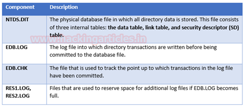
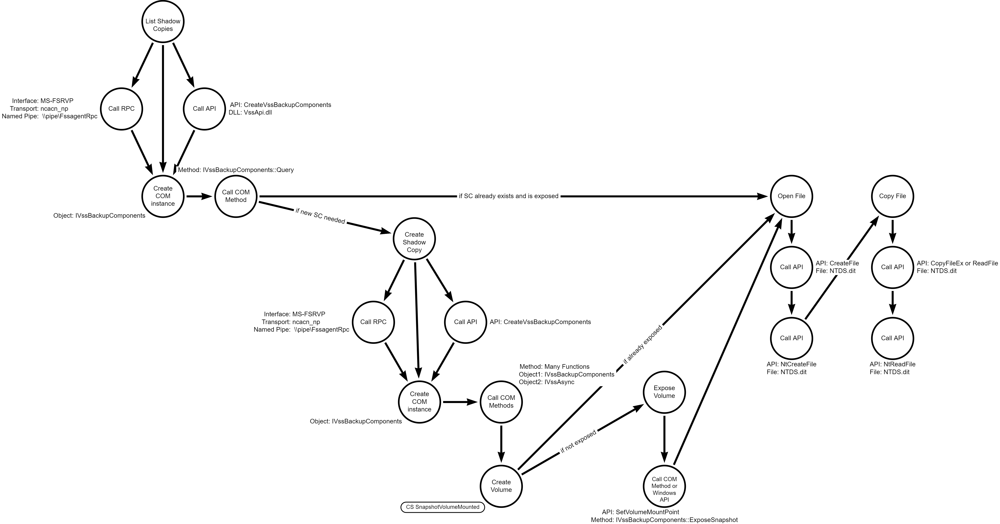
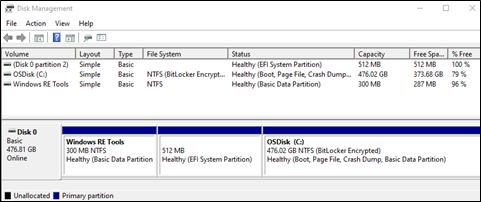
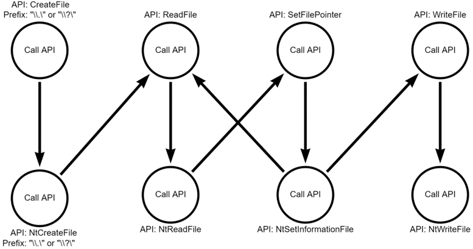

# Stealing Credentials from the NTDS.dit

## Metadata

| Key          | Value              |
|--------------|--------------------|
| ID           | TRR0015            |
| External IDs | [T1003.003]        |
| Tactics      | Credential Access  |
| Platforms    | Windows, Active Directory |
| Contributors | Andrew VanVleet    |

## Technique Overview

Adversaries may attempt to access or create a copy of the Active Directory
domain database in order to steal credential information, as well as obtain
other information about domain members such as devices, users, and access
rights. In addition to looking for NTDS files on active Domain Controllers,
adversaries may search for backups that contain the same or similar information.

## Technical Background

### What is the NTDS.dit file?

Microsoft's Active Directory Services (ADS) uses a database to store all the
data it requires -- including groups, group membership, user objects, and user
credentials (in the form of password hashes) -- for everything in the domain.
That database is stored in the `NTDS.dit` file on each domain controller. ADS
uses synchronization to ensure that each domain controller's copy of the
database is identical. By default, the NTDS.dit file is stored in the folder
`%SystemRoot%\NTDS\NTDS.dit`.

The NTDS folder holds a number of files that are used to maintain the database,
but the actual data an attacker would want is stored in the `NTDS.dit` file.

  
*Source: [Credential Dumping: NTDS.dit - Raj Chandel’s Blog]*

The file itself follows the Extensible Storage Engine (ESE) file format, which
is a format developed by Microsoft. ESE is the core of Microsoft Exchange
Server, Active Directory, and Windows Search. It's also used by a number of
Windows components including Windows Update client and Help and Support Center.
Its purpose is to allow applications to store and retrieve data via indexed and
sequential access.[^1] An ESE file can be identified by the file header, which
uses the following format:

`<4 byte checksum> EF CD AB 89`

The `NTDS.dit` file is constantly in use by Active Directory and is therefore
locked against reading by any other process. In order to make a copy, you must
use a method that permits copying locked files.

Sensitive information in the `NTDS.dit` file is encrypted using the boot key
(also called System Key or SysKey), which is unique to each domain controller
and is stored in the System registry hive (which itself is stored in the file
`C:\Windows\system32\config\SYSTEM`). How the boot key is extracted is beyond
the scope of this report, but details are available at [SysKey and the SAM -
Moyix Blog].

### Why would an attacker want to get it?

Using the boot key and a copy of the `NTDS.dit` file, an attacker can extract
password hashes for all users on the domain, which they can then attempt to
crack. Alternatively, an adversary can extract the NT hash for the KRBTGT
account, which can be used in a [Golden Ticket] attack.

## Procedures

| ID | Title | Tactic |
|----|----|----|
| TRR0015.WIN.A | Volume shadow copy access | Credential Access |
| TRR0015.WIN.B | Raw disk access | Credential Access |

### Procedure A: Volume shadow copy access

The VSS is a set of Component Object Model (COM) interfaces[^2] that implement a
framework to allow volume backups to be performed while applications on a system
continue to write to them. Backup software can interface with VSS COM objects to
create and delete shadow snapshots and copy files from them. Attackers can
access copies of files, including sensitive system files and files locked by the
operating system, through the Volume Shadow Copy Service.

#### What is VSS?

The Volume Shadow Copy Service (VSS) was introduced in Windows Server 2003 to
facilitate the process of backing up and restoring critical business data
without taking applications offline. Backing up files is complicated by the fact
that the data usually needs to be backed up or restored while the applications
that produce the data are still running, and thus data files might be open or in
an inconsistent state. Also, if a data set is large, it can be difficult to back
up all of it at one time because changes might be made during the time it takes
to create the copy.

VSS coordinates the actions that are required to create a consistent shadow copy
(also known as a snapshot or a point-in-time copy) of the data that is to be
backed up. This is a complicated process that involves coordinating with all
writers to temporarily freeze writes, complete all open transactions, and flush
caches so that the data is in a consistent state. Then the copy is made, and
future changes are logged to allow the VSS to reconstruct the state of the data
at the time of copy. Once a shadow copy has been created, the files can be read
even if the original files are locked.

#### What are Component Object Model (COM) interfaces?

COM is a technology that allows objects to interact across process and computer
boundaries as easily as within a single process. COM allows developers to define
an interface, or group of related functions, that can then be used by other
programmers. Many Windows components, like the File Open dialogue, are
implemented as COM objects to simplify the effort required to perform a common
Windows task.[^3]

COM interfaces are assigned a class identifier (CLSID) that is used to
instantiate the COM object. So, for example, the CLSID for the VSS COM interface
is `DA9F41D4-1A5D-41D0-A614-6DFD78DF5D05`, while the CLSID for the VSS
Coordinator interface is `E579AB5F-1CC4-44B4-BED9-DE0991FF0623`. A program must
first initialize the COM library by calling [CoInitializeEx], then it can create
an instance of an object by calling [CoCreateInstance] and providing the
object's class identifier (CLSID). After that, it can call any of the methods
defined in the interface. So, after a program has instantiated a VSS Coordinator
object, it can use that object to call the interface's "DeleteSnapshots" method
to delete a volume snapshot.

#### Using the VSS

There are numerous ways for users to interact with the VSS:

- The COM interfaces can be accessed from all major programming languages: C,
C++, VisualBasic, PowerShell and even Python. Microsoft provides a lot of
documentation[^4] and an example application[^5] to help programmers learn how
to use the COM classes and methods.

- Microsoft has created a function, `CreateVssBackupComponents` (exported by
`VssApi.dll`), that handles the task of instantiating the COM interfaces so it's
easier to use the VSS COM interface methods. The function returns a pointer to
an IVssBackupComponents interface object, ready for use.

- WMI has a [Win32_ShadowCopy] class that can be used to list, create, and
delete VSS shadow copies. WMI can also be accessed through most Windows
programming languages, or directly through tools like wmic.exe.

- Windows has also defined an RPC interface for creating and deleting volume
shadow copies, [File Server Remote VSS Protocol] \[MS-FSRVP\]. This RPC
interface has methods to query, create, or delete shadow copies on a remote
server. The RPC methods don't expose all of the possible options available
via the COM interfaces, but they do permit some actions to be performed
remotely.

- There are multiple windows applications, like `VSSAdmin.exe` and
`DiskShadow.exe`, that have been created to facilitate interactions with the
VSS.

VSS can create three kinds of shadow copies:

- **Complete copy**  - This method makes a complete copy (called a "full copy"
or "clone") of the original volume at a given point in time. This copy is
read-only and can be transported to a different system.

- **Copy-on-write**   This method does not copy the original volume. Instead,
it makes a differential copy by storing all the original values for any
changes made to the volume in the volume shadow copy. The original data can
be reconstructed by taking the data from the original volume, then rolling
back changes using the original values stored in the shadow copy.

- **Redirect-on-write**   This method does not copy the original volume, and
it does not make any changes to the original volume after a given point in
time. Instead, it makes a differential copy by redirecting all changes to
the volume shadow copy. The original data can be read from the original
volume, while the current data state can be constructed by taking the
original data and adding the changes logged in the shadow copy.

For the purpose of this procedure, we only need a differential shadow copy on
the Domain Controller, which we will use to extract a full copy of the
`NTDS.dit`.

#### Exposing and Surfacing Shadow Copies

A requester can make a shadow copy available to other processes as a mounted
read-only device, which is known as "exposing"[^6] the shadow copy. Shadow
copies can be exposed as a local volume – assigned a drive letter or associated
with a mounted folder — or as a file share. A shadow copy can be exposed using
the method [IVssBackupComponents::ExposeSnapshot]. Only persistent shadow copies
can be exposed.

"Surfacing" a shadow copy means making it known to the system's mount manager,
so that it can be mounted like any other volume. Exposed shadow copies are also
surfaced copies, but it's possible to create a surfaced copy without exposing
it. (In the example below, we create a surfaced shadow copy and then expose it
via mklink.)

#### Example: Creating and Using a Shadow Copy in Powershell or VSSAdmin

To list existing shadow copies, you can use:

- (using VSSAdmin) `vssadmin list shadows`

- (using PowerShell) `get-wmiobject win32\_shadowcopy`

 **Example:**

```plaintext
 **PS** C:\Users\user\Desktop> gwmi win32\_shadowcopy

 \_\_CLASS : Win32\_ShadowCopy
 \_\_SUPERCLASS : CIM\_LogicalElement >
 \_\_NAMESPACE : root\cimv2
 Differential : True
 ExposedLocally : False
 ExposedName :
 ExposedPath :
 ExposedRemotely : False
 ID : {FADFC2F5-749A-4632-8A1C-04F2D5FA4E13}
 Imported : False
 InstallDate : 20211013144420.052997-420
 Name :
 OriginatingMachine : TESTHOST
 Persistent : True
 ProviderID : {B5946137-7B9F-4925-AF80-51ABD60B20D5}
 VolumeName : \\?\Volume{93d0c553-e9b9-4f87-a13c-14f5a695ac83}\\


 **PS** C:\Users\user\Desktop> Get-Volume | format-table -property DriveLetter, UniqueID, FileSystemType

 DriveLetter  UniqueID  FileSystemType
 -----------  --------  --------------
             \\?\Volume{4dec07df-4886-495d-b819-9dbeb5fd7e90}\\ NTFS
 C           \\?\Volume{93d0c553-e9b9-4f87-a13c-14f5a695ac83}\\ NTFS
 D           \\?\Volume{b9ee48ff-146b-11e9-bf7e-806e6f6e6963}\\ Unknown
             \\?\Volume{e09f7c72-9ec6-4f9f-98ed-973b808c77b4}\\ NTFS
             \\?\Volume{efe8e10e-ee7f-4193-a810-a9774ff8ade4}\\ FAT32
```

The VolumeName identifies which volume is contained in this particular shadow
copy. Powershell only provides the unique ID and you have to look it up with the
`Get-Volume` cmdlet. VSSAdmin provides a simpler view of existing shadow copies:

```plaintext
 c:\Users\user\Desktop> vssadmin list shadows

 vssadmin 1.1 - Volume Shadow Copy Service administrative command-line tool

 (C) Copyright 2001-2013 Microsoft Corp.

 Contents of shadow copy set ID: {b69c4b7f-6c0a-4a4f-9528-a17a97f8d074}

    Contained 1 shadow copies at creation time: 10/13/2021 2:44:20 PM

       Shadow Copy ID: {fadfc2f5-749a-4632-8a1c-04f2d5fa4e13}
       Original Volume: (C:)\\?\Volume{93d0c553-e9b9-4f87-a13c-14f5a695ac83}\\
       Shadow Copy Volume: \\?\GLOBALROOT\Device\HarddiskVolumeShadowCopy2
       Originating Machine: TESTHOST
       Service Machine: TESTHOST
       Provider: 'Microsoft Software Shadow Copy provider 1.0'
       Type: ClientAccessible
       Attributes: Persistent, Client-accessible, No auto release, No writers, Differential
```

If there is no existing shadow copy for the desired volume, you can request that
one be created:

- (using PowerShell) `gwmi -list
    win32\_shadowcopy).create("C:\\,"ClientAccessible"` - A return value of 0
    means it was successful, and the returned object will contain a ShadowID of
    the newly created copy

- (using VSSAdmin) `vssadmin create shadow /for=C:` - This only works on
    Windows Server, for testing on Windows 10, use PowerShell

Most programs default to creating a surfaced but not exposed shadow copy. To
read from it, most applications will need it to be locally exposed. One way to
accomplish this is to use mklink to create a symbolic link to the volume (using
the folder `C:\Extract` as our mount point in this example):

```plaintext
mklink /d C:\Extract \\?\GLOBALROOT\Device\HarddiskVolumeShadowCopy2\\
```

Then you can browse the contents of the shadow copy using the mounted folder
like any other folder. Alternately, the copy command (which is a native command
in `cmd.exe`) can copy from volumes what haven't been assigned a drive letter or
mounted to a folder. You can provide the volume identifier directly in the
command. This is what the command looks like to extract the NTDS from a given
volume shadow copy:

```plaintext
copy \\?\GLOBALROOT\Device\HarddiskVolumeShadowCopy2\Windows\NTDS\ntds.dit C:\Extracted\totallyinnocentfile.bin
```

To clean up, you can remove a symbolic link with:

```plaintext
rmdir C:\Extract
```

And you can delete the shadow copy with:

- (using PowerShell) `(gwmi win32\_shadowcopy -filter
    "ID='{fadfc2f5-749a-4632-8a1c-04f2d5fa4e13}'").delete()`

- (using VSSAdmin) `vssadmin delete shadows
    /shadow={fadfc2f5-749a-4632-8a1c-04f2d5fa4e13}`

The following tools (administrative or attack tools) can be used to access the
NTDS.dit via the volume shadow service:

- Impacket's [secretsdump.py]
- [esentutl]
- Metasploit's [NTDSGRAB]
- NTDSUtil
- VSSAdmin
- Powershell - `get-wmiobject` and `win32_shadowcopy`
- WMIC - `win32_shadowcopy`
- diskshadow
- [CrackMapExec]

#### Detection Data Model



There is very little public telemetry to identify access to files inside a
volume shadow copy.

### Procedure B: Raw disk access

An attacker can gain access to restricted or sensitive files by accessing the
raw disk or volume, allowing them to bypass OS security and file locking
mechanisms.

#### What is raw disk access?

Normal input/output operations use operating system APIs (like CreateFile and
WriteFile) to interact with files on the disk. This permits the operating system
to do all the work required to locate the file on the physical disk, regardless
of file system structure, and read or write the requested data. This also means
that the operating system can enforce consistency protections and security
checks on the requested access. A few examples of checks the operating system
might enforce are:

- Locks on files which are opened by a process and cannot be opened by other
    processes, such as the `NTDS.dit` file or SYSTEM registry hives.

- A System Access Control List (SACL) flag set on a file to alert when the
    file is opened.

- A Discretionary Access Control List (DACL) which only allows a specific set
    of users, like SYSTEM, to open a file.

An attacker can bypass these OS-level protections by opening the raw risk
directly, but they also lose the benefits of having the operating system read
the file system structures.

#### How are raw disks structured?

Physical disks are subdivided into partitions and volumes. There is a table
maintained of the divisions in one of two formats: Master Boot Record (MBR) or
Global Partition Table (GPT). GPT is the way most modern operating systems do
it, while MBR is the legacy method. The disk, partitions, and volumes of a
generic business laptop are below: there are 3 volumes and 3 partitions across a
single disk, with a 1-1 relationship between volumes and partitions. Two volumes
have been formatted using the NTFS file system, but only one (C:) has been
assigned a drive letter and is accessible from the OS.



There are many details about disk management and partitioning that aren't in
scope for this TRR. The most important aspect is that in order for the operating
system to store files on a disk, it must be assigned to a volume, given a drive
letter and formatted with a file system (on Windows, that's usually
NTFS). **Thus, to read raw data, we will mostly likely be accessing a
volume.** It is possible to access the raw physical disk, but then you would
have to parse the GPT or MBR yourself to find the volume you wanted.

At the time of creation, volumes are assigned a globally unique identifier
(GUID) that can be used to reference them.  They can also be assigned a drive
letter, a label, both, or neither. (A label is a user-friendly name that is
assigned to a volume, usually by an end user, to make it easier to recognize.)
In the picture above, the third volume has been assigned a label of `Windows RE
Tools` but no drive letter. The second has both a label of `OSDisk` and a letter
of `C:`. The first volume has neither label nor letter.

#### How do you read a raw volume in Windows?

The CreateFile API provides the ability to access everything from raw disks to
individual files. In order to access a file, you provide the full file path. If
you need to access a device instead of a file, the `\\.\\` prefix will access
the Win32 device namespace instead of the Win32 file namespace. So, to access a
physical disk, you use `\\.\PhysicalDrive0` (the number specifies which disk),
and to access a volume you can use `\\.\C:` (specifying the volume drive
letter).

It is also possible access a volume (like one that doesn't have a drive letter
assigned) by using the `\\?\\` prefix. The `\\?\\` prefix to a path string tells
the Windows APIs to disable all string parsing and to send the string that
follows it straight to the file system. So, you can access a volume
using `\\?\Volume{*GUID*}\\` (the PowerShell `Get-Volume` cmdlet will show
volume GUIDs). **You must have administrative rights to open a raw disk or
volume.**

When reading a disk in "raw" mode, the operating system doesn't interpret the
data at all, it simply reads the raw binary data from the disk sectors. You must
parse file system structures (like the MFT) manually to find and read the
physical address of the desired data on disk. This also requires knowing disk
geometry details like sector size. There is at least one public library[^7] that
defines all the data structures and functions needed to read the NTFS file
system using a raw volume. Attackers can use it or create their own
implementation.

#### Are there legitimate cases for raw volume access?

Backup solutions will often open the entire volume and copy it byte for byte.
Forensics solutions will do the same.

#### Detection Data Model



Similar to procedure A, there is little public telemetry available for raw disk
access.

## Available Emulation Tests

| ID            | Link               |
|---------------|--------------------|
| TRR0015.WIN.A | [Atomic Tests 1-9] |
| TRR0015.WIN.B |                    |

## References

### General Information

- [Extracting Password Hashes from the NDTS.dit - StealthBits]
- [Credential Dumping: NTDS.dit - Raj Chandel’s Blog]
- [Extensible Storage Engine (ESE) Database File (EDB) format specification]

### Raw Disk Access

- [NTFSParser - GitHub]
- [Invoke-NinjaCopy - GitHub]

### Volume Shadow Copy Service

- [COM Objects and Interfaces - Microsoft Learn]
- [Creating a COM Object -  - Microsoft Learn]
- [Code Sample Using VSS API - Experts Exchange]
- [Volume Shadow Copy Service - Microsoft]
- [Volume Shadow Copy Service - Microsoft Learn]
- [Intro to the Volume Shadow Copy Service API - CodeProject]
- [Windows Wednesday: Volume Shadow Copies - Medium]
- [CreateFileA API - Microsoft]
- [VSS: Generating a Backup Set - Microsoft Learn]
- [Volume Shadow Copy API - Microsoft Learn]
- [Exposing and Surfacing Shadow Copies - Microsoft Learn]

[T1003.003]: https://attack.mitre.org/techniques/T1003/003/
[Golden Ticket]: https://attack.mitre.org/techniques/T1558/001/
[Credential Dumping: NTDS.dit - Raj Chandel’s Blog]: https://www.hackingarticles.in/credential-dumping-ntds-dit/
[SysKey and the SAM - Moyix Blog]: http://moyix.blogspot.com/2008/02/syskey-and-sam.html
[CoInitializeEx]: https://learn.microsoft.com/en-us/windows/desktop/api/combaseapi/>nf-combaseapi-coinitializeex
[CoCreateInstance]: https://learn.microsoft.com/en-us/windows/desktop/api/combaseapi/>nf-combaseapi-cocreateinstance
[Win32_ShadowCopy]: https://learn.microsoft.com/en-us/previous-versions/windows/desktop/legacy/aa394428(v=vs.85)
[File Server Remote VSS Protocol]: https://learn.microsoft.com/en-us/openspecs/windows_protocols/ms-fsrvp/dae107ec-8198-4778-a950-faa7edad125b
[IVssBackupComponents::ExposeSnapshot]: https://learn.microsoft.com/en-us/windows/desktop/api/VsBackup/nf-vsbackup-ivssbackupcomponents-exposesnapshot
[secretsdump.py]: https://github.com/SecureAuthCorp/impacket/blob/impacket_0_9_23/examples/secretsdump.py
[esentutl]: https://attack.mitre.org/software/S0404/
[NTDSGRAB]: https://github.com/rapid7/metasploit-framework/blob/master/data/post/powershell/NTDSgrab.ps1
[CrackMapExec]: https://github.com/byt3bl33d3r/CrackMapExec/wiki/SMB-Command-Reference
[Atomic Tests 1-9]: https://github.com/redcanaryco/atomic-red-team/blob/master/atomics/T1003.003/T1003.003.md
[Extracting Password Hashes from the NDTS.dit - StealthBits]: https://stealthbits.com/blog/extracting-password-hashes-from-the-ntds-dit-file/
[Extensible Storage Engine (ESE) Database File (EDB) format specification]: https://github.com/libyal/libesedb/blob/main/documentation/Extensible%20Storage%20Engine%20(ESE)%20Database%20File%20(EDB)%20format.asciidoc
[NTFSParser - GitHub]: https://github.com/PowerShellMafia/PowerSploit/tree/master/Exfiltration/NTFSParser
[Invoke-NinjaCopy - GitHub]: https://github.com/PowerShellMafia/PowerSploit/blob/master/Exfiltration/Invoke-NinjaCopy.ps1
[COM Objects and Interfaces - Microsoft Learn]: https://learn.microsoft.com/en-us/windows/win32/com/com-objects-and-interfaces
[Creating a COM Object -  - Microsoft Learn]: https://learn.microsoft.com/en-us/windows/win32/learnwin32/creating-an-object-in-com
[Code Sample Using VSS API - Experts Exchange]: https://www.experts-exchange.com/questions/27588086/Volume-Shadow-Copy-c.html
[Volume Shadow Copy Service - Microsoft]: https://docs.microsoft.com/en-us/windows-server/storage/file-server/volume-shadow-copy-service
[Volume Shadow Copy Service - Microsoft Learn]: https://learn.microsoft.com/en-us/windows/win32/vss/volume-shadow-copy-service-portal
[Intro to the Volume Shadow Copy Service API - CodeProject]: https://www.codeproject.com/Articles/321273/Introduction-to-the-Volume-Shadow-Copy-Service-API
[Windows Wednesday: Volume Shadow Copies - Medium]: https://bromiley.medium.com/windows-wednesday-volume-shadow-copies-d20b60997c22
[CreateFileA API - Microsoft]: https://docs.microsoft.com/en-us/windows/win32/api/fileapi/nf-fileapi-createfilea
[VSS: Generating a Backup Set - Microsoft Learn]: https://learn.microsoft.com/en-us/windows/win32/vss/generating-a-backup-set
[Volume Shadow Copy API - Microsoft Learn]: https://learn.microsoft.com/en-us/windows/win32/vss/volume-shadow-copy-api-interfaces
[Exposing and Surfacing Shadow Copies - Microsoft Learn]: https://learn.microsoft.com/en-us/windows/win32/vss/exposing-and-surfacing-shadow-copied-volumes

[^1]: [Extensible Storage Engine - Wikipedia](https://en.wikipedia.org/wiki/Extensible\_Storage\_Engine)
[^2]: [Volume Shadow Copy API - Microsoft Learn](https://learn.microsoft.com/en-us/windows/win32/vss/volume-shadow-copy-api-interfaces)
[^3]: [Code Example: The Open Dialog Box - Microsoft Learn](https://learn.microsoft.com/en-us/windows/win32/learnwin32/example--the-open-dialog-box)
[^4]: [VSS: Generating a Backup Set - Microsoft Learn](https://learn.microsoft.com/en-us/windows/win32/vss/generating-a-backup-set)
[^5]: [VShadow - GitHub](https://github.com/microsoft/Windows-classic-samples/tree/main/Samples/VShadowVolumeShadowCopy)
[^6]: [Exposing and Surfacing Shadow Copies - Microsoft Learn](https://learn.microsoft.com/en-us/windows/win32/vss/exposing-and-surfacing-shadow-copied-volumes)
[^7]: [An NTFS Parser Library - CodeProject](https://www.codeproject.com/Articles/81456/An-NTFS-Parser-Lib)
