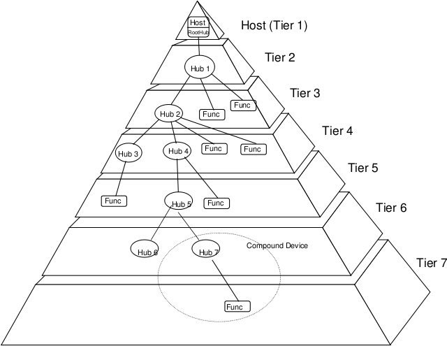
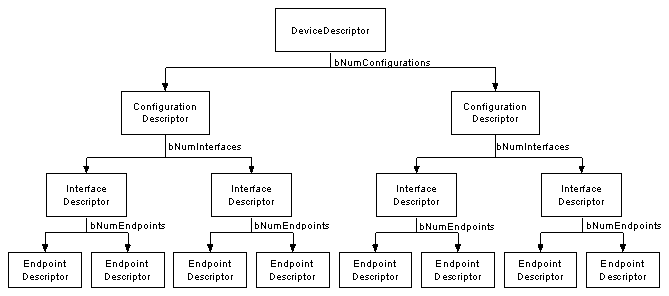
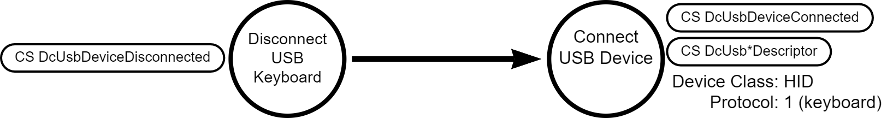
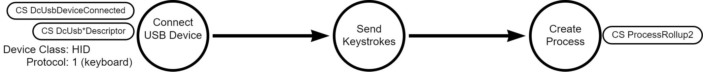
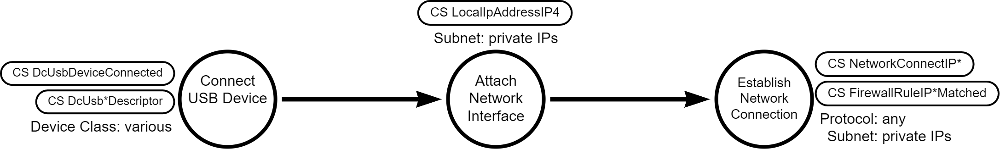

# Malicious USB Device

## Metadata

| Key          | Value   |
|--------------|---------|
| ID           | TRR0017 |
| External IDs | [T1200] |
| Tactics      | Initial Access, Credential Access, Defense Evasion |
| Platforms    | Windows |
| Contributors | Andrew VanVleet |

## Technique Overview

An adversary with physical access to a system can use a malicious USB device to
record user keystrokes, inject keystrokes, or transfer data to or from a target
machine. USB attacks are very versatile, because the attacker controls all
aspects of how the USB device appears to the user and host and what the device
does once it is connected.

## Technical Background

### Universal Serial Bus (USB)

*Source: [Universal Serial Bus]*

USB is a plug and play interface that allows a computer to communicate with a
wide range of peripheral devices. The system is controlled by the USB **host
controller** which provides the interface between connected devices and the
operating system. A USB system consists of a USB host, an interconnect, and USB
devices.

A USB system contains only one **USB host**. The host interfaces with the USB
interconnect via the host controller. The host includes an embedded hub called
the **root hub** which provides one or more **attachment points**, or **ports**.
The **interconnect** provides a connection from the USB device(s) to the USB
host. Physically, the USB interconnect is a tiered star topology (see image). A
maximum of seven tiers are allowed, and the root hub occupies the first tier.

### USB Devices

Devices connect at attachment points. They are classified as a **hub** or a
**function**. Hubs provide additional attachment points to the bus, while
functions provide capabilities to the system. Some devices can be both hubs and
functions in one device, and these are called **compound devices**.

Every USB device has one **device descriptor**, which provides general
information about the device. The device descriptor includes the [device class
code] to identify the type of USB device (audio, printer, keyboard, mass
storage, etc) but most device manufactures use a generic device class code
(`0xEF` - "Miscellaneous Device") or use a class code that indicates that each
endpoint will define its own class code (`0x00`).

All devices also have at least one **configuration descriptor,** but can provide
alternative configurations. Alternate configurations can include different
interfaces, different power usage configurations (perhaps a hub-powered
configuration and a self-powered configuration), or other configuration
variations. Changing a device's configuration requires stopping all activity on
all interfaces, so most modern USB device developers define a single
configuration and use alternative interfaces instead.

Each device configuration has at least one **interface** defining a set of zero
or more **endpoints** that provide the device's functionality. An interface can
be seen as a group of endpoints that perform a single function of the device.
For example, you could have a multi-function fax/scanner/printer device.
Interface descriptor one could describe the endpoints of the fax function,
interface descriptor two the scanner function, and interface descriptor three
the printer function. There is no limitation on how many interfaces are enabled
at a time; a device can have 1 or many interfaces enabled simultaneously.

Interfaces are identified by a numbered interface descriptor. Additionally, you
can define two interface descriptors with the same interface number and an
`AlternativeSettings` field to distinguish different variations of the
interface. When a configuration is enabled, the interface descriptors with an
`AlternativeSettings` field equal to zero are used. During device operation, the
host can send a `SetInterface` request to direct the device to switch to an
alternate interface descriptor by specifying the desired AlternativeSetting
value. Interfaces can be changed while other interfaces are still active,
allowing a more dynamic way to reconfigure a device than configuration changes.

**Endpoints** are used to define the sources and recipients of data to and from
the host. Endpoints are identified by a unique device-defined number and define
the endpoint's data transfer direction (in or out), maximum packet size, the
transfer type (control, interrupt, isochronous, or bulk transfers). At the
software layer, the device driver can send a packet to or receive a packet from
any of the device's defined endpoints. For example, the host's device driver
might send data to endpoint 1 (`EP1 IN`), where it will be held in a buffer
until the device firmware reads it. The device can also write data to an
endpoint (say `EP2 OUT`), and it will wait in a buffer until the host driver
reads it. Although endpoints have a specific direction, two endpoints may have
the same endpoint number but opposing data transfer directions (`EP1 IN` and
`EP1 OUT`).

All devices must support endpoint zero for both input and output (`EP0 IN` and
`EP0 OUT`), which are collectively known as the **default control pipe**. This
is the endpoint which receives all the device's control and status requests
during enumeration and while the device is operational on the bus. To facilitate
device enumeration and configuration, `EP0` is accessible whenever the device is
attached and powered; all other endpoints are in an undefined state until the
device is configured. `EP0` is reserved; no interface may define a functional
use of endpoint zero.

There are 4 different transfer types defined, each supporting a different use
case:

- **Control transfers** - this is an essential transfer type used to transmit
  data for device enumeration, configuration, status updates, and control.
  For example, when a device is plugged in the host will send a control transfer
  requesting information about the device's configuration and interface
  descriptors. A driver might also send a control transfer to change to an
  alternative interface. A device will send a control transfer to report the
  status of some functionality, like a transfer being completed.

- **Interrupt transfers** - these transfers are used for small, urgent messages
  between the device and the host. For example, a USB mouse or keyboard will use
  interrupt transfers to send time-sensitive, small data packets containing
  information about keystrokes or mouse movements.

- **Isochronous transfers** - these transfers are for continuous and periodic
  data transfers with some time sensitivity, similar to the UDP protocol.
  Isochronous transfers do not include error correction. For example, an audio
  or video device would define an endpoint using isochronous data transfers to
  stream data that needs to be received in a timely and ongoing fashion.

- **Bulk transfers** - these transfers are for large amounts of non-time
  sensitive data. Bulk transfers provide error correction in the form of a CRC16
  field on the data payload and error detection/re-transmission mechanisms to
  ensure data is transmitted and received without error. A USB mass storage
  device would define an endpoint using bulk transfers.

### USB Design Flexibility

Because the USB protocol was designed to allow connectivity to ANY type of
device (the universal part), it provides immense flexibility to device
developers. This also provides immense flexibility to an attacker looking to
abuse USB devices. A USB device is responsible for identifying itself and its
functionality, and that functionality can change dynamically as alternative
configurations or interfaces are activated. This allows an attacker to create a
USB that physically looks like anything and can report itself to the host as
anything: keyboard, storage device, printer, network interface, etc. Devices can
report themselves as generic composite USB devices and have dynamic
capabilities, making it very difficult to really know what a device may or may
not do.

For example, a USB device can look like a wireless mouse receiver but present
itself as a keyboard and send fake keystrokes to the host. Or it could present
itself as a networking device and configure a virtual network, allowing the host
to connect to a 'website' hosted on the device itself and transfer data back and
forth. A device could look and function just like a speaker, but at midnight it
enables an HID interface and injects keystrokes. There is no built-in operating
system-level validation or enforcement of USB capabilities. So long as a driver
is identified and the device acts in accordance with the driver's expected
interface, it works. This makes detecting malicious USBs an extremely
challenging task. The attacker controls all aspects of how a device appears to
the user and the host and what a device does once it's connected. This is why
security professionals are so cautious about unknown USB devices.

### Device Enumeration

Whenever a device is connected to a powered port, a set of interactions take
place to initialize the device, identify it and its various interfaces, and find
a driver to handle it. A simplified description of those steps follows:

1. The port's hub notifies the host controller of a newly attached device.

2. The host controller then sends the device a `GET_DESCRIPTOR` message
   requesting the device descriptor.

3. The device responds with a [`USB_DEVICE_DESCRIPTOR`] data structure
   containing its device descriptor.

4. The Windows operating system will create a device entry, assign a hardware ID
   (HID) to the device, and search for a driver to handle it. This can be a
   generic driver or one that has been registered as a handler for the specific
   device type (defined by the fields `bDeviceClass`,
   `bDeviceSubClass`,`bDeviceProtocol`). (To register a driver as the handler
   for a specific device, you must either install the driver on the system or
   provide it to Microsoft for inclusion in their device driver database.)

5. The host controller sends the device another `GET_DESCRIPTOR` message
   requesting the first configuration descriptor.

6. The device sends back a [`USB_CONFIGURATION_DESCRIPTOR`] structure containing
   the information for that configuration, followed immediately by a
   [`USB_INTERFACE_DESCRIPTOR`] for the first interface descriptor for that
   configuration, followed immediately by a [`USB_ENDPOINT_DESCRIPTOR`] for each
   of the endpoint descriptors for that interface (which may be none). This
   continues until all the information within the scope of the specific
   configuration is transferred to the host controller.

7. The host controller then picks a configuration and sends a
   `SET_CONFIGURATION` message to the device. All endpoints are initialized as
   described by the selected configuration.

8. The device is ready to use.

### USB Human Interface Devices (HID)

For HID devices, the interface descriptor will include a HID descriptor
alongside the endpoint descriptors. HID devices have both class/sub-class values
of `0x00` in their device descriptors (indicating to use the class/subclass in
each interface descriptor instead). The class value that identifies a HID device
in the interface descriptors is 3. The sub-class value in the interface
descriptor can be either 1 to indicate the device supports the boot protocol (it
will work with the BIOS during boot), or zero (it only works after the OS is
loaded). The protocol field in the interface descriptor reports if it is a mouse
or a keyboard: 1 indicates the HID device is a keyboard, while 2 indicates the
device is a mouse. HID devices send data via interrupt transfers. The transfer
reports device status change information, like a key press, mouse movement, etc.

### Logging - Crowdstrike Events

Crowdstrike records most of the device enumeration process the first time a new
device is connected, and then every 7 days thereafter. Each of the device,
configuration, interface, endpoint, and HID descriptors are reported in their
respective Crowdstrike events. The `DeviceDescriptorSetHash` field can be used
to link all the descriptors for a single device together.

- DcUsbConfigurationDescriptor
- DcUsbInterfaceDescriptor
- DcUsbEndpointDescriptor
- DcUsbHIDDescriptor

Crowdstrike also reports every time a USB device is connected or disconnected.
The connection event includes the device descriptor information and is sent each
time the system powers on, the associated hub/port is power cycled, or the
device is physically inserted into or removed from the system.

- DcUsbDeviceConnected
- DcUsbDeviceDisconnected

## Procedures

| ID | Title | Tactic |
|----|----|----|
| TRR0017.WIN.A | Hardware-based keystroke logging | Credential Access |
| TRR0017.WIN.B | Keystroke injection | Initial Access |
| TRR0017.WIN.C | Clandestine data transfer | Defense Evasion |

### Procedure A: Hardware-based keystroke logging

In this procedure, an attacker inserts a USB device between the user's existing
external USB keyboard and the machine. The malicious USB device reports itself
as an HID device (it can also mimic the device and vendor IDs reported by the
original keyboard to make itself difficult to detect). The malicious USB device
then records all keystrokes and forwards them on to the host. This allows the
device to create a log of all keystrokes typed by the machine's user, including
logon credentials. The malicious USB device can then be manually retrieved, or
it can send the keystroke log to the attacker (via Bluetooth, wireless, or any
other means). If the malicious USB device mimic's the original device's
configuration, it can be almost impossible to detect its presence via security
logging.

#### Detection Data Model

### Procedure B: Keystroke injection

An attacker inserts a USB device into a target asset. The device identifies
itself as a keyboard and then sends the host a series of preprogrammed or
remotely-received keystrokes, allowing the attacker to run arbitrary commands on
the target asset.

#### Detection Data Model

### Procedure C: Clandestine data transfer

An attacker inserts a USB device into the target asset. The device identifies
itself as a USB network interface (there are various types, including 'CDC-Data'
and 'Communications and CDC Control') to the host. The USB then emulates a
virtual private network and presents itself as a host on that network. The user
can connect to the device via SSH, FTP, HTTP, or any other networking protocol
and transfer data to/from the device. This allows the attacker to control the
type of data transfer used, potentially circumventing removable media and DLP
controls. A connection to the device will appear in system logs as a network
connection to an internal host (on a private IP address) rather than a data
transfer to a mass storage removable device.

#### Detection Data Model

## Available Emulation Tests

| ID            | Link             |
|---------------|------------------|
| TRR0017.WIN.A |  |
| TRR0017.WIN.B |  |
| TRR0017.WIN.C |  |

## References

- [Universal Serial Bus - Wikipedia]
- [USB in a Nutshell - BeyondLogic]
- [Defined Class Codes - USB Org]
- [What Happens When I Insert My USB Into a Computer _ SuperUser]
- [USB Human Input Devices - OSDev Wiki]
- [USB Made Simple]
- [Device Class Definition for Human Interface Devices (HID) - USB Org]

[T1200]: https://attack.mitre.org/techniques/T1200/
[`USB_CONFIGURATION_DESCRIPTOR`]: https://learn.microsoft.com/en-us/windows-hardware/drivers/ddi/usbspec/ns-usbspec-_usb_configuration_descriptor
[`USB_DEVICE_DESCRIPTOR`]: https://learn.microsoft.com/en-us/windows-hardware/drivers/ddi/usbspec/ns-usbspec-_usb_device_descriptor
[`USB_ENDPOINT_DESCRIPTOR`]: https://learn.microsoft.com/en-us/windows-hardware/drivers/ddi/usbspec/ns-usbspec-_usb_endpoint_descriptor
[`USB_INTERFACE_DESCRIPTOR`]: https://learn.microsoft.com/en-us/windows-hardware/drivers/ddi/usbspec/ns-usbspec-_usb_interface_descriptor
[Defined Class Codes - USB Org]: https://www.usb.org/defined-class-codes
[device class code]: https://www.usb.org/defined-class-codes
[Device Class Definition for Human Interface Devices (HID) - USB Org]: https://www.usb.org/sites/default/files/hid1_11.pdf
[Universal Serial Bus - Wikipedia]: https://wiki.osdev.org/Universal_Serial_Bus
[Universal Serial Bus]: https://wiki.osdev.org/Universal\_Serial\_Bus
[USB Human Input Devices - OSDev Wiki]: https://wiki.osdev.org/USB_Human_Input_Devices
[USB in a Nutshell - BeyondLogic]: https://www.beyondlogic.org/usbnutshell/usb1.shtml
[USB Made Simple]: https://www.usbmadesimple.co.uk/index.html
[What Happens When I Insert My USB Into a Computer _ SuperUser]: https://superuser.com/questions/708945/what-exactly-happens-when-i-insert-my-usb-into-a-computer
