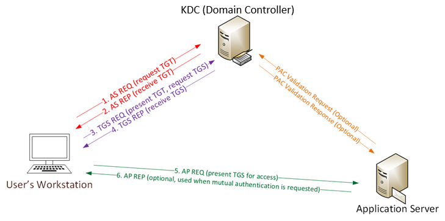
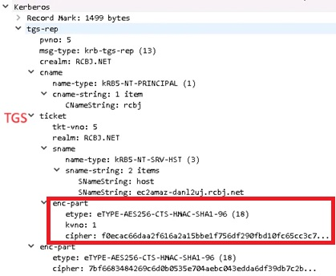
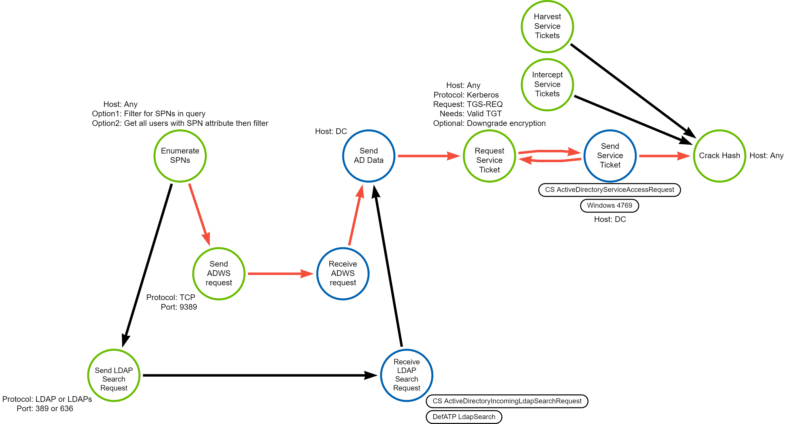
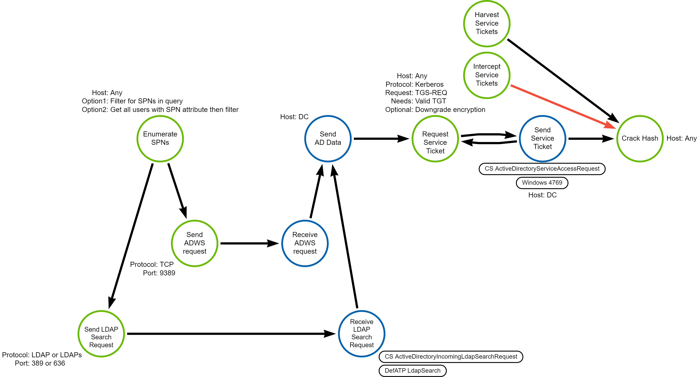

# Kerberos Service Ticket Roasting (Kerberoasting)

## Metadata

| Key          | Value             |
|--------------|-------------------|
| ID           | TRR0018           |
| External IDs | [T1558.003]       |
| Tactics      | Credential Access |
| Platforms    | Active Directory  |
| Contributors | Andrew VanVleet, Chris Hodson   |

## Technique Overview

Adversaries may reveal credentials of accounts by cracking encrypted portions of
Kerberos' service tickets, which have a known message structure that can serve
as a crib[^0] (a known plain-text output that can be used to determine when
something is successfully decrypted) for determining when the correct password
has been attempted. Any valid domain account can be used to request a service
ticket for any service in the domain.

This attack is similar to [T1558.004] AS-REP Roasting. Kerberoasting attempts to
crack cipher texts from service tickets, while AS-REP roasting attempts to crack
cipher texts from Authentication Server messages.

> [!note]
>
> This technique involves brute force password cracking. The TRR addresses the
> technique based on the state of encryption security as of 2025. Should quantum
> computing alter the current state, this TRR will need to be revisited to
> ensure it remains accurate.

## Technical Background

### The Kerberos Protocol

Kerberos is a network authentication protocol designed to provide strong
authentication for client/server applications by using symmetric key
cryptography to sign 'tickets' that a client can use to prove their identity and
authorization to access a network resource. The Kerberos protocol consists of 3
components (hence the name, which references the 3-headed dog of Greek
mythology):

- Client
- Application Server (AP)
- Key Distribution Center (KDC)

The client is the user who wants access to a network resource. The AP is the
server hosting the desired network resource. The KDC is the authoritative source
of information about users and what resources they are authorized to access. In
Windows domains, the domain controllers are also the Kerberos KDC.

The KDC is also comprised of 3 elements. While these can be distributed over
multiple servers, most modern implementations have them on the same server:

- An authentication server (AS) that performs the initial authentication.
- A ticket-granting server (TGS) that issues tickets to clients for specific
  services hosted on APs.
- A Kerberos database that stores the password and identity of all verified
   users.

 The Kerberos protocol defines a series of messages exchanged between the
 client, the KDC and AP. After a client has authenticated, they receive a Ticket
 Granting Ticket (TGT) that is stored on the client device and can be used to
 request access to specific network resources without having to reauthenticate.
 The client presents a TGT to the TGS when it requests access to a network
 resource, and the TGS provides a service ticket back to the client. The client
 can then provide the service ticket to the AP to gain access to the service.

Kerberos is stateless: it relies on cryptographically signed tickets for
authentication and authorization. This requires that the cryptographic keys are
known only by the key's owner and the KDC. There are a few different keys used
for these cryptographic signatures:

- TGTs are signed with the password hash of the `KRBTGT` account, which is a
special service account that represents the KDC in the directory.
- Service tickets are signed with the hash of the service account associated
with a given service (a CIFS share, an FTP server, etc). In the directory,
services are represented by a service principal name (SPN) connected to the
associated service account. The password of the service account should be known
only by the KDC and the service.
- Clients prove their identity by signing a timestamp with their own password
hash, which should be known only by the KDC and themselves.

 The Kerberos protocol was originally designed in the 1980's and is on version
 5. It is employed in use cases far beyond what was originally envisioned and
has had dozens of extensions added to it to enable those use cases. As a result,
it is a very complex protocol. What follows is a simplified summary; you can
find more in-depth descriptions online.[^1][^2][^3]



1. **AS-REQ**: The client authenticates to the AS with a username and password.
By default in a Windows domain, pre-authentication data is also included in the
form of a current timestamp encrypted with the user’s secret key (derived from
the windows password).  
2. **AS-REP**: The KDC validates the client's credentials, then sends back a
TGT. The TGT contains the Privilege Attribute Certificate (PAC), which includes
the symmetric user session key that is used in subsequent steps to encrypt
communications with the KDC. The TGT also contains the username that it was
issued for and an expiration timestamp. Note that the client cannot read the
encrypted portions of the TGT because it does not have the KDC's encryption key.
The AS-REP also contains the session key and expiration time encrypted with the
user's hash, which the client can read. At this point, the client has a session
key that it decrypted using the user’s secret key and the TGT (which contains
the same session key, encrypted with the KDC's secret key). In the image below,
you can see an AS-REP message, with the TGT (the ticket section), PAC (the
ticket->enc-part section), and data encrypted with the user's key (the enc-part
section).
3. **TGS-REQ**: When the client wants access to a specific resource, it presents
the TGT to the KDC's Ticket Granting Service (TGS) in a message that also
contains the SPN of the service it wants to access. The request is encrypted
using the user's session key, obtained from the AS-REP message earlier.
4. **TGS-REP**: The KDC opens the TGT and validates the PAC checksum. If
successful, it proceeds to create a service ticket that contains the PAC. A
symmetric key is generated for use between the client and the requested service
(the service session key). The service ticket is encrypted with the service’s
password hash. The service ticket and the service session key are encrypted a
second time using the user's session key and sent to the client.
5. **AP-REQ**: Client decrypts the service ticket and service session key from
the TGS-REP message and sends the service ticket to the server hosting the
desired resource. The client also includes an authenticator message generated by
the client and encrypted with the service session key.
6. The Application Server decrypts the service ticket (using its own password
hash) and extracts the service session key. It then decrypts the authenticator
using the service session key. The Application Server extracts the PAC from the
service ticket and grants the client access to the resource.  
7. **AP-REP** (optional): If mutual authentication is needed, it can send back
an optional AP-REP message.
8. **PAC Validation**: In the AD implementation of Kerberos, if the TGT is older
than 20 minutes, the AP will send a PAC Validation message to the KDC to verify
that the PAC's information is valid.

### Service Principal Names (SPNs)

A service principal name (SPN) is a unique identifier of a service instance.
Kerberos authentication uses SPNs to associate a service instance with a service
sign-in account. The service's sign-in account will contain the password hash
used for Kerberos authentication to that service. Before a client can use an SPN
to authenticate to an instance of a service, the SPN must be registered as a
property on the user or computer account in the directory that the service
instance will use to log on. Adding an SPN requires write permissions to the
object in Active Directory.

There are two types of SPNs that can be created: one that is host-based and
another that is manually defined. When a new computer account is created in
Active Directory, a `HOST` SPN is automatically generated for built-in services
on the host. This SPN acts as a catch-all identifier for services running under
a machine’s local system or network service account. This simplifies management
for many standard Windows services and reduces the need for manual SPN
configuration. All built-in services are automatically mapped to the `HOST` SPN
unless they have been specifically mapped to a Windows account. You can view the
services that are automatically mapped to `HOST` by viewing the [SPN-Mappings]
attribute in AD.

```powershell
PS> Get-ADObject -Identity "CN=Directory Service,CN=Windows NT,CN=Services,CN=Configuration,DC=contoso,DC=com" -prop sPNMappings

{host=alerter,appmgmt,cisvc,clipsrv,browser,dhcp,dnscache,replicator,eventlog,eventsystem,policyagent,oakley,dmserver,dns,mcsvc,fax,msiserver,ias,messenger,netlogon,netman,netdde,netddedsm,nmagent,plugplay,protectedstorage,rasman,rpclocator,rpc,rpcss,remoteaccess,rsvp,samss,scardsvr,scesrv,seclogon,scm,dcom,cifs,spooler,snmp,schedule,tapisrv,trksvr,trkwks,ups,time,wins,www,http,w3svc,iisadmin,msdtc}
```

> [!note]
>
> The `HOST` service represents the host computer. The `HOST` SPN is used to
> access the host computer account, and the machine account password is used by
> the KDC to encrypt service tickets for these services.

An SPN consists of two or three parts, each separated by a forward slash ('/').
The first part is the [service class], the second part is the host name (with an
optional port), and the third part (if present) is the service name. For
example, the LDAP service on a DC named DC-01 in the Fabrikam.com domain would
be identified with the SPN `ldap/dc-01.fabrikam.com/fabrikam.com`; `ldap` is the
service class name, `dc-01.fabrikam.com` is the host name, and `fabrikam.com` is
the service name. With a port specified, it would be
`ldap/dc-01.fabrikam.com:389/fabrikam.com`.

A client wishing to connect to a service in the domain will compose the SPN for
the desired service, then request a Kerberos service ticket for that service. If
the client has permission to access the service, the Kerberos protocol ensures
that the necessary information and session key are provided to both the client
and the service to allow for mutual authentication. Kerberos ensures that only
the intended recipients can access that information by encrypting it with their
respective password hashes.

### Enumerating SPNs

Attackers can identify accounts with SPNs by enumerating Active Directory. There
are two protocols that support querying or retrieving the `servicePrincipalName`
property: Lightweight Directory Protocol (LDAP) and Active Directory Web
Services (ADWS).

> [!TIP]  
> Both the Security Account Manager RPC interface (MS-SAMR) and WMI
> `Win32_UserAccount` class can enumerate users in Active Directory, but neither
> supports querying or retrieving the `servicePrinicipalName` property, which is
> needed for Kerberoasting.

There are numerous public tools or scripts for Kerberoasting. The table below
categorizes a selection of them by which protocol they use for enumerating SPNs:

| LDAP | ADWS |
|----|----|
| [Rubeus]| Powershell [ActiveDirectory] module |
| [SetSPN.exe] | [SOAPHound] |
| Impacket's [GetUserSPNs.py]|  |
| Empire Powershell's "[Invoke-Kerberoast]"|  |
| .NET [DirectorySearcher] class |  |

In addition to having two protocols for enumeration, there are two possible
approaches to the enumeration query:

1. Filter for accounts with SPNs in the query
2. Retrieve **all** accounts with their `servicePrincipalName` property and
   filter for those with SPNs client side.

These two approaches will have distinct signatures and might be used to evade
protections that are looking for SPN enumeration. Most public tools take the
approach of filtering in the query, but Impacket's script has a 'stealth' mode
that uses client-side filtering (the PowerShell script below also uses
client-side filtering). The table below shows the critical portion of the LDAP
query used by some of the well-known tools.

| Tool | LDAP Query |
|----|----|
| Rubeus | (&(samAccountType=805306368)**(servicePrincipalName=*)** |
| SetSPN.exe | **(servicePrincipalName=\*/\*)** |
| Impacket's GetUserSPN.py | (&(objectCategory=person)(!(UserAccountControl:1.2.840.113556.1.4.803:=2))**(servicePrincipalName=*)**) |
| Impacket's GetUserSPN.py "Stealth Mode" | (&(objectCategory=person)(!(UserAccountControl:1.2.840.113556.1.4.803:=2))) |
| Empire Powershell's "Invoke-Kerberoast" | **(servicePrincipalName=*)** |

### Roasting Service Tickets

Once the attacker has identified accounts with SPNs, they can request a service
ticket for each of those accounts, extract the ticket and take it offline to
crack. Adversaries may attempt to guess the password of a service account by
cracking the portions of the service ticket that are encrypted with the
service's password hash. The encrypted message has a known structure, which
serves as a crib for determining when the correct password has been attempted.
Cracking the password can be easier if a weak encryption algorithm, like RC4, is
used.



Any valid TGT can be used to request a service ticket for any service in the
domain. This is a necessity for the Kerberos protocol to function: users needing
services can gain access to them by requesting a service ticket for them. After
verifying that the user is authorized to use the service, the KDC will issue a
ticket for it. Kerberoasting works by using the ticket to crack the password
rather than presenting to the application server for access, as intended.

### Logging

Windows generates Event 4769 *A Kerberos service ticket was requested* with
every request for a service ticket. The field `TicketEncryptionType` holds a
hex value representing the different encryption options; RC4 and DES are the
most easily cracked. `TargetUserName` holds the name of the requesting user
(this will be identified from the TGT used to request the service ticket), and
`ServiceName` holds the name of the service for which the ticket was requested.

CrowdStrike also logs service ticket requests with the
ActiveDirectoryServiceAccessRequest event.

> [!note]
>
> When viewing Kerberos logs, you will probably see many service ticket requests
> for SPNs that are not explicitly defined in AD. These will be host-based SPNs
> (discussed in [Service Principal Names]), and
> the tickets will be encrypted with the asset's machine account, which is
> automatically and randomly generated and rotated every 30 days by default.
> Thus, service tickets for these host-based services should be resistant to
> Kerberoasting attacks.

## Procedures

| ID           | Title            | Tactic    |
|--------------|------------------|-------------------|
| TRR0018.AD.A | Enumerate SPNs with LDAP | Credential Access |
| TRR0018.AD.B | Enumerate SPNs with ADWS | Credential Access |
| TRR0018.AD.C | Intercept Tickets On the Network | Credential Access |
| TRR0018.AD.D | Harvest Tickets off Endpoints | Credential Access |

### Procedure A: Enumerating Users with LDAP

LDAP is the protocol most commonly used in public Kerberoasting tools.

#### Detection Data Model


If you have telemetry on LDAP search requests, you can look for query filters
containing `serviceprincipalname` (for the filter-in-the-query approach) or for
queries returning the `serviceprincipalname` attribute (for the
filter-on-the-client approach). Depending on environmental noise, this could
provide solid coverage of this procedure. Otherwise, there are opportunities
(addressed in procedure B) at the point where an attacker requests a service
ticket  that provide limited identification of both procedures A and B.

### Procedure B: Enumerating Users with ADWS

Most of the best-known Kerberoasting tools use LDAP, but it is just as viable to
use ADWS. By way of example, the below PowerShell script enumerates via ADWS
(using the ActiveDirectory module) and requests a service ticket with the
[KerberosRequestorSecurityToken class].

```powershell
$adusers = get-aduser -filter * -properties serviceprincipalname  #get all users, including the SPN property
$spns = @()
$adusers | ?{$_.serviceprincipalname.count -gt 0} | %{$spns += $_.serviceprincipalname[0]} #filter for only users with SPNs defined, add the first SPN for each account to the list.
foreach ($spn in $spns) {
  New-Object System.IdentityModel.Tokens.KerberosRequestorSecurityToken -ArgumentList "$spn"  #request a service ticket for each SPN.
  #That's enough for our purposes, no need to actually extract the ticket for cracking.
}
```

#### Detection Data Model



There is currently no available telemetry for SPN enumeration using ADWS. Should
this telemetry become available, you could look for SPN enumeration similar to
procedure A. Otherwise, a canary account (one that has no actual use in the
environment, so there should be no legitimate service ticket requests for it)
with an SPN is a good alternative for identifying this procedure.

Additionally, there is some opportunity to identify this technique when the
attacker requests a service ticket: if the TGS encryption is downgraded or if
the attacker requests enough service tickets to stand out above normal request
thresholds. However, it would be possible to request tickets at a low enough
frequency to avoid crossing the threshold, and it is not necessary to downgrade
encryption (for example, if the environment is configured for RC4 hashes by
default or allows weak passwords that could be cracked even when using AES).

### Procedure C: Intercept Tickets On the Network

Rather than requesting service tickets themselves, an attacker can passively
collect service tickets by capturing network traffic between the client and the
KDC. Depending on their position in the network, this may limit the number of
accounts they could attempt to crack, but it would also eliminate many detection
options. An attacker might take this route if they know the password policy or
encryption algorithm is weak and anticipate being able to crack passwords
easily.

#### Detection Data Model



An attacker collecting service tickets from an adversary-in-the-middle position
on the network would be difficult to identify.

### Procedure D: Harvest Tickets from Endpoints

Similar to procedure C, if an attacker already has access to an endpoint (or
many endpoints), they can harvest any service ticket cached in memory. On
Windows, no special privileges are required to harvest a user's own tickets, but
special privileges are needed to harvest another user's tickets.[^5][^6]

#### Detection Data Model


If an attacker has access to endpoints in the network, they can freely collect
service tickets cached on that endpoint. There are not many identification
opportunities for this procedure.

## Available Emulation Tests

| ID           | Link             |
|--------------|------------------|
| TRR0018.AD.A | [Atomic Tests 1-3, 5-7] |
| TRR0018.AD.B |  |
| TRR0018.AD.C |  |
| TRR0018.AD.D |  |

## References

- [Introduction to Kerberos - Echo_Slow]
- [Kerberos v5 Protocol - Robert Broeckelmann]
- [Kerberos Wireshark Captures - Robert Broeckelmann]
- [Event 4769 - Microsoft Learn]
- [Rubeus' Roast.cs - GitHub]
- [SPN Types]
- [Machine Accounts in the Active Directory - XMCO.fr]

[T1558.003]: https://attack.mitre.org/techniques/T1558/003/
[T1558.004]: https://attack.mitre.org/techniques/T1558/004/
[service class]: https://learn.microsoft.com/en-us/openspecs/windows_protocols/ms-drsr/5c2026b-f732-4c9d-9d60-b945c0ab54eb#gt_c1386afd-9d42-47c7-a7ea-d01912a17647
[Rubeus]: https://github.com/GhostPack/Rubeus
[ActiveDirectory]: https://learn.microsoft.com/en-us/powershell/module/activedirectory/
[SetSPN.exe]: https://learn.microsoft.com/en-us/previous-versions/windows/it-pro/windows-server-2012-r2-and-2012/cc731241(v=ws.11)
[SOAPHound]: https://github.com/FalconForceTeam/SOAPHound
[GetUserSPNs.py]: https://github.com/fortra/impacket/blob/master/examples/GetUserSPNs.py
[Invoke-Kerberoast]: https://github.com/EmpireProject/Empire/blob/master/data/module_source/credentials/Invoke-Kerberoast.ps1
[DirectorySearcher]: https://learn.microsoft.com/en-us/dotnet/api/system.directoryservices.directorysearcher
[Introduction to Kerberos - Echo_Slow]: https://infosecwriteups.com/introduction-to-kerberos-39a1922ec5ac
[Kerberos v5 Protocol - Robert Broeckelmann]: https://medium.com/@robert.broeckelmann/kerberos-and-windows-security-kerberos-v5-protocol-b9c804e06479
[Kerberos Wireshark Captures - Robert Broeckelmann]: https://medium.com/@robert.broeckelmann/kerberos-wireshark-captures-a-windows-login-example-151fabf3375a
[Event 4769 - Microsoft Learn]: https://learn.microsoft.com/en-us/previous-versions/windows/it-pro/windows-10/security/threat-protection/auditing/event-4769
[Rubeus' Roast.cs - GitHub]:
    https://github.com/GhostPack/Rubeus/blob/master/Rubeus/lib/Roast.cs
[Atomic Tests 1-3, 5-7]: https://github.com/redcanaryco/atomic-red-team/blob/master/atomics/T1558.003/T1558.003.
[KerberosRequestorSecurityToken class]: https://learn.microsoft.com/en-us/dotnet/api/system.identitymodel.tokens.kerberosrequestorsecuritytoken?view=netframework-4.8.1
[SPN-Mappings]: https://learn.microsoft.com/en-us/windows/win32/adschema/a-spnmappings
[Machine Accounts in the Active Directory - XMCO.fr]: https://www.xmco.fr/en/active-directory-en/part-5-machine-accounts-in-the-active-directory/
[Service Principal Names]: #service-principal-names-spns
[SPN Types]: https://learn.microsoft.com/en-us/previous-versions/msp-n-p/ff649429(v=pandp.10)?redirectedfrom=MSDN#spn-types

[^0]: [Known Plaintext Attack - Wikipedia](https://en.wikipedia.org/wiki/Known-plaintext_attack)
[^1]: [Kerberos v5 Protocol - Robert Broeckelmann](https://medium.com/@robert.broeckelmann/kerberos-and-windows-security-kerberos-v5-protocol-b9c804e06479)
[^2]: [Kerberos Wireshark Captures - Robert Broeckelmann](https://medium.com/@robert.broeckelmann/kerberos-wireshark-captures-a-windows-login-example-151fabf3375a)
[^3]: [Designing an Authentication System: a Dialogue in Four Scenes - MIT.edu](https://web.mit.edu/kerberos/dialogue.html)
[^5]: [Get-KerberosTicketCache.ps1 - GitHub](https://github.com/Invoke-IR/ACE/blob/master/ACE-Management/PS-ACE/Scripts/ACE_Get-KerberosTicketCache.ps1)
[^6]: [Rubeus - GitHub](https://github.com/GhostPack/Rubeus/blob/6ce95440c7ff8c6a458d6999d197cab58c66dac7/Rubeus/lib/LSA.cs#L191)
