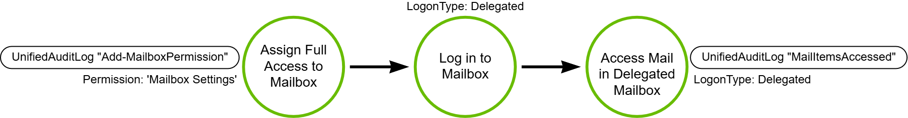

# Remote Email Collection

## Metadata

| Key          | Value                      |
|--------------|----------------------------|
| ID           | TRR0019                    |
| External IDs | [T1114.002]                |
| Tactics      | Collection                 |
| Platforms    | Exchange Online            |
| Contributors | Andrew VanVleet            |

### Scope Statement

This TRR covers Exchange Online (EXO) specifically. While there are many
features in common between Exchange Server (the self-hosted version) and EXO,
there are also features that EXO does not support (like `MailboxExportRequests`
in Exchange Powershell[^0]). This TRR will address only techniques that apply to
EXO. Additionally, this TRR is focused on remote email collection, which we will
define as collection that doesn't require access to a victim's machine or mail
client. Techniques that require access to a victim's machine (like extracting
emails from the local cache) or a victim's mail client (like mail forwarding
rules and Outlook add-ins) are out of scope for this report.

## Technique Overview

Threat actors often target administrator mailboxes, which can often yield useful
information like network details and credentials that can grant additional
access. Exchange Online is one of the most ubiquitous mail servers and is
frequently targeted by threat actors to collect information from an
organization.

## Technical Background

### Exchange Online (EXO)

Exchange is an enterprise-scale mail, contacts, and calendaring server (with
more features in later versions) that has been around since 1996. In all those
years it has come to support numerous protocols and APIs to allow users to send
and receive email messages. Currently, the two most popular variants of Exchange
are Exchange Server, which is the self-hosted solution, and Exchange Online
(EXO), which is a software-as-a-service (SaaS) solution hosted by Microsoft in
Azure.

Exchange Online is a 'first-party application'[^9] in Azure, meaning it is
hosted by Microsoft in their own tenant. It has been assigned the Application ID
of `00000002-0000-0ff1-ce00-000000000000.` When a user adds Exchange Online to
their tenant, an Enterprise Application (aka service principal) is created in
their tenant to represent the application and its local configuration.


### EXO RBAC

Exchange Online has its own RBAC system independent of the Azure tenant in which
it's hosted. A role or management role grants the permissions to do a set of
tasks. Exchange Online permissions use the following types of roles:

- **Administrator roles**: Defines the set of tasks that an admin can do. When
  an administrator role is assigned to a role group, and an admin or user is a
  member of that role group, that person is granted the permissions provided by
  the role. These roles are listed and described in this article.
- **End-user roles**: These roles, which are assigned using role assignment
  policies, enable users to manage aspects of their own mailbox and distribution
  groups that they own. End-user roles begin with the prefix "My."
- **Application roles**: The role names that start or end with 'Application'
  are part of RBAC for Applications in Exchange Online. They will be discussed
  more in depth in the [Application Roles in EXO] section.

The `Organization Management` role group is the most highly-privileged role in
EXO. It holds almost all available permissions, including the `Role Management`
permission that allows a member of the group to assign themselves any other
role. Thus, an Organization Manager has full control over the EXO instance.

Users can be granted administrative rights in Exchange Online without adding
them to Entra roles by adding the user as a member of an EXO role group. The
user gets permissions in Exchange Online, but they don't get permissions in
other Microsoft 365 workloads.[^3] Additionally, there are a handful of Entra
roles that are automatically assigned EXO roles. The following table lists them
and the EXO role groups that they correspond to. (The table lists Administrator
roles in other Office 365 solutions to illustrate that they hold no permissions
in the Exchange tenant.)

| Entra role | Exchange Online role group |
| --- | --- |
| Global Administrator | Organization Management <br><br> **Note**: The Global Administrator role and the Organization Management role group are tied together using a special Company Administrator role group. The Company Administrator role group is managed internally and can't be modified directly. |
| Exchange Administrator | Organization Management |
| Global Reader | View-Only Organization Management |
| Helpdesk Administrator | Help Desk |
| Service Support Administrator | None |
| SharePoint Administrator | None |
| Teams Administrator | None |
| Exchange Recipient Administrator | Recipient Management |
| User Experience Success Manager | None |

> [!NOTE]
>
> EXO has the ability to grant users or groups **delegating role assignments**.
> A delegating role assignment doesn't give the role assignee the permissions
> granted by the role, only the ability to assign the role to others. This can
> sometimes be confusing when listing role assignments in ExchangeOnline
> PowerShell because users will be listed as having a role whether they have the
> actual role or just permission to assign the role.
>
> In order to list only the users who have the role permissions, you can use the
> command:
>
> `Get-ManagementRoleAssignment -role 'RoleNameHere' -GetEffectiveUsers
> -Delegating:$False`
>
> To assign a delegating role assignment, use the command
>
> `New-ManagementRoleAssignment -Role 'RoleNameHere' UserOrGroupHere
> -Delegating`

### Application Roles in EXO

Exchange defines "Application Roles" that allow applications to be granted
permission to access EXO resources. There are two different permission grant
systems for applications in operation in EXO:

1. API permissions consented in Entra ID[^6]
2. EXO's RBAC for Applications[^4]

These two permission grant systems operate completely independent of one
another. An app can have both Microsoft Entra consented permissions and EXO RBAC
assignments. Permission consents are additive (i.e. an application's effective
permissions are the union of the permissions granted in either system).
Currently, there is no single interface that shows all permissions granted in
both systems, Microsoft has promised this feature in the future.[^7] An
administrator must check both EXO's Role Assignments (via PowerShell) and an
SPN's 'API Permissions' in Entra to determine what permissions are held.

#### API Permissions Consented in Entra ID

Entra ID Applications can request specific permissions to resources in the
tenant and must be granted these by user or admin consent (admin consent grants
it on behalf of all users). Each permission includes a claim (`User.Read`,
`User.Write`, etc) against an API (Microsoft Graph, Office 365 Exchange Online,
etc).

Users can only grant consent for "low impact" permissions, otherwise admin
consent is required. The application developer determines which permissions
require user or admin consent. `Global Admin`, `Application Admin`, and `Cloud
Application Admins` all have permissions to "grant permissions to applications"
and can provide tenant-wide consent.

Entra supports two types of API permissions: "Application" and "Delegated."

##### Application Permissions

Application permissions are used by apps that run without a signed-in user
present, for example, apps that run as background services. These permissions
are held directly by the application and apply to all relevant resources in the
tenant. For example, an app that has the `Mail.Read` permission can read the
mailboxes of every user in the organization.

- For application permissions, the effective permissions of the app are the full
level of privileges granted by that permission.
- Application permissions are also called "App-only permissions" (in
documentation), "AppRoles" (in the application manifest, logs and the Graph API)
and "roles" (in the `requiredResourceAccess` section of the application manifest
and OAuth token). The permissions an application requires can also be seen in
the "API Permissions" blade of the App Registration.

Application developers can define the roles exposed by their application using
either the "Manifest" or the "App roles" blade in the portal or by adding an
`appRoleAssignment` programmatically. When a user signs in to the application,
Entra ID adds a `roles` claim to the OAuth token they receive for each role that
the user or service principal was granted to the resource they’re authenticating
to. These can then be used by the application to implement claim-based
authorization (i.e. granting access based on a user’s role claims).

##### Delegated Permissions

Delegated permissions are used by apps that have a signed-in user present. They
grant the application the ability to exercise the requested permission on behalf
of the user. The app is delegated with the permission to act as a signed-in user
when it makes calls to the target resource. For example, an app with a
`Mail.Read` delegated permission can read the mailbox of the signed-in user
only.

- For delegated permissions, the effective permissions of your app are the
  least-privileged intersection of the delegated permissions the app has been
  granted (by consent) and the privileges of the currently signed-in user. Your
  app can never have more privileges than the signed-in user. For example, if a
  signed-in user doesn't have rights to read their own mailbox, then an
  application with the `Mail.Read` delegated permission will not have permission
  to read the user's mailbox.
- Delegated permissions are also called "scopes" (in documentation, the
  `requiredResourceAccess` section of the application manifest, and the OAuth
  token) and "OAuth2 permission scopes/grants" (in logs, the application
  manifest, and the Graph API)

Application developers can define the delegated permissions exposed by their
application using either the "Manifest" or the "Expose an API" blade in the
portal or by adding an `oauth2PermissionGrant` programmatically. When a user
signs in to the application, Entra ID adds an `scp` claim to the OAuth token
they receive for each scope that the user or service principal was granted to
the resource they’re authenticating to.

> [!NOTE]
>
> You can view an application’s manifest by using the PowerShell
> `Get-AzureADServicePrincipal` cmdlet. This is particularly useful for 1st or
> 3rd party applications where you can’t see the manifest or App Registration.
> For example, the Microsoft Graph API is registered as AppId
> `00000003-0000-0000-c000-000000000000` and the Azure AD API is registered as
> `00000002-0000-0000-c000-000000000000`. (These IDs will be the same across all
> tenants, while the Service Principal will be distinct for each tenant – it
> will share the same `AppID`, but have a unique `ObjectID`). The `AppRoles` or
> `OAuth2Permissions` defined in the app manifest for those applications show
> all the application and delegated permissions that can be requested for that
> application’s API.
>
> ```Text
> $EXO = Get-AzureADServicePrincipal -Filter "AppId eq '00000002-0000-0ff1-ce00-000000000000'"
> $EXO.Oauth2Permissions
>
> AdminConsentDescription : Allows the app to read mail a user can access, including their own and shared mail.
> AdminConsentDisplayName : Read user and shared mail
> Id                      : ad13ac2e-ad46-4dc0-b7da-249c94395a6d
> IsEnabled               : True
> Type                    : User
> UserConsentDescription  : Allows the app to read mail you can access, including shared mail.
> UserConsentDisplayName  : Read mail you can access
> Value                   : Mail.Read.All
> ....
> ```

##### Mail Related Permissions in Entra

Permission to access EXO's resources can be acquired through both the Graph API
and the Office 365 Exchange Online (EXO's own application registration in Entra)
application API. Between both APIs, there are many EXO-related API permissions
available; this TRR will only list those that grant the ability to read email
messages. The table will use "EXO" to refer to the Office 365 Exchange Online
App Registration in Entra.

| API | Permission | Type (Application or Delegated) |
| --- | --- | --- |
| EXO & Graph | Mail.Read |  Both |
| EXO | Mail.ReadWrite |  Both |
| Graph | Mail.ReadWrite/Mail.ReadWrite.All | Delegated/Application |
| EXO | full_access_as_app (for EWS) |  Application |
| EXO | IMAP.AccessAsApp |  Application |
| EXO | POP.AccessAsApp |  Application |
| EXO & Graph | EWS.AccessAsUser.All | Delegated |
| Graph | IMAP.AccessAsUser | Delegated |
| Graph | POP.AccessAsUser | Delegated |
| Graph | MailboxItem.Read/MailboxItem.Read.All | Delegated/Application |
| Graph | MailboxItem.ImportExport/MailboxItem.ImportExport.All | Delegated/Application |

#### RBAC for Applications

EXO's RBAC for Applications provides the ability to grant an application a role
with a limited scope (for example, only the mailboxes of employees working at a
specific location). Entra-consented permissions by default allow access to all
resources, though they can be scoped using Application Access Policies[^5] (RBAC
for Applications is intended to replace Application Access Policies). Microsoft
advises that tenant-wide permissions should be assigned in Microsoft Entra ID
while resource-scoped permissions should be granted using RBAC for
Applications.[^8]

RBAC for Applications uses a `Management Scope` to define the scope under which
a permission can be exercised. (A `ManagementScope` is also referred to as a
`CustomResourceScope`.) It is not necessary to define a limiting scope, but it
is recommended. `ManagementScopes` can be defined according to numerous
available criteria[^27]; for example, mailboxes starting with a particular
string, or users with a specific department or title.

EXO Application Roles allow access to EXO resources using either the Graph API
or EWS (there is only one for EWS, which grants full access to all mailboxes).
In order to use either protocol, a service principal (SPN) must be registered in
Entra **and** EXO so that it can be bound to the application role. The EXO SPN
is simply a reference to the Entra SPN, but it must be created in EXO before it
can be assigned an application role.[^20] The Entra SPN is necessary to allow
the application to authenticate with Entra and receive an OAuth token to
authorize further API calls. (Previously, an application could also authenticate
using 'basic authentication,' but that is no longer possible. See the section on
Basic vs Modern Authentication for details.) The EXO SPN is necessary to grant a
specific application a `ManagementRoleAssignment` in EXO.

> [!WARNING]
>
> EXO's RBAC for Applications roles are NOT included in the Entra API
> permissions list or the OAuth token's claims: Entra is completely unaware of
> them. EXO identifies the service principal using the OAuth token and grants it
> access to resources according to the `ManagementRoleAssignment` scope.
>
> You can view RBAC for Applications role assignments using ExchangeOnline
> PowerShell's `Get-ManagementRoleAssignment` cmdlet. Below is an example of an
> Entra SPN that has been assigned the "Application Mail.Read" role in RBAC for
> Applications. The RoleAssigneeName is the SPN's ApplicationID in Entra (in
> this case, it starts `f731c7d5`).
>
> ```Text
> Role                     RoleAssigneeName             RoleAssigneeType    AssignmentMethod
> ----                     ----------------             ----------------    ----------------
> Application Mail.Read    f731c7d5-5de2-458e-93d8-...  ServicePrincipal    Direct          
> ```

The table below lists the RBAC for Applications role name, the protocol it is
associated with, and the permissions that the role includes.

| Name | Protocol | Permissions List | Description |
| --- | --- | --- | --- |
| Application Mail.Read | MS Graph | Mail.Read | Allows the app to read email in all mailboxes without a signed-in user. |
| Application Mail.ReadBasic | MS Graph | Mail.ReadBasic | Allows the app to read email except the body, previewBody, attachments, and any extended properties in all mailboxes without a signed-in user |
| Application Mail.ReadWrite | MS Graph | Mail.ReadWrite | Allows the app to create, read, update, and delete email in all mailboxes without a signed-in user. Doesn't include permission to send mail. |
| Application Mail.Send | MS Graph | Mail.Send | Allows the app to send mail as any user without a signed-in user. |
| Application MailboxSettings.Read | MS Graph | MailboxSettings.Read | Allows the app to read user's mailbox settings in all mailboxes without a signed-in user. |
| Application MailboxSettings.ReadWrite | MS Graph | MailboxSettings.ReadWrite | Allows the app to create, read, update, and delete user's mailbox settings in all mailboxes without a signed-in user. |
| Application Calendars.Read | MS Graph | Calendars.Read | Allows the app to read events of all calendars without a signed-in user. |
| Application Calendars.ReadWrite | MS Graph | Calendars.ReadWrite | Allows the app to create, read, update, and delete events of all calendars without a signed-in user. |
| Application Contacts.Read | MS Graph | Contacts.Read | Allows the app to read all contacts in all mailboxes without a signed-in user. |
| Application Contacts.ReadWrite | MS Graph | Contacts.ReadWrite | Allows the app to create, read, update, and delete all contacts in all mailboxes without a signed-in user. |
| Application Mail Full Access | MS Graph | Mail.ReadWrite, Mail.Send | Allows the app to create, read, update, and delete email in all mailboxes and send mail as any user without a signed-in user. |
| Application Exchange Full Access | MS Graph | Mail.ReadWrite, Mail.Send, MailboxSettings.ReadWrite, Calendars.ReadWrite, Contacts.ReadWrite | Without a signed-in user: Allows the app to create, read, update, and delete email in all mailboxes and send mail as any user. Allows the app to create, read, update, and delete user's mailbox settings in all mailboxes. Allows the app to create, read, update, and delete events of all calendars. Allows the app to create, read, update, and delete all contacts in all mailboxes. |
| Application EWS.AccessAsApp | EWS | EWS.AccessAsApp | Allows the app to use Exchange Web Services with full access to all mailboxes. |

### EXO APIs

There are 2 primary APIs for interacting with Exchange Online, though a third
undocumented API exists to support the ExchangeOnline PowerShell module. All
APIs require OAuth2 tokens issued by Entra ID for authentication and
authorization.

**Microsoft Graph** The Microsoft Graph API offers a single REST endpoint,
`https://graph.microsoft.com`, to provide access to data and resources across
the Microsoft cloud, including Microsoft 365. Microsoft has created numerous
resources, including a PowerShell module and various SDKs, to assist developers
in building applications that make use of Graph. It has also deprecated a number
of legacy APIs in favor of Graph; Graph is the recommended solution for most
Microsoft cloud-based solutions.

**Exchange Web Services API**
Exchange Web Services (EWS) was the primary API for access EXO data and
resources before Graph. It is a SOAP-based API, and there is also an EWS managed
API for use with the .NET framework. Microsoft has not been making updates to
EWS since 2018, and it will be completely retired for EXO in October 2026 (it
will continue to function for Exchange Server).[^12] EWS can be enabled or
disabled at both the tenant or mailbox level using the organization-level or
user-level `EWSEnabled` flag, which can be viewed with the
`Get-OrganizationConfig` or `Get-CASMailbox` cmdlets.[^21]

**Exchange Online Admin API** The Exchange Online Admin API at
`https://outlook.office365.com/adminapi/beta` is a dedicated REST API to support
the ExchangeOnline PowerShell module. It is not documented, but can be used to
run PowerShell cmdlets directly without the need to run PowerShell locally. You
can use the API to make POST requests to the
`https://outlook.office365.com/adminapi/beta/{tenantId}/InvokeCommand` endpoint,
providing the ExchangeOnline PowerShell cmdlet name and parameters in the
request body.

### EXO Logging

In order to get audit logs from EXO, mailbox auditing must be enabled (it is
enabled by default). There are two places it can be set: the organization
`AuditDisabled` field and the individual mailbox `AuditEnabled` field. When
enabled, the organization-level configuration overrides that of individual
mailboxes, so if the `AuditDisabled` field is set to `False` then all mailboxes
will be audited, regardless of their individual `AuditEnabled` setting. If
`AuditDisabled` is `True` then only those mailboxes with `AuditEnabled` set to
`True` will generated audit logs.

You can view an organization's or mailbox's auditing configuration with the
following ExchangeOnline PowerShell commands:

```PowerShell
Get-OrganizationConfig | select-object AuditDisabled

Get-Mailbox -Identity <mailbox> | format-list AuditEnabled
```

The following actions are logged for each user logon type:

| Action | Description | Admin | Delegate | Owner |
| --- |  --- |  --- |  --- |  --- |
| Copy | An item is copied to another folder. | Yes | No | No |
| Create | An item is created in the Calendar, Contacts, Notes, or Tasks folder in the mailbox; for example, a new meeting request is created. Note that message or folder creation isn't audited. | Yes* | Yes* | Yes |
| FolderBind | A mailbox folder is accessed. | Yes* | Yes** | No |
| HardDelete | An item is deleted permanently from the Recoverable Items folder. | Yes* | Yes* | Yes |
| MailboxLogin | The user signed in to their mailbox. | No | No | Yes*** |
| MailItemsAccessed | A mail item has been accessed. | Yes | Yes | Yes |
| MessageBind | An item is accessed in the reading pane or opened. | Yes | No | No |
| Move | An item is moved to another folder. | Yes* | Yes | Yes |
| MoveToDeletedItems | An item is moved to the Deleted Items folder. | Yes* | Yes | Yes |
| SendAs | A message is sent using Send As permissions. | Yes* | Yes* | No |
| SendOnBehalf | A message is sent using Send on Behalf permissions. | Yes* | Yes | No |
| SoftDelete | An item is deleted from the Deleted Items folder. | Yes* | Yes* | Yes |
| Update | An item's properties are updated. | Yes* | Yes* | Yes |

\* Audited by default if auditing is enabled for a mailbox.  
** Entries for folder bind actions performed by delegates are consolidated. One
log entry is generated for individual folder access within a time span of 24
hours.  
*** Auditing for owner logins to a mailbox works only for POP3, IMAP4, or OAuth
logins. It doesn't work for NTLM or Kerberos logins to the mailbox.

The type of logon is indicated by the `LogonType` field, with the follow
possible values:

- 0 - logon by the mailbox owner
- 1 - logon by an administrator
- 2 - logon by a delegate
- 3 & 4 - logon by services in the Microsoft datacenter
- 6 - logon by a delegated administrator

> [!NOTE]
>
> Mailboxes are considered to be accessed by an administrator only in the
> following scenarios:
>
> - In-Place eDiscovery is used to search a mailbox.
> - The `New-MailboxExportRequest` cmdlet is used to export a mailbox (only
>   applies to Exchange Server)
> - Microsoft Exchange Server MAPI Client and Collaboration Data Objects is used
>   to access the mailbox.

These logs are written to the M365 Unified Audit Log (UAL). When reading the
`MailItemsAccessed` event logs, it's important to understand the two types of
access possible:

- **Sync** operations are only recorded when a mailbox is accessed by a desktop
Outlook client. During the sync operation, these clients typically download a
large set of mail items from the cloud to a local computer. The audit volume for
sync operations is huge, so instead of generating an audit record for each mail
item that's synched, Microsoft generates an audit event for the mail folder. In
a sync operation, all mail items in the synched folder may have been accessed.

- A **bind** operation is access to a specific individual email message. For
bind access, the InternetMessageId of individual messages is recorded in the
audit record. Bind operations that occur within a 2 minute interval are
aggregated into a single `MailItemsAccessed` audit record. Each message that was
accessed is identified by its InternetMessageId, and the total number of
aggregated operations in the record is displayed in the `OperationCount` field
in the `AuditData` property.

The MailItemsAccessed mailbox-auditing action covers all mail protocols: POP,
IMAP, MAPI, EWS, Exchange ActiveSync, and REST.

> [!TIP]
>
> EWS has the concept of 'first class properties' that are a set of properties
> returned when requesting an item. First class properties include the message
> ID, subject, size, sender, whether or not the message has been read, etc. The
> message body and attachments are not in the set of first class properties.
> When recording access to items via a `MailItemsAccessed` log, reading only
> first class properties does **not** count as 'accessed.' A `MailItemsAccessed`
> log will be generated only if the body or attachments have been requested
> (which requires a `bind`, `load`, or `getItem` request for the specific item).

> [!NOTE]
>
> If more than 1000 `MailItemsAccessed` audit records are generated for a single
> mailbox in less than 24 hours, EXO stops generating auditing records for
> MailItemsAccessed activity for that mailbox for 24 hours after the mailbox was
> throttled. Only `MailItemsAccessed` records are throttled, all other audit
> records are unaffected. Note that throttling occurs when 1000 audit events are
> generated, not when 1000 items are accessed.

### ApplicationImpersonation

EXO previously supported the ability for a user account to hold the
`ApplicationImpersonation` role, which allowed the user to access other user's
accounts via EWS. Because of the security issues caused by this role, Microsoft
has disabled it effective March 2025.[^11] The role enabled the impersonator to
perform operations using the permissions associated with the impersonated
account, including accessing and sending emails. `ApplicationImpersonation` was
intended for use with service accounts and was the recommended solution for
scenarios where a single account needed access to all other user mailboxes (for
example, to set an out-of-office reply automatically or to archive mail).

This permission allowed threat actors to grant an account the
`ApplicationImpersonation` role and use it to collect all email from an
organization. (For example, the MailSniper tool abused this role to collect
email from a victim tenant.[^10])

## Procedures

| ID                           | Title            | Tactic            |
|----------------|------------------|-------------------|
| TRR0019.EXO.A  | Valid Credentials | Collection    |
| TRR0019.EXO.B  | API Access as an Application | Collection |
| TRR0019.EXO.C  | eDiscovery | Collection |
| TRR0019.EXO.D  | Mailbox Delegation | Collection |
| TRR0019.EXO.E  | Export Mailbox | Collection |

### Procedure A: Valid Credentials

An attacker who possess valid credentials for a user can access that user's
email by logging in to their account. EXO supports numerous protocols for mail
access, including POP3, [MAPI], IMAP, SMTP, and Exchange ActiveSync. Microsoft
also offers the Outlook Web App (OWA), which is a SaaS version of the Outlook
client that can be used to access mail in EXO. Any mail client using these
protocols can be used to authenticate and retrieve the user's messages.

#### Basic vs Modern Authentication

Exchange Online originally supported both basic and 'modern' authentication.
Basic authentication refers to the client providing just a username and
password, while EXO's 'modern' authentication is based on OAuth2 and allows
multi-factor authentication (MFA), smart cards, and certificate-based
authentication (CBA). Modern authentication also respects the tenant's
conditional access policies (CAP). As of January 2023, basic authentication has
been disabled in EXO for Exchange ActiveSync (EAS), POP, IMAP, Remote
PowerShell, EWS, Offline Address Book (OAB), Autodiscover, Outlook for Windows,
and Outlook for Mac.[^1] Attempts to use basic authentication now result in a
HTTP 401 and "bad username/password" error.

> [!NOTE]
>
> When basic authentication was disabled, Microsoft did not alter the tenant's
> authentication policy. Thus, if basic auth was enabled via policy prior to the
> cut-off date[^2], it will still show as enabled but will not work. This can be
> seen with Exchange Online PowerShell's `Get-AuthenticationPolicy` cmdlet, for
> example:
>
> ```text
> AllowBasicAuthActiveSync           : False  
> AllowBasicAuthAutodiscover         : False  
> AllowBasicAuthImap                 : True  
> AllowBasicAuthMapi                 : True  
> AllowBasicAuthOfflineAddressBook   : True  
> AllowBasicAuthOutlookService       : True  
> AllowBasicAuthPop                  : False  
> ....
> ```

#### Tokens as Valid Credentials

In addition to having a user's logon credentials, an attacker can steal valid
authentication tokens, particularly the Primary Refresh Token (PRT)[^17], and
use them to authenticate as the user. Once issued, a PRT is valid for 14 days
and is continuously renewed as long as the user actively uses an Entra-joined
device.

Additionally, in July 2023 Microsoft published information about an incident in
which a stolen private signing key permitted Chinese-based threat actors to
forge valid authentication tokens to access OWA and Outlook.com[^19] and access
victim emails. While the circumstances of that breach required a remarkable
combination of errors, it demonstrates that Microsoft services, and particularly
EXO, are enduring targets of capable threat groups and new incidents of forged
tokens could possibly arise.

#### Detection Data Model


Using stole usernames and passwords became more difficult with the end of basic
authentication because an attacker now needs to have the user's credentials,
pass any additional MFA challenges, and fulfill the organization's conditional
access policies (if any are defined). Stolen tokens are now probably the easiest
way to execute this procedure.

### Procedure B: API Access as an Application

An attacker can access an organization's mailboxes by configuring an application
with the necessary API permissions in the EXO tenant. As noted in the
Application Roles section, with the retirement of basic authentication, all
applications must authenticate through Entra ID, which means they must all be
registered as an application in the Entra directory in order to access EXO data
and resources. Applications can use either EWS or Graph to access all resources,
and permissions can be assigned either in Entra or in EXO.

#### Detection Data Model


To execute this procedure, at attacker needs three things:

1. An Entra ID application
2. A client secret
3. Permissions to access mail via any available API and protocol (these
permissions are listed in the [Application Roles in EXO] section above).

This could involve hijacking an existing application that already has the
desired permissions or adding permissions to an application they control. They
could also create a new application and add a secret and the requisite
permissions.

In order to grant permissions, an attacker will need either an account that can
grant admin consent (if using a permission control by Entra), or an EXO role
with the `Role Management` permission (if using an EXO RBAC for Applications
permission). Finally, they can access mail in the EXO tenant using either the
EWS or Graph API (depending on the permission held). It is possible to use
delegated permissions in this approach, but that would require the threat actor
to have a target user's credentials (and potentially pass an MFA challenge). It
would be much easier for attackers going this route to use procedure A and
authenticate with an existing mail client like OWA (which effectively already
has delegated permissions)

When granting permissions to an application in Entra, the follow logs are
relevant:

| Log | Action |
| ---- | ---- |
| Add app role assignment to the service principal | This is logged when an app-only permission is granted to an application (it is not logged when the permission is added but not consented). |
| Add delegated permission grant | This is logged when an admin grants a tenant-wide delegated permission to an app. |
| Consent to application | This is logged both when a user grants consent to a delegated permission (on their behalf only) and when an admin grants tenant-wide consent to a delegated permission on behalf of all users. |

> [!NOTE]
>
> To grant a new RBAC for Applications permission to an application, the
> `New-ManagementRoleAssignment` PowerShell cmdlet is needed, and a log will be
> generated with the same name. However, if a management role assignment already
> exists, but is disabled or holds a limited scope, an attacker could modify
> that assignment using the `Set-ManagementRoleAssignment` cmdlet, which
> generates a `Set-ManagementRoleAssignment` log. This could allow an attacker
> to quietly expand or remove a limiting management scope.

### Procedure C: eDiscovery

Exchange Online is integrated with Microsoft's electronic discovery (eDiscovery)
solution to facilitate identifying, retaining, and delivering information that
can be used as evidence in investigations and legal cases. An attacker could use
eDiscovery to either search every mailbox in the EXO tenant for specific
interesting terms (like 'credentials,' 'username,' or 'password') or to bulk
download messages from target mailboxes. Microsoft's eDiscovery solution is
accessed via the Microsoft Purview portal[^13], Microsoft Graph[^14], or using
the `ComplianceSearch` series of cmdlets in the ExchangeOnlineManagement
module[^15]. Attackers need the `Discovery Management` or `Discovery
Administrator` EXO role or the `Mailbox Search` permission to create and access
discovery (also called compliance) searches. Exporting the results requires the
`Export` permission. For Graph they need the permissions `eDiscovery.Read.All`
(to view existing search results) or `eDiscovery.ReadWrite.All` (to create new
searches).

#### Detection Data Model


Exchange's eDiscovery solution is fairly simple: you create a compliance search
and define the parameters to be used to match messages. The search is then run
and once it has completed, you can preview the results, add them to a review
set, or initiate a bulk export. This enables attackers to
extract messages across all mailboxes that might be of interest to them.

Microsoft's eDiscovery solution uses 'cases' as an organizational construct,
with each case containing 'content searches' (also called 'collections'),
'review sets,' and 'exports.' Items from content searches can be added to a
review set to be reviewed directly, or they can be exported in bulk.

#### eDiscovery Logging

Microsoft's eDiscovery for Microsoft 365 logs to the Unified Audit Log. Logs can
be retrieved using Purview's Audit search, PowerShell's `Search-UnifiedAuditLog`
cmdlet, or via the Office 365 Activity Management API (it's one of the "General"
workloads, with an `AuditLogRecordType` of "Discovery" or ID "24"[^18]).

The following events might be interesting for identifying efforts to use
eDiscovery to collect and export emails:

| Event | Description |
| --- | --- |
| searchcreated | A compliance search has been created |
| searchstarted | A compliance search has been executed |
| searchviewed | A compliance search's results have been viewed |
| searchexported | Results from a compliance search have been exported |
| searchexportdownloaded | The exported results have been downloaded |
| ReviewSetSearchRun | The results of a search have been added to a review set |
| ReviewSetDocumentViewed | A document in a review set has been viewed |

> [!WARNING]
>
> When an email item is reviewed or exported using eDiscovery, there is no
> `MailItemsAccessed` log generated to show the access. The only record of this
> type of access is via the eDiscovery logs.

### Procedure D: Delegation

EXO allows users to be granted access to other user's mailboxes as 'delegates.'
EXO supports 3 levels of delegated permissions:

| Permission | Access Description |
| --- | --- |
| Full Access | Allows the delegate to open the mailbox, and view, add and remove the contents of the mailbox. Doesn't allow the delegate to send messages from the mailbox. |
| Send As | Allows the delegate to send messages as if they came directly from the mailbox or group. There's no indication that the message was sent by the delegate. Doesn't allow the delegate to read the contents of the mailbox. |
| Send On Behalf | Allows the delegate to send messages from the mailbox or group. The From address of these messages clearly shows that the message was sent by the delegate ("on behalf of"). However, replies to these messages are sent to the mailbox or group, not to the delegate. Doesn't allow the delegate to read the contents of the mailbox. |

A user must have the `Mailbox settings` permission (held by Organization
Management and Recipient Management) to assign delegate access, and access must
be assigned mailbox-by-mailbox. Below is an example of assigning Full Access
rights using EXO PowerShell:

```powershell
Add-MailboxPermission -Identity <targetmailbox> -User <delegateduser> -AccessRights FullAccess
```


> [!NOTE]
>
> EXO supports shared mailboxes to allow a group of people to monitor and send
> email from a common account (like support@company.org, for example). When
> someone sends a message from a shared mailbox, it looks like the message was
> sent from the group box, not the individual user. Creating a shared mailbox in
> EXO also creates an active user principal in the Entra directory with a
> system-generated, unknown password, and Microsoft recommends blocking sign-ins
> for the shared mailbox account.[^26] Access to shared mailboxes is granted
> using delegated permissions.

#### Detection Data Model



An attacker with sufficient permissions could grant delegated access for
specific target mailboxes to an account in their control. They could then log in
using delegated access to read or extract the victim's emails.

Changes to mailbox delegate permissions are logged with the
`Add-MailboxPermission` operation, and access to a mailbox is logged via the
`MailItemsAccessed` operation (with a LogonType of `delegated`).

### Procedure E: Export Mailbox

An attacker can use the Graph `exportItems` API[^22] to export mailboxes from
EXO. This API allows users to bulk export messages in full fidelity, which can
later be imported into a new Exchange mailbox. The API uses the
`/admin/exchange/mailboxes/{mailboxId}/exportItems` endpoint. It is also
possible to submit the export requests via the Graph batch endpoint, which will
accept up to 20 API requests in a single network request.[^23]

The export API uses a special mailbox identifier with the format of
`MBX:mailbox-exchange-guid@entra-tenant-id`. The mailbox GUID for a given
mailbox can be found using the `Get-Mailbox` cmdlet, it's in the `ExchangeGuid`
field. The API takes a list of up to 20 exchange `ItemIds`[^24] (a lengthy
unique id assigned to all items in Exchange) that will be returned individually
in Microsoft's proprietary "Fast Transfer Stream" (`.fts`) file format. These
files can then be imported back into an Exchange instance (Server or Online) or
converted to more common formats using something like [Outlook Redemption].

This procedure requires the following Graph permissions to enumerate mailboxes
for their `ItemIds` and export those items:

- MailboxItem.ImportExport (delegated) or MailboxItem.ImportExport.All
  (application)
- MailboxItem.Read (delegated ) or MailboxItem.Read.All (application)

#### Detection Data Model


Due to the requirement to provide unique `ItemIds` for each item to be exported,
an attacker first must enumerate the mail items in a victim's mailbox. This can
be done via Graph or EWS. They can then submit any portion of those to the
`exportItems` API in batches of up to 20 items. They could also submit the
export request to the Graph Batches API endpoint, which would allow retrieval of
batches of up to 400 (20 items per request x 20 requests per batch).

The `exportItems` API is still in beta as of 6/25/2025. Access to mail items
using the `exportItems` API generates a `MailItemsAccessed` log, and requests to
the API can be identified using the MicrosoftGraphActivityLog[^25]. The log
records requests to Graph API endpoints and the roles/scopes used in the
request. An API request to the `exportItems` or `$batch` endpoints with the
`role` or `scopes` of `MailboxItem.ImportExport*` indicate a probable export
request. Requests with a large number of bytes sent in the response would be a
strong indication of this procedure.

#### The `MailboxExportRequest` PowerShell Cmdlets

Attackers have frequently used the `*-MailboxExportRequest` cmdlets for Exchange
Server (which use the `Mailbox Import Export` role) to collect email. These
cmdlets are not supported in Exchange Online.[^16] The Graph `exportItems` API
provides equivalent functionality in EXO.

## Available Emulation Tests

| ID            | Link            |
|---------------|-----------------|
| TRR0019.EXO.A | [Atomic Test 1] |
| TRR0019.EXO.B |       |
| TRR0019.EXO.C |       |
| TRR0019.EXO.D | [Atomic Test]      |
| TRR0019.EXO.E |       |

## References

- [Disable Basic Auth in EXO - Microsoft Learn]
- [Deprecation of Basic authentication in EXO - Microsoft Learn]
- [Exchange Online Permissions - Microsoft Learn]
- [RBAC for Applications in EXO - Microsoft Learn]
- [ExchangeService Class - Microsoft Learn]
- [EWS Auth using OAUTH - GitHub]
- [Export Items using EWS - Microsoft Learn]
- [MailSniper - Black Hills Security]
- [Securing EXO: Users Accessing EXO for Administration]
- [Exporting Items with EWS - Microsoft Learn]
- [Delegate Role Assignments - Microsoft Learn]
- [O365 Audit Log]
- [Demo EWS Traffic - GitHub]
- [Impersonation and EWS in EXO]
- [Defining Permissions and Roles in AAD - Joonas W Blog]
- [Delegated Access Primer - Microsoft Learn]
- [Scopes and permissions in the Microsoft identity platform - Microsoft Learn]
- [eDiscovery - Microsoft Learn]
- [eDiscovery Export Search Results - Microsoft Learn]
- [App-Only Access for eDiscovery]
- [MailItemsAccessed - Microsoft Learn]
- [How to Access Other Mailboxes - Microsoft Learn]
- [Mailbox audit logging in Exchange Server]
- [Manage permissions for recipients in Exchange Online]
- [Results of Major Investigation into Storm-0558 Key Acquisition]
- [Remediation and Hardening Strategies for Microsoft 365 - Mandiant]
- [First Look at new Import Export Graph API - Glen Scales]
- [mailbox: exportItems - Microsoft Learn]
- [MS Graph JSON Batching]

[Deprecation of Basic authentication in EXO - Microsoft Learn]: https://learn.microsoft.com/en-us/exchange/clients-and-mobile-in-exchange-online/deprecation-of-basic-authentication-exchange-online
[Disable Basic Auth in EXO - Microsoft Learn]:
    https://learn.microsoft.com/en-us/exchange/clients-and-mobile-in-exchange-online/disable-basic-authentication-in-exchange-online
[Exchange Online Permissions - Microsoft Learn]:
    https://learn.microsoft.com/en-us/exchange/permissions-exo/permissions-exo
[RBAC for Applications in EXO - Microsoft Learn]: https://learn.microsoft.com/en-us/exchange/permissions-exo/application-rbac
[T1114.002]: https://attack.mitre.org/techniques/T1114/002/
[ExchangeService Class - Microsoft Learn]:
    https://learn.microsoft.com/en-us/dotnet/api/microsoft.exchange.webservices.data.exchangeservice
[EWS Auth using OAUTH - GitHub]:
    https://github.com/MicrosoftDocs/office-developer-exchange-docs/blob/main/docs/exchange-web-services/how-to-authenticate-an-ews-application-by-using-oauth.md
[Export Items using EWS - Microsoft Learn]:
    https://learn.microsoft.com/en-us/exchange/client-developer/exchange-web-services/how-to-export-items-by-using-ews-in-exchange
[MailSniper - Black Hills Security]:
    https://www.blackhillsinfosec.com/introducing-mailsniper-a-tool-for-searching-every-users-email-for-sensitive-data
[Securing EXO: Users Accessing EXO for Administration]:
    https://medium.com/@SecurityArchitect/secops-understanding-and-mitigating-risks-associated-with-users-accessing-exchange-online-for-7c44ba1292f1
[Exporting Items with EWS - Microsoft Learn]:
    https://learn.microsoft.com/en-us/exchange/client-developer/exchange-web-services/how-to-export-items-by-using-ews-in-exchange
[Delegate Role Assignments - Microsoft Learn]:
    https://learn.microsoft.com/en-us/exchange/delegate-role-assignments-exchange-2013-help
[O365 Audit Log]:
    https://learn.microsoft.com/en-us/purview/audit-log-detailed-properties
[MAPI]: https://en.wikipedia.org/wiki/MAPI
[Demo EWS Traffic - GitHub]:
    https://github.com/jmartinmsft/Exchange-App-Usage-Reporting/blob/main/Demo-EWS-Traffic.md
[Impersonation and EWS in EXO]:
    https://learn.microsoft.com/en-us/exchange/client-developer/exchange-web-services/impersonation-and-ews-in-exchange
[Defining Permissions and Roles in AAD - Joonas W Blog]:
    https://joonasw.net/view/defining-permissions-and-roles-in-aad
[Delegated Access Primer - Microsoft Learn]:
    https://learn.microsoft.com/en-us/entra/identity-platform/delegated-access-primer
[Scopes and permissions in the Microsoft identity platform - Microsoft Learn]:
    https://learn.microsoft.com/en-us/entra/identity-platform/scopes-oidc
[eDiscovery - Microsoft Learn]: https://learn.microsoft.com/en-us/purview/edisc
[eDiscovery Export Search Results - Microsoft Learn]:
    https://learn.microsoft.com/en-us/purview/edisc-search-export
[App-Only Access for eDiscovery]:
    https://learn.microsoft.com/en-us/graph/security-ediscovery-appauthsetup
[MailItemsAccessed - Microsoft Learn]:
    https://learn.microsoft.com/en-us/exchange/client-developer/exchange-web-services/mailbox-synchronization-and-ews-in-exchange
[How to Access Other Mailboxes - Microsoft Learn]:
    https://learn.microsoft.com/en-us/exchange/troubleshoot/user-and-shared-mailboxes/how-to-access-other-mailboxes
[Mailbox audit logging in Exchange Server]:
    https://learn.microsoft.com/en-us/exchange/policy-and-compliance/mailbox-audit-logging/mailbox-audit-logging
[Manage permissions for recipients in Exchange Online]:
    https://learn.microsoft.com/en-us/exchange/recipients-in-exchange-online/manage-permissions-for-recipients
[Results of Major Investigation into Storm-0558 Key Acquisition]: https://msrc.microsoft.com/blog/2023/09/results-of-major-technical-investigations-for-storm-0558-key-acquisition/
[Remediation and Hardening Strategies for Microsoft 365 - Mandiant]: https://cloud.google.com/blog/topics/threat-intelligence/remediation-and-hardening-strategies-for-microsoft-365-to-defend-against-unc2452
[Application Roles in EXO]: #application-roles-in-exo
[Outlook Redemption]: https://dimastr.com/redemption/home.htm
[First Look at new Import Export Graph API - Glen Scales]:
    https://glenscales.substack.com/p/a-first-look-at-the-new-import-export-6f8
[mailbox: exportItems - Microsoft Learn]:
    https://learn.microsoft.com/en-us/graph/api/mailbox-exportitems
[MS Graph JSON Batching]: https://learn.microsoft.com/en-us/graph/json-batching
[Atomic Test 1]: https://github.com/redcanaryco/atomic-red-team/blob/master/atomics/T1114.002/T1114.002.md#atomic-test-1---office365---remote-mail-collected
[Atomic Test]: https://github.com/redcanaryco/atomic-red-team/blob/master/atomics/T1098.002/T1098.002.md#atomic-test-1---exo---full-access-mailbox-permission-granted-to-a-user

[^0]: [New-MailboxExportRequests - Microsoft Learn](https://learn.microsoft.com/en-us/powershell/module/exchange/new-mailboxexportrequest?view=exchange-ps)
[^1]: [Deprecation of Basic authentication in Exchange Online](https://learn.microsoft.com/en-us/exchange/clients-and-mobile-in-exchange-online/deprecation-of-basic-authentication-exchange-online)
[^2]: [Disable Basic authentication in Exchange Online](https://learn.microsoft.com/en-us/exchange/clients-and-mobile-in-exchange-online/disable-basic-authentication-in-exchange-online)
[^3]: [Exchange Online Permissions - Microsoft Learn](https://learn.microsoft.com/en-us/exchange/permissions-exo/permissions-exo)
[^4]: [RBAC for Applications in EXO - Microsoft Learn](https://learn.microsoft.com/en-us/exchange/permissions-exo/application-rbac)
[^5]: [Limiting application permissions in EXO - Microsoft
    Learn](https://learn.microsoft.com/en-us/graph/auth-limit-mailbox-access)
[^6]: [Microsoft Graph Permissions - Microsoft
    Learn](https://learn.microsoft.com/en-us/graph/permissions-reference)
[^7]: [RBAC for Applications in EXO FAQs - Microsoft Learn](https://learn.microsoft.com/en-us/exchange/permissions-exo/application-rbac#how-can-i-view-and-modify-all-application-permissions-in-one-interface)
[^8]: [RBAC for Applications in EXO FAQs - Microsoft
    Learn](https://learn.microsoft.com/en-us/exchange/permissions-exo/application-rbac#how-does-rbac-for-applications-work-alongside-application-access-policies)
[^9]: [Verify first-party apps - Microsoft
    Learn](https://learn.microsoft.com/en-us/troubleshoot/entra/entra-id/governance/verify-first-party-apps-sign-in)
[^10]: [MailSniper - GitHub](https://github.com/dafthack/MailSniper/blob/master/MailSniper.ps1)
[^11]: [ApplicationImpersonation RBAC Role Deprecation in
    EXO](https://techcommunity.microsoft.com/blog/exchange/critical-update-applicationimpersonation-rbac-role-deprecation-in-exchange-onlin/4295762)
[^12]: [Retirement of EWS -
    Microsoft](https://techcommunity.microsoft.com/blog/exchange/retirement-of-exchange-web-services-in-exchange-online/3924440)
[^13]: [Microsoft Purview](https://purview.microsoft.com)
[^14]: [Graph API: Create Searches - Microsoft Learn](https://learn.microsoft.com/en-us/graph/api/security-ediscoverycase-post-searches?view=graph-rest-1.0&tabs=http)
[^15]: [Policy and Compliance Cmdlets - Microsoft
    Learn](https://learn.microsoft.com/en-us/powershell/module/exchange/?view=exchange-ps#policy-and-compliance-content-search)
[^16]: [New-MailboxExportRequest](https://learn.microsoft.com/en-us/powershell/module/exchange/new-mailboxexportrequest?view=exchange-ps)
[^17]: [Understanding Primary Refresh Token](https://learn.microsoft.com/en-us/entra/identity/devices/concept-primary-refresh-token)
[^18]: [AuditLogRecordType - Microsoft Learn](https://learn.microsoft.com/en-us/office/office-365-management-api/office-365-management-activity-api-schema#auditlogrecordtype)
[^19]: [Results of Major Investigation into Storm-0558 Key Acquisition](
    https://msrc.microsoft.com/blog/2023/09/)
[^20]: [Get-ServicePrincipal - Microsoft
    Learn](https://learn.microsoft.com/en-us/powershell/module/exchange/get-serviceprincipal)
[^21]: [The way to control EWS usage in Exchange Online is changing - Microsoft](https://techcommunity.microsoft.com/blog/exchange/the-way-to-control-ews-usage-in-exchange-online-is-changing/4383083)
[^22]: [Introducing the Microsoft Graph Export-Import APIs for
    Exchange - Microsoft](https://devblogs.microsoft.com/microsoft365dev/introducing-the-microsoft-graph-export-import-apis-for-exchange-in-public-preview/)
[^23]: [Combine multiple HTTP requests using JSON
    batching](https://learn.microsoft.com/en-us/graph/json-batching)
[^24]: [Exchange Store ItemIds - Microsoft
    Learn](https://learn.microsoft.com/en-us/exchange/client-developer/web-service-reference/itemid)
[^25]: [Access Microsoft Graph activity
    logs](https://learn.microsoft.com/en-us/graph/microsoft-graph-activity-logs-overview)
[^26]: [Shared mailboxes in Exchange
    Online](https://learn.microsoft.com/en-us/exchange/collaboration-exo/shared-mailboxes)
[^27]: [Filterable properties for the RecipientFilter parameter on Exchange
    cmdlets - Microsoft Learn](https://learn.microsoft.com/en-us/powershell/exchange/recipientfilter-properties?view=exchange-ps)
