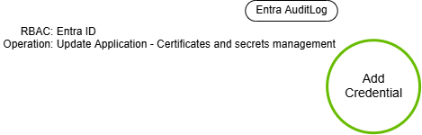
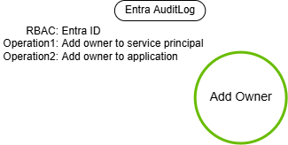

# Azure Service Principal Manipulation

## Metadata

| Key          | Value                                |
|--------------|--------------------------------------|
| ID           | TRR0020                              |
| External IDs | [AZT501.2], [AZT502.2], [T1098.001], [T1098.003], [T1136.003] |
| Tactics      | Persistence                          |
| Platforms    | Azure                                |
| Contributors | Andrew VanVleet                      |

### Scope Statement

This TRR covers manipulation of a service principal for persistence in Azure,
including optionally creating a new service principal. This technique
corresponds to multiple subtechniques on the MITRE ATT&CK matrix and Microsoft's
Azure Threat Research Matrix (ATRM). The following techniques are addressed (as
they pertain to Azure):

- AZT502.2 Account Creation: Service Principal Creation
- AZT501.2 Account Manipulation: Service Principal Manipulation
- T1098.001 Account Manipulation: Additional Cloud Credentials
- T1098.003 Account Manipulation: Additional Cloud Roles
- T1136.003 Create Account: Cloud Account

## Technique Overview

Attackers can use Azure service principals to achieve persistent access to a
compromised tenant. An attacker can create a new service principal (AZT502.2 &
T1136.003) or take over an existing one. Those options include:

1. Adding new credentials to a service principal (T1098.001 & AZT501.2)
2. Adding an account they control as a new owner of a service principal.
   (AZT501.2)
3. Granting a service principal they control additional roles. (T1098.003)
4. Granting a service principal additional permissions.

These options all represent unique procedures and are addressed individually in
the [Procedures] section.

## Technical Background

### Security Principals

To access resources that are secured by a Microsoft Entra tenant, the entity
that requires access must be represented by a [security principal]. This
requirement is true for both users (user principal) and applications (service
principal). The security principal defines the access policy and permissions for
the user/application in the Microsoft Entra tenant.

- **User principals** are the human users of the applications/resources in
  the tenant.
- **Service Principals** represent non-human identities in a tenant. They are
  the security objects that are assigned privileges, access policies, roles,
  etc, for an application in a single tenant. These account types provide a way
  for applications and services to authenticate and use resources without an
  interactive user. Service principals are called "Enterprise Apps" in the Azure
  portal.

This TRR addresses only service principals (non-human identities) in Entra ID.
User principals (human identities) will be addressed in a separate TRR.

### Applications in Azure

Applications in Azure have two components:

1. An [App Registration]
2. A [Service Principal] (aka Enterprise Application)

An **App Registration** is how you register a new application with Azure; it is
the global representation of your application in Azure across all tenants and is
assigned a globally unique application object ID. You can configure details like
the reply and logout URLs, define the application's APIs, and add credentials
for your application to use to authenticate. You also define the specific
permissions that your application will need to use various Azure resources.

A **Service Principal** is the local representation of an application in *a
single tenant only*. A service principal is created in each tenant where the
application is used and references the globally unique app object. The service
principal object defines what the app can actually do in the specific tenant,
who can access the app, and what resources the app can access. When an
application is given permission to access resources in a tenant (upon
registration or consent), a service principal object is created.  

> [!TIP]
>
> An example helps illustrate this concept: ZScaler offers a "Private Access"
> (ZPA) product in Azure. The App Registration for ZPA exists in ZScaler's own
> tenant. If you want to use the application in your tenant, you go to
> Enterprise Applications, create a new application, and select ZPA from the
> "Azure AD Gallery." This will create a service principal for ZPA in your
> tenant and you will need to grant your consent for it to hold the application
> permissions that it requires (which were defined by ZScaler in the App
> Registration). You can then use ZPA in your tenant.

### Service Principal Types

There are three types of service principals in Azure[^3]. An application can be
represented by any one of the three.

- **Application** - Application service principals are very flexible, but
  require developers to manually handle secrets, credentials, certificates, or
  keys used to authenticate the application.

- **Managed identity** - Managed identities allow Azure to handle the
  application authentication behind the scenes, eliminating the need for
  developers to manage credentials. Managed identities can be granted access and
  permissions, but can't be updated or modified directly.[^1][^2]

- **Legacy** - This type of service principal represents a legacy app, which is
  an app created before app registrations were introduced or through legacy
  mechanisms. These cannot be created anymore, but preexisting objects can still
  function. A legacy service principal can have credentials, service principal
  names, reply URLs, and other properties that an authorized user can edit, but
  doesn't have an associated app registration. The service principal can only be
  used in the tenant where it was created.

### Azure Roles and Permissions

Azure permissions are assigned to principals using role-based access control
(RBAC). There are two distinct RBAC systems operating inside an Azure tenant.
All resources in Azure will be controlled by one or the other of these two RBAC
systems. Roles for both RBAC systems can be assigned to any user, group, or
service principal.

- Microsoft Entra ID roles (formerly Azure AD) control access to Microsoft
   Entra resources such as users, groups, and applications using Microsoft
   Graph. These permissions are usually granted tenant-wide, though they can be
   scoped to specific Entra resources or administrative units.
- Azure roles control access to Azure resources and the data in them, such as
   virtual machines or storage, using the Azure Resource Manager[^9]. Azure
   roles are always scoped to a specific resource, subscription, or management
   group.

In the Azure portal, you can see these permissions in different blades (see
image) on the profile for a user, group, or service principal.


#### Entra ID RBAC (formerly Azure AD)

Entra ID roles apply to directory resources like users, groups, domains,
applications, licenses, synchronization settings, etc. Entra offers many
built-in roles, plus the ability to create custom roles. At its core, a role
assignment consists of three elements:

- Security principal - An identity that gets the permissions. It could be a
  user, group, or a service principal.
- Role definition - A collection of permissions.
- Scope - A way to constrain where those permissions are applicable.

Microsoft Entra ID provides multiple options for assigning roles:

- You can assign roles to users directly, which is the default way to assign
  roles. Both built-in and custom Microsoft Entra roles can be assigned to
  users, based on access requirements.
- You can create role-assignable groups and assign roles to these groups.
  Assigning roles to a group instead of individuals allows for easy addition or
  removal of users from a role and creates consistent permissions for all
  members of the group. Role-assignable groups requires a Microsoft Entra P1 or
  P2 license.
- You can use Microsoft Entra Privileged Identity Management (PIM) to assign
  members to roles. PIM allows you to grant time-limited or approval-based
  access to a role rather than permanent access. It also provides detailed
  reporting and auditing capabilities about when users enable their PIM-eligible
  roles.

`Global Administrator` is the most well-known built-in Entra ID role; this role
is at the top of the Entra ID hierarchy. A `Global Administrator` in Entra can
elevate themselves to the Azure RBAC `User Access Administrator` role over the
tenant's root management group (which is the top of the Azure RBAC hierarchy),
allowing them to grant themselves access to any resource in the tenant.

#### Azure RBAC

Azure RBAC defines roles with common access needs that can be assigned to
principals. Principals include users, security groups, managed identities,
workload identities, and service principals. (Principals are created and managed
in Entra.) You can assign a role to any principal. There are over 70 built-in
roles, and it's possible to define custom ones. However, there are 4 fundamental
roles that apply to all resources:

| Role | Permissions |
| ----- | ----- |
| Owner | Full access to all resources and manage access for other users |
| Contributor | Full access to all resources |
| Reader | View all resources |
| User Access Administrator | View all resources and manage access for other users |

Azure roles are always scoped to a specific resource. In the Azure Portal, they
are accessed by selecting a resource and choosing the "Access Control (IAM)"
blade. There you can see the roles defined for the resource and the principles
(users, assignable groups, and applications) who are assigned those roles.
Because permissions are inherited from parent resource groups and subscriptions,
the highest level of access in Azure RBAC is `Owner` or `User Access
Administrator` on the Root Management Group (the latter can grant themselves the
former). However, the Entra ID `Global Administrator` role can grant itself the
Owner role on any resource, so it also controls the whole tenant. Likewise, any
account with the control plane action `Microsoft.Authorization/*/Write` (which
is held by the `User Access Administrator`) could grant themselves permissions
to any resource within the scope where the permission is granted.

Each Azure role defines a set of permissions that are granted or denied to the
role. These are listed as `Actions` and `NotActions.` You can see a role
definition with AZ Powershell by using the cmdlet `get-azroledefinition.`  Azure
separates permissions for control plane actions from data plane actions. Control
plane actions are things like managing access to a storage account, or creating
a blob container, key vault, or resource group. Data plane actions
are things like reading or writing blobs in a container or reading a key in a
key vault.

By way of example, here is the definition for the role `Storage Blob Data
Reader`, which has rights to both read the containers (control plane), and
also to read the blobs inside the container (data plane):

```json
{  
  "Name": "Storage Blob Data Reader",  
  "Id": "2a2b9908-6ea1-4ae2-8e65-a410df84e7d1",  
  "IsCustom": false,  
  "Description": "Allows for read access to Azure Storage blob containers and data",  
  "Actions": [
   "Microsoft.Storage/storageAccounts/blobServices/containers/read", 
   "Microsoft.Storage/storageAccounts/blobServices/generateUserDelegationKey/action"
  ],  
  "NotActions": [],  
  "DataActions": [
    "Microsoft.Storage/storageAccounts/blobServices/containers/blobs/read"
  ],
  "NotDataActions": [],  
  "AssignableScopes": [    
   "/"  
  ]
}
```

## Procedures

| ID              | Title            | Tactic        |
|-----------------|------------------|---------------|
| TRR0020.AZR.A   | Add credentials  | Persistence   |
| TRR0020.AZR.B   | Add owner        | Persistence   |
| TRR0020.AZR.C   | Add role         | Persistence   |
| TRR0020.AZR.D   | Add API permissions | Persistence   |

### Procedure A: Add credentials

An attacker can gain persistence in a compromised Azure tenant by adding new
credentials to a service principal with the permissions the attacker is
interested in retaining. Adding credentials known by the attacker would allow
them to authenticate as that service principal until those credentials are
revoked.

Credentials can be certificates, client secrets (a string), or federated
identity credentials.

- Certificates are the recommended credential type. You can add the public key
to app registration, and then configure the application manifest to use the
certificate to authenticate. Microsoft recommends using certificates from a
trusted certificate authority, but this is not required.
- Client secrets are also sometimes called *application passwords*. Microsoft
recommends client secrets for development, but not for production applications.
When a client secret is created, Azure generates a string value that the
application can provide with a request to authenticate itself. Anyone who has
the secret can authenticate as the application. Azure will only show the secret
once -- when it is first created -- and after that the secret value cannot be
retrieved. It can, however, be stolen from the application.
- The third option for authenticating applications is a federated credential.
Azure supports GitHub, Kubernetes, customer-managed keys, or an external OpenID
Connect provider.[^3][^4]


#### Detection Data Model



The operation in gray indicates that it is optional.

Adding credentials to a service principal name (SPN) as a user requires a role
with the `Microsoft.Directory/servicePrincipals/credentials/update` permission
in Entra. To add credentials as an application, one of the
`Application.ReadWrite*` Graph permissions is required. There are many options
for how to do it, including Powershell (`New-AzAdSpcredential`), the Graph
API[^8], or the Azure portal. There is one relevant Entra Audit log generated:
"Update Application - Certificates and secrets management."

### Procedure B: Add owner

An attacker can establish persistence by adding themselves as an owner to an
existing application. They can be owners of both the service principal or the
application registration.


An attacker is most likely to add themselves as an additional owner of an
application that already holds permissions they want in the tenant, but as an
owner they can also add new permissions to any application (though admin consent
would be required). They can also manage the tenant-specific configuration of
the application, such as the single sign-on (SSO) configuration.

Ownership grants an adversary permissions to carry out other account
manipulation procedures, like adding roles, permissions, or credentials. Some of
the permissions held by owners over an application registration that would be
useful to an attacker are:

| Action | Description |
| ----- | ----- |
|microsoft.directory/applications/authentication/update | Update the applications.authentication property in Microsoft Entra ID. |
|microsoft.directory/applications/credentials/update | Update the applications.credentials property in Microsoft Entra ID. |
|microsoft.directory/applications/permissions/update | Update the applications.permissions property in Microsoft Entra ID. |
|microsoft.directory/applications/policies/update | Update the applications.policies property in Microsoft Entra ID. |

Similarly, attackers would find the following permissions held by owners of
enterprise applications useful:

| Action | Description |
| ----- | ----- |
| microsoft.directory/policies/delete | Delete policies in Microsoft Entra ID. |
| microsoft.directory/servicePrincipals/appRoleAssignments/update | Update the users.appRoleAssignments property in Microsoft Entra ID. |
| microsoft.directory/servicePrincipals/authentication/update | Update the servicePrincipals.authentication property in Microsoft Entra ID. |
| microsoft.directory/servicePrincipals/credentials/update | Update the servicePrincipals.credentials property in Microsoft Entra ID. |

#### Detection Data Model



The operation in gray indicates that it is optional.

Adding an owner to an SPN or application requires a role with the
`Microsoft.Directory/servicePrincipals/owners/update` or
`Microsoft.Directory/applications/owners/update` permissions in Entra. To add an
owner as an application, one of the `Application.ReadWrite*` Graph permissions
is required. There are many options for how to do it, including the AZ command
line interface[^11][^12], the Graph API[^10], or the Azure portal. There are two
Entra Audit logs generated: "Add owner to application" or "Add owner to service
principal."

### Procedure C: Add role

Attackers can establish persistence by granting additional privileged roles to
an attacker-controlled service principal. These roles could be assigned in both
Entra or Azure RBAC.


#### Privileged Roles

Privileged roles are those that grant administrative access, such as the ability
to manage Azure resources or assign roles to other users. The following Azure
roles are considered privileged and apply to all resource types.

| Azure role | Permissions |
| ----- | ----- |
| Owner | Grants full access to manage all resources, assign roles in Azure RBAC |
| Contributor | Grants full access to manage all resources, can't assign roles in Azure RBAC. Can't manage assignments in Azure Blueprints or share image galleries. |
| Reservations Administrator | Manage all the reservations in a tenant. Assign roles in Azure RBAC for reservations |
| Role Based Access Control Administrator | Manage user access to Azure resources. Assign roles in Azure RBAC. Assign themselves or others the Owner role. Can't manage access using other ways, such as Azure Policy |
| User Access Administrator | Manage user access to Azure resources. Assign roles in Azure RBAC. Assign themselves or others the Owner role |

These specific Azure permissions are considered privileged, regardless of the
role holding them:

| Action string | Description |
| ----- | ----- |
| * | Create and manage resources of all types. |
| */delete | Delete resources of all types. |
| */write | Write resources of all types. |
|Microsoft.Authorization/denyAssignments/delete | Delete a deny assignment at the specified scope. |
| Microsoft.Authorization/denyAssignments/write | Create a deny assignment at the specified scope. |
| Microsoft.Authorization/roleAssignments/delete | Delete a role assignment at the specified scope. |
| Microsoft.Authorization/roleAssignments/write | Create a role assignment at the specified scope. |
| Microsoft.Authorization/roleDefinitions/delete | Delete the specified custom role definition. |
| Microsoft.Authorization/roleDefinitions/write | Create or update a custom role definition with specified permissions and assignable scopes. |

#### Detection Data Model


The operation in gray indicates that it is optional.

Changes to Entra ID objects, including adding or removing roles, are logged in
the Azure Audit Log. The Entra logs that are most relevant to this technique
are:

| Operation Name | Description |
| ----- | ----- |
| Add member to group | Add a user, group, or service principal to a group (and all the roles the group holds) |
| Add member to role <br> Add eligible member to role | Add a user, group, or service principal to a role (either permanently or temporarily) |
| Add eligible member to role in PIM completed (permanent) <br> Add eligible member to role in PIM completed (time bound) <br> Add eligible member to role in PIM requested (permanent) <br> Add eligible member to role in PIM requested (time bound) <br> Add member to role approval requested (PIM activation) <br> Add member to role completed (PIM activation) <br> Add member to role in PIM completed (permanent) <br> Add member to role in PIM completed (time bound) <br> Add member to role in PIM requested (permanent) <br> Add member to role in PIM requested (time bound) <br> Add member to role outside of PIM (permanent) <br> Add member to role request approved (PIM activation) <br> Add member to role request denied (PIM activation) <br> Add member to role requested (PIM activation) | Various logs for assigning users to roles via PIM (which can assign either temporarily or  permanently) |
| Add role definition <br> Update role definition | Add or modify the permissions for a custom role definition. |

Changes to Azure resources, including adding or removing roles, are logged in
the Azure Activity Log. These are the RBAC-related operations that get logged
(under the Category "Administrative" with the operationName "Authorization"):

| Permission | Description |
| ----- | ----- |
| Microsoft.Authorization/roleAssignments/write | Create role assignment |
| Microsoft.Authorization/roleAssignments/delete | Delete role assignment |
| Microsoft.Authorization/roleDefinitions/write | Create or update role definition |
| Microsoft.Authorization/roleDefinitions/delete | Delete role definition |

### Procedure D: Add API permissions

An attacker can establish persistence by granting additional API permissions to
an application they control. Changes to an application's permissions must be
approved through consent.

#### Granting Permissions to Applications

Applications request specific permissions in the tenant and must be granted
these by user or admin consent. Each permission includes a claim (User.Read,
User.Write, etc) against an API (Microsoft Graph, Azure Resource Management,
Windows Azure Active Directory, etc).

There are two scopes for which a permission can be requested: **Application**
and **Delegated**.

##### Application Permissions

Application permissions are used by apps that run without a signed-in user
present, for example, apps that run as background services. These permissions
are held directly by the application and apply to all relevant resources in the
tenant. For example, an app that has the `Mail.Read` permission can read the
mailboxes of every user in the organization.

- For application permissions, the effective permissions of the app are the full
level of privileges granted by that permission. Application permissions are also
called "App-only permissions" (in documentation), "AppRoles" (in the application
manifest, logs and the Graph API) and "roles" (in the `requiredResourceAccess`
section of the application manifest and OAuth token). The permissions an
application requires can also be seen in the "API Permissions" blade of the App
Registration.
- Application developers can define the roles exposed by their application using
either the "Manifest" or the "App roles" blade in the portal or by adding an
`appRoleAssignment` programmatically. When a user signs in to the application,
Entra ID adds a `roles` claim to the OAuth token they receive for each role that
the user or service principal was granted to the resource they’re authenticating
to. These can then be used by the application to implement claim-based
authorization (i.e. granting access based on a user’s role claims).

##### Delegated Permissions

Delegated permissions are used by apps that have a signed-in user present. They
grant the application the ability to exercise the requested permission on behalf
of the user. The app is delegated with the permission to act as a signed-in user
when it makes calls to the target resource. For example, an app with a
`Mail.Read` delegated permission can read the mailbox of the signed-in user
only.

For delegated permissions, the effective permissions of your app are the
least-privileged intersection of the delegated permissions the app has been
granted (by consent) and the privileges of the currently signed-in user. Your
app can never have more privileges than the signed-in user. For example, if a
signed-in user doesn't have rights to read their own mailbox, then an
application with the `Mail.Read` delegated permission will not have permission
to read the user's mailbox.

- Delegated permissions are also called "scopes" (in documentation, the
  `requiredResourceAccess` section of the application manifest, and the OAuth
  token) and "OAuth2 permission scopes/grants" (in logs, the application
  manifest, and the Graph API)
- Application developers can define the delegated permissions exposed by their
  application using either the "Manifest" or the "Expose an API" blade in the
  portal or by adding an `oauth2PermissionGrant` programmatically. When a user
  signs in to the application, Entra ID adds an `scp` claim to the OAuth token
  they receive for each scope that the user or service principal was granted to
  the resource they’re authenticating to.

 

#### Consent

Consent is a process where users or admins authorize an application to
access a protected resource. Consent can be granted by individual users for
their own data (delegated) or by an administrator for tenant-wide permissions
(application or delegated).

##### User consent

User consent happens when a user attempts to sign in to an application and
grants that application delegated permissions to access specific resources as
the user. The user provides their sign-in credentials, which are checked to
determine if consent has already been granted for the requested permissions. If
no previous record of user or admin consent for the permissions exists, the user
is shown a consent prompt and asked to grant the application the requested
permissions. For specific permissions, an admin may be required to grant consent
on behalf of the user. Once a user has consented to delegated permissions for an
application, they don't have to grant it again for the same application.

##### Administrator consent

Administrators can grant consent for delegated permissions for specific users or
for an entire organization. Applications can also be pre-authorized for
permissions so that users don't see a consent prompt when they first use the
application. Application permissions can only be granted by admin consent.
Additionally, depending on the permissions they require, some applications might
require an administrator to be the one who grants consent, even for a single
user. For example, many high-privilege delegated permissions can only be
consented to by an administrator (see [Risky Graph Permissions] below).
Authentication requests are prompted for admin consent if consent wasn't granted
and if one of those high-privilege permissions is requested. `Global Admin`,
`Privileged Role Admins`, `Application Admin`, and `Cloud Application Admins`
all have permission to grant tenant-wide consent (but only the first two can
consent to Graph API permissions)[^13]. Additionally, custom roles that hold the
permission `microsoft.directory/servicePrincipals/managePermissionGrantsForAll`
can grant admin consent.[^5]


##### Bypassing Consent

Generally, granting permissions to an application within a tenant always
requires that consent be granted by a human admin. There is one method that
allows consent to be bypassed: an application holding the
`AppRoleAssignment.ReadWrite.All` can grant itself or any other application any
application permission to any API, including Microsoft Graph, without the
normally required admin consent process. By way of example, an application with
this permission could escalate to `Global Admin` without consent by granting
itself `RoleManagement.ReadWrite.Directory` and `Global Admin`, in turn.[^6]

#### Risky Graph Permissions

The following Graph permissions are more likely to be targeted by attackers
because they permit access to files, contacts, notes, mail, or the ability to
make sensitive changes to permissions. The addition of these permissions to an
application or role -- or the addition of a role containing these permissions --
would be interesting from a security perspective. The full list of Graph
permissions and whether they require admin consent can be found in the Graph
Permissions Reference.[^7]

- Application.ReadWrite.All
- AppRoleAssignment.ReadWrite.All
- Contacts.Read
- Contacts.ReadWrite
- Directory.ReadWrite.All
- Domain.ReadWrite.All
- Files.Read.All
- Files.ReadWrite.All
- Group.ReadWrite.All
- Mail.Read
- Mail.ReadWrite
- Mail.Send
- MailboxSettings.Read
- MailboxSettings.ReadWrite
- Member.Read.Hidden
- Notes.Read.All
- Notes.ReadWrite.All
- People.Read.All
- RoleManagement.ReadWrite.Directory
- User.ReadWrite.All
- User.ManageCreds.All

#### Detection Data Model


The operation in gray indicates that it is optional.

To add a new API permission, there are two options: via consent or bypassing
consent. The permissions required differ per approach. When a new permission is
added, Entra logs an `Update Application` log with a change to the
`RequiredResourceAccess` field (this is the section that declares the
permissions required for an application). When consent is granted, there is a
`Consent to application` and `Add app role assignment to service principal` log
generated.

The DDM focuses on application permissions rather than delegated permissions
because to abuse delegated permissions an attacker must be able to sign a user
in to the application in order to access their data, including passing all MFA
and Conditional Access checks, even after they've granted and consented to the
permission in Entra. This makes application permissions considerably easier
to abuse. In Azure logging, delegated permissions are called an
`OAuth2PermissionGrant` and application permissions are called an
`appRoleAssignment`.

## Available Emulation Tests

| ID            | Link        |
|---------------|-------------|
| TRR0020.AZR.A | [Atomic Test 1], [Atomic Test 2] |
| TRR0020.AZR.B |         |
| TRR0020.AZR.C | [Atomic Test 1-2], [Atomic Test 5], [Atomic Test 7] |
| TRR0020.AZR.D | [Atomic Test 8] |

## References

- [Overview of Permissions and Consent - Microsoft Learn]
- [Application and service principal objects in Microsoft Entra ID]
- [Graph Permissions Reference - Microsoft Learn]
- [Azure Privilege Escalation via Azure API Permissions Abuse - SpecterOps]
- [Default User Permissions in Entra ID - Microsoft Learn]
- [User and Admin Consent - Microsoft Learn]
- [Grant Tenant-Wide Admin Consent - Microsoft Learn]

[T1098.001]: https://attack.mitre.org/techniques/T1098/001/
[T1136.003]: https://attack.mitre.org/techniques/T1136/003/
[AZT502.2]: https://microsoft.github.io/Azure-Threat-Research-Matrix/Persistence/AZT502/AZT502-2/
[AZT501.2]: https://microsoft.github.io/Azure-Threat-Research-Matrix/Persistence/AZT501/AZT501-2/
[T1098.003]: https://attack.mitre.org/techniques/T1098/003/
[Procedures]: #procedures
[Application and service principal objects in Microsoft Entra ID]: https://learn.microsoft.com/en-us/entra/identity-platform/app-objects-and-service-principals
[Graph Permissions Reference - Microsoft Learn]: https://learn.microsoft.com/en-us/azure/active-directory/roles/permissions-reference
[Azure Privilege Escalation via Azure API Permissions Abuse - SpecterOps]: https://posts.specterops.io/azure-privilege-escalation-via-azure-api-permissions-abuse-74aee1006f48
[Default User Permissions in Entra ID - Microsoft Learn]: https://learn.microsoft.com/en-us/entra/fundamentals/users-default-permissions#owned-application-registrations
[User and Admin Consent - Microsoft Learn]: https://learn.microsoft.com/en-us/entra/identity/enterprise-apps/user-admin-consent-overview
[Grant Tenant-Wide Admin Consent - Microsoft Learn]: https://learn.microsoft.com/en-us/entra/identity/enterprise-apps/grant-admin-consent
[Overview of Permissions and Consent - Microsoft Learn]: https://learn.microsoft.com/en-us/entra/identity-platform/permissions-consent-overview
[Risky Graph Permissions]: #risky-graph-permissions
[security principal]: https://learn.microsoft.com/en-us/windows-server/identity/ad-ds/manage/understand-security-principals
[App Registration]: https://learn.microsoft.com/en-us/entra/identity-platform/app-objects-and-service-principals?tabs=browser#application-registration
[Service Principal]: https://learn.microsoft.com/en-us/entra/identity-platform/app-objects-and-service-principals?tabs=browser#service-principal-object
[Atomic Test 1]: https://github.com/redcanaryco/atomic-red-team/blob/master/atomics/T1098.001/T1098.001.md#atomic-test-1---azure-ad-application-hijacking---service-principal
[Atomic Test 2]: https://github.com/redcanaryco/atomic-red-team/blob/master/atomics/T1098.001/T1098.001.md#atomic-test-2---azure-ad-application-hijacking---app-registration
[Atomic Test 1-2]: https://github.com/redcanaryco/atomic-red-team/blob/master/atomics/T1098.003/T1098.003.md
[Atomic Test 5]: https://github.com/redcanaryco/atomic-red-team/blob/master/atomics/T1098/T1098.md#atomic-test-5---azure-ad---adding-service-principal-to-azure-ad-role
[Atomic Test 7]: https://github.com/redcanaryco/atomic-red-team/blob/master/atomics/T1098/T1098.md#atomic-test-7---azure---adding-service-principal-to-azure-role-in-subscription
[Atomic Test 8]: https://github.com/redcanaryco/atomic-red-team/blob/master/atomics/T1098/T1098.md#atomic-test-8---azure-ad---adding-permission-to-application

[^1]: [Entra Managed Identities - Microsoft Learn](https://learn.microsoft.com/en-us/entra/identity/managed-identities-azure-resources/overview)
[^2]: [Application and service principal objects in Microsoft Entra ID - Microsoft Learn](https://learn.microsoft.com/en-us/entra/identity-platform/app-objects-and-service-principals)
[^3]: [Access Token Request with a Federated Credential - Microsoft Learn](https://learn.microsoft.com/en-us/entra/identity-platform/v2-oauth2-client-creds-grant-flow#third-case-access-token-request-with-a-federated-credential)
[^4]: [Adding Credentials - Microsoft Learn](https://learn.microsoft.com/en-us/entra/identity-platform/quickstart-register-app?tabs=federated-credential#add-credentials)
[^5]: [App consent permissions for custom roles - Microsoft Learn](https://learn.microsoft.com/en-us/entra/identity/role-based-access-control/custom-consent-permissions)
[^6]: [Azure Privilege Escalation via API Permissions Abuse - SpecterOps](https://posts.specterops.io/azure-privilege-escalation-via-azure-api-permissions-abuse-74aee1006f48)
[^7]: [Microsoft Graph Permissions Reference - Microsoft     Learn](https://learn.microsoft.com/en-us/graph/permissions-reference)
[^8]: [Graph API ServicePrincipal Add Password - Microsoft Learn](https://learn.microsoft.com/en-us/graph/api/serviceprincipal-addpassword?view=graph-rest-1.0&tabs=http)
[^9]: [Azure Resource Manager - Microsoft Learn](https://learn.microsoft.com/en-us/azure/azure-resource-manager/management/overview)
[^10]: [Graph API ServicePrincipal  Add Owner - Microsoft Learn](https://learn.microsoft.com/en-us/graph/api/serviceprincipal-post-owners?view=graph-rest-1.0&tabs=http)
[^11]: [AZ CLI App Owner - Microsoft Learn](https://learn.microsoft.com/en-us/cli/azure/ad/app/owner?view=azure-cli-latest)
[^12]: [AZ CLI SPN Owner - Microsoft     Learn](https://learn.microsoft.com/en-us/cli/azure/ad/sp/owner?view=azure-cli-latest)
[^13]: [Microsoft Entra built-in roles - Microsoft Learn](https://learn.microsoft.com/en-us/entra/identity/role-based-access-control/permissions-reference)
