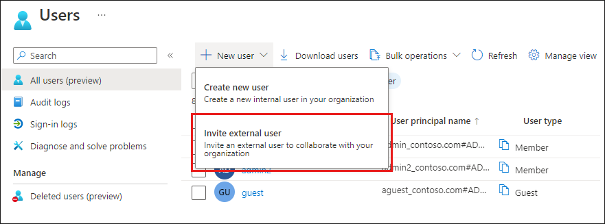
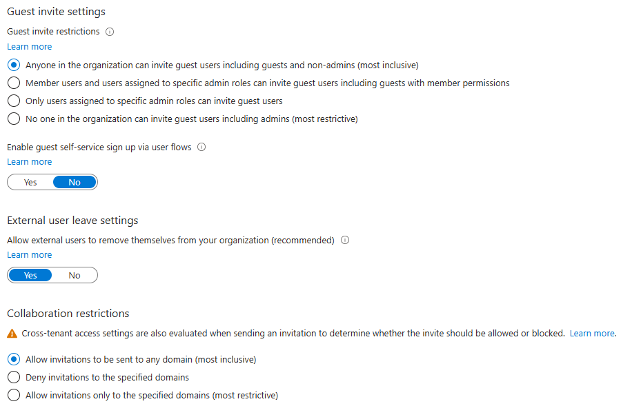
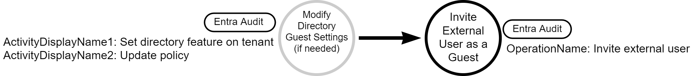

# Azure Guest Account Creation

## Metadata

| Key          | Value                                      |
|--------------|--------------------------------------------|
| ID           | TRR0021                                    |
| External IDs | [AZT502.3], [T1136.003]                    |
| Tactics      | Persistence                                |
| Platforms    | Azure                                      |
| Contributors | Tequila Schramm, Andrew VanVleet           |

### Scope Statement

This TRR covers the creation of a guest account in Azure, which is [AZT502.3] on
the Azure Threat Research Matrix and part of [T1136.003] Create Account: Cloud
Account on the ATT&CK matrix. Creating service principals is covered in
[AZT502.2] and creating user accounts is covered in [AZT502.1]

## Technique Overview

Attackers can gain persistence in a compromised tenant by inviting an external
account as a guest user. A guest user might be overlooked by tenant defenders
and allow the attacker to retain access to tenant resources after their initial
access is removed.

## Technical Background

Also referred to as "External Users", Azure guest accounts typically represent
individuals outside the organization, such as partners, vendors, or contractors,
who are being granted direct access to the tenant. Guest accounts allow these
users to utilize their existing identity provider to access resources inside the
host organization's tenant, such as Microsoft 365 services, Azure applications,
or shared content. Guest user accounts are designed to facilitate external
collaboration and are not intended for use by employees or for automation and
service-to-service authentication

By using a guest account in a victim's tenant, an attacker gains control over
how that account authenticates to Azure. The victim tenant admins cannot change
the password or enforce authentication requirements, they only control what
resources the guest can access. So long as the guest account goes unnoticed, an
attacker can retain access to victim tenant resources.

A guest account is created whenever an external user is invited to
collaborate.

 

There are two Entra external collaboration settings that control
guest access:

1. The first is the "Guest invite settings" that controls who, if anyone, is
allowed to invite guests. The default is to allow anyone in the tenant to invite
external users, including other tenant guests.
2. The second is the "Collaboration restrictions" setting, which controls which
domains (using email as the controlling factor) guests can be invited from.
There are three options:
    1. All invitations to be sent to any domain (no allowlist or blocklist -
       this is the default)
    2. Deny invitations to the specified domains (blocklist)
    3. Allow invitations only to the specified domains (allowlist)



After a user is invited, an account is added to Microsoft Entra ID, with a
`UserType` of Guest. The guest user must then redeem their invitation to access
resources. It's important to note that unredeemed invitations do not expire and,
currently, there is no option to set expiration dates on unredeemed
invitations.[^1]

### Logging

Activity related to external user account management, such as guest account
creation and redeemed invitations, are provided by the `Invited Users` logging
service, categorized under `UserManagement` and recorded in the **Entra Audit
Logs**.

To review all activity related to guest account management, query the `Invited
Users` logging service.

```kusto
AuditLogs
| where LoggedByService == 'Invited Users'
```

#### Invited Users Logs

These logs provide events that can be of particular interest to security and
monitoring teams. The following table provides a list of the types of activity
logged.

| Audit Category | Activity |
|---|---|
|UserManagement|Delete external user|
|UserManagement|Email not sent, user unsubscribed|
|UserManagement|Invitation Email|
|UserManagement|Invite external user|
|UserManagement|Invite external user with reset invitation status|
|UserManagement|Invite internal user to B2B collaboration|
|UserManagement|Redeem external user invite|

#### Guest Settings Modification Logs

When the guest access policy is changed, Entra ID generates an audit log with an
`ActivityDisplayName` of "Update policy" and a `TargetResources.displayName` of
"B2BManagementPolicy." The `TargetResources.modifiedProperties.displayName`
field will hold a value showing "PolicyDetails" and `oldValue` and `newValue`
fields showing the policy before and after the change.

The policy controlling collaboration restrictions is titled
`InvitationsAllowedAndBlockedDomainsPolicy`. This can be followed by an
`AllowedDomains` field, which is array of the allowlisted domains. It could
alternately be followed by a `BlockedDomains` field with an array of blocklisted
domains. The setting allowing invitations to any domain will configure the
policy as an empty blocklist.

The setting that controls who can invite guests (if at all) is a "directory
feature" and is logged in the Entra audit log with an `ActivityDisplayName` of
"Set directory feature on tenant." The log contains a property named
`DirectoryFeatures` and it contains a key named `EnabledFeatures`. This is
followed by an array of the enabled directory features. The value
`RestrictInvitations` is included in the array when guests are prohibited
entirely.

## Procedures

| ID                  | Title                | Tactic            |
|---------------------|----------------------|-------------------|
| TRR0021.AZR.A       | Create guest account | Persistence       |

### Procedure A: Create guest account

There are many ways a guest can be invited, though all will eventually call the
Graph API:  

- **Az PowerShell:** `New-MgInvitation`  
- **Azure CLI:** `az ad user invite`  
- **Microsoft Graph API:** `POST https://graph.microsoft.com/v1.0/invitations`  
- **Azure Portal**

Using slight variations of the methods above, guest users can also be invited in
bulk using CSV files.  

#### Detection Data Model



## Available Emulation Tests

| ID            | Link             |
|---------------|------------------|
| TRR0021.AZR.A |                  |

## References

- [External Collaboration Settings in Entra]
- [AD Tenant Enumeration with Guest Accounts]

[T1136.003]: https://attack.mitre.org/techniques/MITRE_ATT&CK_ID/T1136/003/
[AZT502.1]: https://microsoft.github.io/Azure-Threat-Research-Matrix/Persistence/AZT502/AZT502-1/
[AZT502.2]: https://microsoft.github.io/Azure-Threat-Research-Matrix/Persistence/AZT502/AZT502-2/
[AZT502.3]: https://microsoft.github.io/Azure-Threat-Research-Matrix/Persistence/AZT502/AZT502-3/
[External Collaboration Settings in Entra]: https://learn.microsoft.com/en-us/entra/external-id/external-collaboration-settings-configure
[AD Tenant Enumeration with Guest Accounts]: https://danielchronlund.com/2021/11/18/scary-azure-ad-tenant-enumeration-using-regular-b2b-guest-accounts/

[^1]: [Invite External User](https://learn.microsoft.com/en-us/entra/external-id/add-users-administrator)
