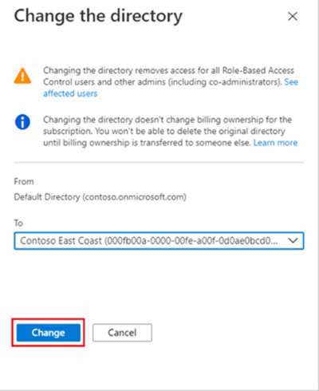

# Hijack Azure Subscription

## Metadata

| Key          | Value                                      |
|--------------|--------------------------------------------|
| ID           | TRR0022                                    |
| External IDs | [AZT507.3], [T1496.004]                    |
| Tactics      | Persistence, Impact                        |
| Platforms    | Azure                                      |
| Contributors | Andrew VanVleet                            |

## Technique Overview

An Azure subscription can be transferred from one directory to another, allowing
an attacker with sufficient permissions to transfer a victim's subscription --
including all the resources inside it -- to a directory they control. A
transferred subscription retains the billing account setup by the target and the
target tenant administrators will no longer have control over the subscription.
This would be a disruptive attack, as the victim tenant would lose all access to
those resources and anything with a dependency on them would immediately break,
but the attacker would gain full control of those resources and have the ability
to deploy new resources that would be charged to the victim.

An attacker might hijack a subscription as a destructive action, to mine
cryptocurrency, or to seize control of a sensitive resource.

## Technical Background

Transferring a subscription requires the following pre-conditions:

1. The directory's guest and subscription transfer settings need to allow
    inviting guests and transferring subscriptions.
2. Access to an account with Owner privileges over the subscription to be
    transferred.
3. The account must exist in both the current directory and in the new
    directory. There are multiple ways to meet this requirement, but they all
    require that guest access be enabled for the tenant. For example, the
    attacker could invite an account from their directory into the victim
    directory or set up an account in the victim directory as a guest in their
    own directory. Additional details can be found on Microsoft's Learn
    site.[^1]

Meeting these conditions might require modifying the guest permissions in the
victim tenant to allow guests from the attacker's tenant. There are two Entra
external collaboration settings that control guest access. The first is the
"Guest invite settings" that control who, if anyone, is allowed to invite
guests. The second is the "Collaboration restrictions" setting, which controls
which domains (using email as the controlling factor) guests can be invited
from. An attacker has many configuration options available to ensure they can
set up the requisite guest account.

The "Guest invite settings" allows a range of options, from prohibiting all
guests to allowing anyone to invite guests.

The "Collaboration restrictions" setting allows one of 3 options:

1. All invitations to be sent to any domain (no allowlist or blocklist)
2. Deny invitations to the specified domains (blocklist)
3. Allow invitations only to the specified domains (allowlist)

Once these conditions are met, the attacker can initiate the transfer via the
portal or the Graph API.

Billing information for a subscription is retained when the subscription is
transferred, so an attacker can effectively hijack a subscription and deploy
resources that the victim is paying for until the billing has been modified
(this would presumably require intervention from Microsoft Support, since the
victim would no longer have access to the subscription to change the billing
information). Additionally, the subscription's logs are also transferred with
it.

### Prevention

Tenant owners can block the transfer of subscriptions in and out of the
directory.[^2] Tenant owners can also control whether or not guests can be
invited into the tenant, from what domains, and what permissions they can hold
(for example, if they could be an owner of a subscription)

This attack is far better to prevent than to detect, due to the heavy impact it
would have on a tenant and the need to engage Microsoft support to remediate the
impact. Unless there is a compelling reason for enabling it, the tenant should
be configured to prohibit subscription transfers out of the directory, and the
domains from which guests are permitted should be configured with an allowlist.

### Logging

#### Guest Settings Modifications

When the guest access policy is changed, Entra ID generates an audit log with an
`ActivityDisplayName` of "Update policy" and a `TargetResources.displayName` of
"B2BManagementPolicy." The `TargetResources.modifiedProperties.displayName`
field will hold a value showing "PolicyDetails" and `oldValue` and `newValue`
fields showing the policy before and after the change.

The policy controlling collaboration restrictions is titled
`InvitationsAllowedAndBlockedDomainsPolicy`. This can be followed by an
`AllowedDomains` field, which is array of the allowlisted domains. It could
alternately be followed by a `BlockedDomains` field with an array of blocklisted
domains. The setting allowing invitations to any domain will configure the
policy as an empty blocklist.

The setting that controls who can invite guests (if at all) is a "directory
feature" and is logged in the Entra audit log with an `ActivityDisplayName` of
"Set directory feature on tenant." The log contains a property named
`DirectoryFeatures` and it contains a key named `EnabledFeatures`. This is
followed by an array of the enabled directory features. The value
`RestrictInvitations` is included in the array when guests are prohibited
entirely.

#### Inviting Guests

When an invitation is sent to a guest, an Entra Audit log is generated with an
`OperationName` of "Invite external user." This log shows the external user's
email and which internal user sent the invitation.

#### Adding Owners

There is an Azure Activity log generated when an owner is added to a
subscription. The `operationName` field will read
"Microsoft.Authorization/roleAssignments/write."  The ID for the Owner role is
`8e3af657-a8ff-443c-a75c-2fe8c4bcb635` in Azure RBAC.

## Procedures

| ID                | Title            | Tactic            |
|-------------------|------------------|-------------------|
| TRR0022.AZR.A     | Hijack via an external guest user  | Persistence, Impact |
| TRR0022.AZR.B     | Hijack via an internal user             | Persistence, Impact |

### Procedure A: Hijack via an external guest user

In order to hijack a subscription, an attacker needs a single account who has
the requisite permissions in both the source (victim) and destination
(attacker-controlled) tenant.  One way to accomplish this is to invite a user
from the attacker's tenant into the victim's tenant as a guest.

The guest account would then need to be granted the `Owner` role over the target
subscription.

If subscription transfers have been prohibited in the victim tenant (the default
is to permit them), the attacker will need to modify that setting. It is a
toggle: allow or deny subscriptions to leave the tenant.

At this point the attacker can initiate the subscription transfer. The victim
loses access to the subscription and its resources and cannot modify billing
information.

#### Detection Data Model

### Procedure B: Hijack via an internal user

The other way to set up the required guest account is to invite a user from the
victim's tenant -- preferably one who is already an `Owner` over the target
subscription -- into the attacker's tenant as a guest.

Similar to the other approach, the attacker may then have to modify the setting
that allows subscription transfers, and can then initiate the transfer.

#### Detection Data Model

## Available Emulation Tests

| ID            | Link             |
|---------------|------------------|
| TRR0022.AZR.A |                  |
| TRR0022.AZR.B |                  |

## References

- [Transfer Subscriptions - Microsoft Learn]
- [Associate Azure Subscriptions to a Directory - Microsoft Learn]
- [Configure External Collab Settings - Microsoft Learn]
- [Cross-Tenant Access - Microsoft Learn]
- [Azure subscription hijacking and cryptomining - Medium]
- [Allow or block B2B collaboration with organizations - Microsoft Learn]

[AZT507.3]: https://microsoft.github.io/Azure-Threat-Research-Matrix/Persistence/AZT507/AZT507-3/
[T1496.004]: https://attack.mitre.org/techniques/T1496/004/
[Transfer Subscriptions - Microsoft Learn]: https://learn.microsoft.com/en-us/azure/role-based-access-control/transfer-subscription
[Associate Azure Subscriptions to a Directory - Microsoft Learn]: https://learn.microsoft.com/en-us/entra/fundamentals/how-subscriptions-associated-directory
[Configure External Collab Settings - Microsoft Learn]: https://learn.microsoft.com/en-us/entra/external-id/external-collaboration-settings-configure
[Cross-Tenant Access - Microsoft Learn]: https://learn.microsoft.com/en-us/entra/external-id/cross-tenant-access-overview
[Azure subscription hijacking and cryptomining - Medium]: https://derkvanderwoude.medium.com/azure-subscription-hijacking-and-cryptomining-86c2ac018983
[Allow or block B2B collaboration with organizations - Microsoft Learn]: https://learn.microsoft.com/en-us/entra/external-id/allow-deny-list

[^1]: [Configure External Collab Settings - Microsoft Learn](https://learn.microsoft.com/en-us/entra/external-id/external-collaboration-settings-configure)
[^2]: [Manage Azure subscription policies - Microsoft Learn](https://learn.microsoft.com/en-us/azure/cost-management-billing/manage/manage-azure-subscription-policy)
